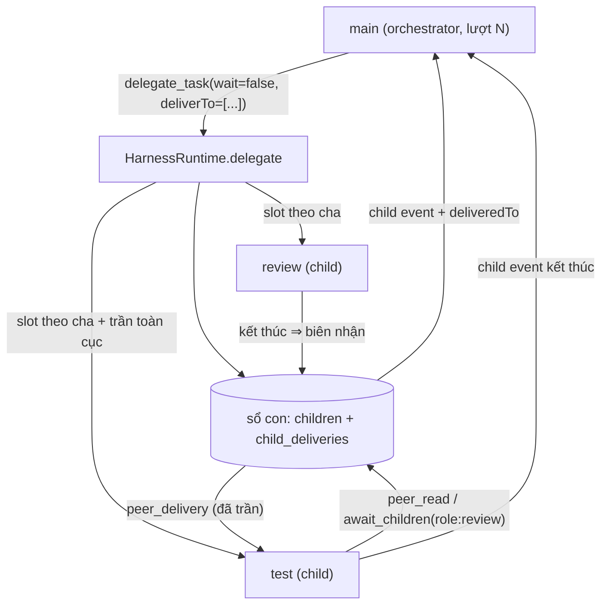

# Kế hoạch vòng 22 — mesh agent con ("peer mesh"): con nhìn thấy nhau và đường ống chờ cho việc dài (2026-09-22)

> Bản này **chỉ lên kế hoạch**; chưa sửa mã sản phẩm. Nó là bản thi công chi tiết cho phần C của
> `docs/plan/v21-boxfox-plan.md` (kiến trúc ba tầng đã phác) và cho việc **D-7** trong
> `docs/tracking/owner-decisions.md:29` — "agent con phải nhìn thấy nhau".
> Mọi số đo hiện trạng trong tệp này được **kiểm lại trực tiếp trong mã** ngày 2026-09-22 trên nhánh
> `vorflux/v21-boxfox-plan` @ `e9ce91d`; chỗ nào mã khác với mô tả cũ thì ghi rõ ở §0.3.
> Cấu trúc: §0 đầu vào đã chốt, §1 kiến trúc và hợp đồng dữ liệu, §2 **sáu pha / 17 việc** (mục T14 là việc tuỳ chọn để vòng sau, không tính vào vòng này; mỗi việc có
> mã, mục tiêu, tệp+dòng, việc cụ thể, rủi ro, lệnh nghiệm thu), §3 nghiệm thu vòng, §4 chủ nhà đã chốt (thay cho câu hỏi mở),
> §5 ánh xạ yêu cầu (a)–(l) → việc.

## 0. Bối cảnh, phạm vi, đầu vào đã chốt

### 0.1 Việc chủ nhà giao (ba luồng phải chạy được)

| # | Luồng chủ nhà mô tả | Điều kiện kỹ thuật để chạy được |
|---|---|---|
| L1 | `test` làm tới một mốc, rồi **chờ** `review`; review xong ⇒ kết quả giao cho **cả `main` và `test`**; test chạy tiếp; main ghi nhận/báo tiến độ; main quay lại chờ các con khác | cha sinh con **không chặn** (nhiều con sống cùng lúc), `deliverTo` định tuyến được, con **chờ** được anh em, cha **chờ** được con |
| L2 | `plan` chạy song song `research`; plan làm tới mốc rồi **chờ** research; kết quả research giao cho `plan` (và `main`, và người nhận tuỳ chọn) | như L1 + địa chỉ theo **vai** (`role:<role>`) để plan không cần biết sid của research |
| L3 | Các chuyên gia còn lại lặp cùng khuôn ⇒ "luồng kiểm tra" (check flow) và "đường ống việc dài" (long-task pipeline) | cùng bốn primitive trên, cộng trần và công tắc để không bao giờ treo |

Ràng buộc chủ nhà chốt (D-10, `owner-decisions.md:32`): **kiến trúc được phép nặng, ổn định là yêu cầu cứng,
chấp nhận tốn thêm token/bước/thời gian**.

**Chủ nhà đã trả lời ba câu hỏi mở của vòng này (2026-09-22), và đây là ràng buộc cứng:**

| # | Chốt | Hệ quả lên kế hoạch |
|---|---|---|
| Q1 | **Con KHÔNG bao giờ tự sinh việc/không có `spawn_peer`.** `main` là **bên duy nhất** sinh con và điều phối toàn bộ đường ống | Bỏ `spawn_peer` khỏi phạm vi (§1.5 staging iv); con chỉ giữ ba quyền: **đọc** bạn (`peer_read`), **chờ** bạn (`await_children`), **nhận** kết quả (`peer_delivery`) |
| Q2 | Chờ **kết thúc khi bạn giao xong kết quả**, không phải sau một khoảng cố định; 300 s/lần và 300 s/tổng-lượt chỉ là **lưới an toàn** | T9 đổi ngữ nghĩa: mặc định chờ tới lúc giao; chạm lưới ⇒ `timeout` + `partial`, **không bao giờ** `failed` |
| Q3 | **Giữ nguyên cách một agent gọi nhiều tool trong một bước (tuần tự).** Song song thật đến từ việc `main` điều phối **nhiều con một lúc** | T14 bị đẩy sang **tuỳ chọn/vòng sau**, cờ `BOXFOX_PARALLEL_READ_TOOLS` mặc định **off**; đầu tàu song song của vòng là **fan-out theo cha** (T5, mặc định 3 / trần 6) |

Bất biến kèm theo (giữ nguyên trong suốt bản này): **con chỉ đọc, chờ và nhận** — con không hỏi người dùng
(`runtime.py:1991-1995`), không uỷ thác (`runtime.py:2492-2494`), và từ bản này cũng không sinh được anh em.

### 0.2 Quyết định đã chốt (đầu vào cố định, không bàn lại)

| Mã | Nội dung chốt | Nơi ghi | Ảnh hưởng tới kế hoạch này |
|---|---|---|---|
| D-1 | `MAX_STEPS_DEFAULT` 16 → **40** (trần 60); hết bước/hết hạn trả **`partial`** thay vì `failed`; tách mã `STEP_BUDGET_EXHAUSTED` / `DEADLINE_EXCEEDED` | `owner-decisions.md:18` | **Bắt buộc trước** T9–T12: con chờ bạn mà hết ngân sách thì phải trả phần đã làm, không được vứt |
| D-2 | `migrate_plans --apply` sao lưu trước, giữ `--renumber-lone`, chỉ xoá plan thử khi không `P:` nào trỏ tới | `owner-decisions.md:19` | **Ngoài phạm vi** tệp này (việc riêng của vòng trước) |
| D-4 | Trần độ dài câu trả lời: cảnh báo 60 000, từ chối 150 000 ký tự | `owner-decisions.md:21` | Đầu vào cho T13 (đo chi phí theo lượt, không đổi ngưỡng) |
| D-5 | Giữ `.session-history` trong box | `owner-decisions.md:22` | **Ngoài phạm vi** tệp này |
| D-7 | Con phải nhìn thấy nhau; luồng test→review và plan→research phải chạy | `owner-decisions.md:29` | **Phạm vi của tệp này** |
| D-9 | Bảng Sub-agents phải tách theo **từng turn** (BUG-43) | `owner-decisions.md:31` | T2 + T4 (số lượt là điều kiện để tách bảng) |
| D-10 | Kiến trúc được phép nặng, **ưu tiên ổn định**, chấp nhận tốn thêm token/bước/thời gian | `owner-decisions.md:32` | Cho phép chọn thiết kế nhiều tầng của §1 và trần rộng ở T5/T9/T13 |
| D-8 | Câu trả lời cuối phải mang **bằng chứng sống** của việc đã làm | `owner-decisions.md:30` | T17 (chạy sống + ảnh/JSON) là bắt buộc, không được chỉ dựa vào test đơn vị |

Ghi chú để không lẫn nguồn: **ngân sách con 40 bước / 300 s** là *đầu vào thiết kế của vòng này* (chủ nhà chốt
cùng lượt với bản "foundation")
(không phải một mục D-x), hiện thực ở `limits.py` trong T5/T13; còn D-3 (`owner-decisions.md:20`, chống kế hoạch
trùng) và D-6 (`:28`, tệp đính kèm) không chạm phạm vi tệp này.

### 0.3 Hiện trạng — kiểm lại trong mã (không suy đoán)

| Khẳng định | Trạng thái | Bằng chứng `path:line` |
|---|---|---|
| Con được sinh **tuần tự**, mỗi cha một con tại một thời điểm | ĐÚNG | `runtime.py:2531-2535` (`async with self.child_slots: task = self.start(...); answer = await task`) |
| `child_slots` là `Semaphore(3)` **toàn tiến trình** | ĐÚNG | `runtime.py:967` |
| Tool trong một bước chạy **tuần tự**, trần lô 16 — **giữ nguyên** (Q3: không đổi cách một agent gọi nhiều tool) | ĐÚNG | `runtime.py:1730-1741`, trần `runtime.py:1728` |
| Tập tool con là frozenset theo vai, giao với tool của cha | ĐÚNG | `roles.py:7-11`, `:148-158`, `:163-165` |
| Chưa có tool peer nào | ĐÚNG | `tool_contracts.py:17-117`; chỉ `delegate_task`/`session_search` liên quan phiên (`:76-98`) |
| `session_search` chỉ orchestrator và **khoá theo sid của chính nó** | ĐÚNG | `roles.py:159-160`; dispatch `runtime.py:1825-1826`; thân `runtime.py:1912-1967` |
| Con **không** hỏi được người dùng | ĐÚNG | `runtime.py:1991-1995` (`DECISION_UNAVAILABLE`) |
| Uỷ thác bị chặn ở con | ĐÚNG | `runtime.py:2492-2494` (`Leaf agents cannot delegate`) |
| Kết quả con là dict có trần, cha đọc tối đa 20 000 ký tự | **ĐÚNG một phần** | dict ở `runtime.py:2554-2564`; trần thật là **clamp của mọi kết quả tool**: `len(text_result) > 24000 ⇒ text_result[:20000]` tại `runtime.py:1762-1763`; `CHILD_ANSWER_MAX_CHARS = 8000` tại `runtime.py:852` |
| `store.events()` trả tối đa 500 hàng | ĐÚNG | `session_store.py:136-139` (`LIMIT 500`) |
| Migration chỉ **thêm cột** | ĐÚNG | `session_store.py:67-86` (`_add_missing_columns`) — bảng mới còn dễ hơn (xem `plan_reviews`, `session_store.py:45-61`) |
| Không được thêm giá trị `status` mới cho phiên | ĐÚNG | `runtime.py:1199`; `runtime_commands.py:29-31`; giao diện ánh xạ giá trị lạ thành `failed` (`SubagentInspectorPanel.tsx:170`) |
| `child` event **không** mang `turn`/`step` | ĐÚNG | `runtime.py:2523-2530` (start) và `:2564` (kết thúc); payload sống chỉ có `sessionId role status goal context prompt [summary answerChars truncated is_error last_error tools_run]` |
| `turn_end` mang `step` nhưng **không** mang số lượt | ĐÚNG (khác mô tả cũ "chỉ có `step`") | payload tại `runtime.py:1445-1454` còn có `status finishReason toolCalls contextEstimate [outputTokens]` |
| `turnId` trong `system_log` là **số BƯỚC**, không phải số lượt | ĐÚNG | `runtime.py:1574`, `:1748`, `:1752`, `:1801` (`turn_id=steps_used`) |
| Chưa có bộ đếm lượt theo phiên | ĐÚNG | `turn['step'] = steps_used` (`runtime.py:1553`); giao diện phải suy lượt từ event `user` (`HarnessStepView.tsx:759-767`) |
| Trần hiện tại | ĐÚNG | `limits.py:16-21` (`MAX_STEPS_DEFAULT 16`, `MAX_STEPS_MAX 60`, `DEADLINE_DEFAULT_SECONDS 180`, `DEADLINE_MAX_SECONDS 600`, `CHILD_MAX_STEPS 10`, `CHILD_DEADLINE_SECONDS 120`) |

**Bốn đính chính so với bản mô tả đầu vào** (mã đúng, mô tả cũ hơi lệch — dùng con số dưới đây):

1. `runtime.py:1762-1763` là trần **chung cho mọi kết quả tool** (24 000 → cắt còn 20 000), không phải luật riêng
   cho `delegate_task`. Dict kết quả con ở `runtime.py:2554-2564` đã tự trần bằng `CHILD_ANSWER_MAX_CHARS = 8000`
   (`runtime.py:852`), nên nó nằm dưới clamp chung.
2. `turn_end` **không** "chỉ mang `step`": nó mang thêm `status`, `finishReason`, `toolCalls`, `contextEstimate`,
   `outputTokens` (`runtime.py:1445-1454`). Thứ còn thiếu là **số lượt** của phiên.
3. `ROLES` bắt đầu ở `roles.py:148` (các phần tử `:149-158`), `ORCHESTRATOR_TOOLS` ở `:159-160`,
   `allowed_tools` ở `:163-165` — không phải `:7-11` cho cả ba (ba dòng đó là bốn frozenset gốc).
4. Bảng `plan_reviews`/`plan_evaluations` (`session_store.py:45-61`) là bằng chứng sống cho thấy **thêm bảng mới**
   đã có tiền lệ và không cần `_add_missing_columns`; chỉ **thêm cột** mới cần hàm đó.

### 0.4 Nguyên tắc bất biến (áp cho mọi việc dưới đây)

1. **Không thêm giá trị `status` cho phiên.** Bốn giá trị của `child` event — `started`, `completed`, `partial`,
   `failed` — là toàn bộ từ vựng; mọi trạng thái "đang chờ" đi qua event riêng + hàng sổ con, không qua `status`.
2. **Không đường nào cho agent ghi vào hội thoại của người khác.** Chỉ runtime bơm **kết quả đã qua trần** của
   con này vào context con kia (T12); người gửi không chọn được chữ trong khối bơm (khối do runtime dựng từ
   `summary` đã trần), và không bao giờ bơm chỉ thị.
3. **Mọi thứ chờ đều có trần** (thời gian, số lần, số người nhận) và **mọi trần đều đo được** bằng một dòng
   event hoặc một dòng `system_log`.
4. **Di trú chỉ ghi thêm**: bảng mới qua `CREATE TABLE IF NOT EXISTS`, cột mới qua `_add_missing_columns`
   (`session_store.py:67-86`).
5. **`store.events()` chỉ trả 500 hàng** (`session_store.py:136-139`) ⇒ mọi bảng/route mới tự lọc theo `turn`
   và tự khai `truncated`, không dựa vào việc đọc hết luồng.
6. **Con chỉ đọc, chờ và nhận — không tự tạo việc.** Con không hỏi người dùng (`runtime.py:1991-1995`), không
   uỷ thác (`runtime.py:2492-2494`), và **không có `spawn_peer`** (Q1): mọi phiên con đều do `main` sinh ra. Con
   chỉ có ba quyền mới — `peer_read` (đọc bạn cùng cha), `await_children` (chờ bạn), nhận `peer_delivery` (được
   bạn giao kết quả). Không có đường nào để con mở rộng phạm vi việc của chính nó.

---

## 1. Kiến trúc: một sổ con ở giữa, bốn primitive hai phía

### 1.1 Sơ đồ



Con không đọc *hội thoại* của bạn: nó đọc **sổ con** (trạng thái, sid, vai) và chỉ nhận **kết quả đã trần** qua
`peer_delivery`. Không có đường nào để con A viết vào transcript của con B ngoài chính đường này.

### 1.2 Hợp đồng dữ liệu (T1)

Bảng mới trong `session_store.py` (đặt cạnh `plan_reviews`, `session_store.py:45-61`):

```sql
CREATE TABLE IF NOT EXISTS children (
  session_id TEXT PRIMARY KEY, parent_id TEXT NOT NULL,
  parent_turn INTEGER NOT NULL DEFAULT 0, spawn_step INTEGER NOT NULL DEFAULT 0,
  role TEXT NOT NULL, goal TEXT NOT NULL DEFAULT '',
  status TEXT NOT NULL DEFAULT 'started',          -- started|completed|partial|failed
  reason TEXT,                                     -- mã lý do khi khác 'completed'
  deliveries TEXT NOT NULL DEFAULT '[]',           -- biên nhận [{recipient,state,chars,truncated}]
  waiting_for TEXT NOT NULL DEFAULT '[]',          -- ['role:review'] khi đang chờ
  waiting_since REAL, started REAL NOT NULL, finished REAL,
  steps_used INTEGER, output_tokens INTEGER, answer_chars INTEGER);
CREATE INDEX IF NOT EXISTS children_parent ON children(parent_id, parent_turn);

CREATE TABLE IF NOT EXISTS child_deliveries (
  id INTEGER PRIMARY KEY AUTOINCREMENT,
  child_id TEXT NOT NULL, recipient TEXT NOT NULL, recipient_turn INTEGER,
  kind TEXT NOT NULL,                              -- main|peer
  state TEXT NOT NULL DEFAULT 'pending',           -- pending|injected|skipped
  chars INTEGER NOT NULL DEFAULT 0, truncated INTEGER NOT NULL DEFAULT 0,
  created REAL NOT NULL, injected REAL, skip_reason TEXT,
  UNIQUE(child_id, recipient, recipient_turn));    -- giao lặp là KHÔNG-THỂ, không phải "đừng làm"
```

Cột mới trên `sessions`: `turn_count INTEGER NOT NULL DEFAULT 0` (qua `_add_missing_columns('sessions', …)`),
cộng `begin_turn(sid) -> int` trả số lượt mới (một chiều, RULE-29).

### 1.3 Hợp đồng sự kiện

| Event | Ở luồng nào | Trường mới | Ai đọc |
|---|---|---|---|
| `user` | phiên | `turn` | giao diện (gom lượt), T4 |
| `turn_start` / `turn_end` | phiên | `turn` (giữ nguyên `step`) | T4, T13, `scripts/eval` |
| `finish` | phiên | `turn`, `steps`, `waitedMs`, `childCount`, `childSteps`, `childTokens` | T13, đo chi phí |
| `child` (start) | cha | `turn`, `step`, `deliverTo`, `wait` | sổ con + giao diện |
| `child` (kết thúc) | cha | `turn`, `step`, `deliveredTo`, `deliveries[]`, `reason`, `stepsUsed`, `outputTokens`, `wallMs` | giao diện, cha |
| `peer_wait` | **con đang chờ** | `targets`, `mode`, `waitsUntilDelivery` (true = chờ tới lúc bạn giao, Q2), `safetySeconds`, `deadline`, `turn`, `step` | giao diện (nhãn "đang chờ") |
| `peer_wait_end` | con đang chờ | `status` (`done`/`timeout`/`empty`/`pending_target`), `waitedMs`, `done[]`, `pending[]`, `extensionExhausted` | giao diện, cha |
| `peer_delivery` | **người nhận** | `from`, `role`, `chars`, `truncated`, `deliveryId`, `injectedAt` | giao diện, người nhận |

### 1.4 Ba luồng ví dụ chạy như thế nào

**L1 (test chờ review, chủ nhà nói rõ nhất).** Lượt của `main`:
`delegate_task(role=testing, goal=…, wait=false)` → `childId T`;
`delegate_task(role=review, goal=…, wait=false, deliverTo=['main','role:testing'])` → `childId R`;
`await_children(targets=['role:testing'], mode='all')` — **không truyền thời hạn**: cha chờ tới lúc `test` giao kết quả.
Trong lúc đó `test` (đã chạy song song) gọi `await_children(targets=['role:review'], mode='all')`:
`peer_wait` bắn lên luồng của test, hàng sổ con ghi `waiting_for=['role:review']`; test **đứng yên chờ tới khi review
giao xong**, không phải chờ một khoảng cố định (lưới an toàn 300 s chỉ để lượt không bao giờ trông như treo).
`review` xong ⇒ runtime ghi hai
biên nhận: một `child` event cho `main`, một `peer_delivery` bơm vào transcript của `test` ở ranh giới bước kế tiếp.
`test` chạy tiếp với kết quả review trong tay rồi kết thúc; `main` nhận `child` event của test và trả lời người dùng.

**L2 (plan song song research).** `main` sinh `plan` rồi `research` với `deliverTo=['main','role:plan']`; `plan` chờ
bằng `await_children(targets=['role:research'], mode='all')` — chờ **tới lúc research giao**, `timeoutSeconds` chỉ
truyền khi người gọi muốn tự chặn sớm. Nếu research chưa kịp được sinh
(vì hai lệnh sinh gần nhau), `await_children` mở **cửa sổ dò có trần** `PEER_TARGET_GRACE_SECONDS` để không
mất kết quả vì đua thời điểm (§T9).

**L3 (chuỗi kiểm tra tổng quát).** `build`/`debug` nhận kết quả `review` qua `deliverTo`; `simplify` nhận kết quả
`testing`; mỗi cặp là **một mục `deliverTo` trong lệnh sinh con của `main`**, không phải một cơ chế mới — và luôn
do `main` bày ra, vì con không tự sinh việc (Q1).

### 1.5 Trần, ngân sách, công tắc (một chỗ, `limits.py`)

| Hằng số | Giá trị đề xuất | Vì sao con số này |
|---|---|---|
| `CHILD_MAX_STEPS` | 10 → **40** | Chủ nhà chốt cùng lượt với bản "foundation"; con phải đủ bước để chờ bạn rồi chạy tiếp |
| `CHILD_DEADLINE_SECONDS` | 120 → **300** | Chủ nhà chốt; mọi trần khác của con phải **≥** hai giá trị này |
| `FANOUT_PER_PARENT_DEFAULT` / `_MAX` | **3** / 6 | Bằng trần cũ (`runtime.py:967`) để không tăng tải mặc định; nới được theo phiên |
| `FANOUT_GLOBAL_CEILING` | **8** | Trần toàn cục giữ nguyên tinh thần `Semaphore(3)` nhưng đủ cho hai cha × ba con |
| `FANOUT_QUEUE_WAIT_SECONDS` | **30** | Hết chỗ chờ ⇒ trả `FANOUT_BUSY` cho model thay vì treo lượt |
| `CHILDREN_PER_TURN_MAX` | **12** | Chặn vòng lặp sinh con trong một lượt |
| `PEER_WAIT_SAFETY_SECONDS` (thay cho "mặc định 120 s") | **300** | **Lưới an toàn**, không phải thời lượng chờ: mặc định chờ **tới lúc bạn giao**; chạm lưới ⇒ `timeout` + `partial` |
| `PEER_WAIT_MAX_SECONDS` | **300** | Trần tuyệt đối khi người gọi tự truyền `timeoutSeconds` (kẹp `[1,300]`) |
| `PEER_WAIT_TOTAL_MAX_SECONDS` | **300** | Tổng thời gian được **hoãn hạn chót** trong một lượt (lưới an toàn thứ hai) |
| `PEER_TARGET_GRACE_SECONDS` | **20** | Cửa sổ dò anh em chưa sinh (L2) |
| `PEER_DELIVER_MAX` | **4** | Số người nhận tối đa cho một con |
| `CHILD_WALL_MAX_SECONDS` | **900** (≥ `CHILD_DEADLINE_SECONDS = 300`) | Trần tường của một phiên con (watchdog) |
| `WATCHDOG_TICK_SECONDS` | **10** | Nhịp quét |
| `CONCURRENT_READ_TOOLS_MAX` | **4** *(chỉ dùng nếu T14 tuỳ chọn được bật ở vòng sau)* | Không nằm trong vòng này (Q3) |
| `PEER_MESH_ENV` | `BOXFOX_PEER_MESH` = `on` hoặc `off`, **mặc định `on`** | Công tắc giết: `off` ⇒ hành vi y hệt hôm nay (uỷ thác chặn, không tool peer) |
| `PEER_FANOUT_ENV` / `PARALLEL_READ_ENV` | `BOXFOX_PEER_FANOUT`, `BOXFOX_PARALLEL_READ_TOOLS` (**mặc định `off`**) | Nới trần fan-out; cờ đọc song song chỉ có nghĩa nếu T14 được bật ở vòng sau |

Phân kỳ (staging) **nói rõ theo câu trả lời của chủ nhà**: (i) sổ con, bộ đếm lượt, `turn`/`step` trên event,
bảng theo lượt, `peer_read`, `await_children`, `deliverTo`, watchdog, đo chi phí — **bật mặc định**; (ii) fan-out
theo cha (T5, mặc định 3 / trần 6) — **bật mặc định**, đây là **đầu tàu song song của vòng này**; (iii) đọc song
song trong một bước (T14) — **giữ nguyên hành vi hôm nay (tuần tự)**, cờ `BOXFOX_PARALLEL_READ_TOOLS` mặc định
**`off`**, việc để **vòng sau**; (iv) cho **con tự sinh anh em** (`spawn_peer`) — **NGOÀI PHẠM VI** (Q1: con
không bao giờ tự sinh việc; `main` là bên duy nhất sinh con). Không có công tắc `BOXFOX_PEER_SPAWN` nào được
thêm trong bản này.

### 1.6 Chống deadlock, đói, mồ côi (luật bắt buộc)

1. **Khoá luôn theo một thứ tự**: slot theo cha trước, slot toàn cục sau, và cả hai mua bằng `wait_for` có trần
   ⇒ không có chu trình chờ (T5).
2. **Chờ kết thúc khi bạn giao hàng, và luôn trả về trạng thái thật.** `await_children` mặc định đứng chờ tới
   lúc mục tiêu giao kết quả (Q2) — không có thời lượng cố định; lưới an toàn 300 s/lần chỉ để lượt không bao
   giờ trông như treo, và khi chạm lưới thì trả `timeout`/`empty`/`pending_target` **thật**, không nuốt im lặng
   (T9). **Chạm lưới không bao giờ làm lượt `failed`**: lượt chạy tiếp với kết quả đang có, và nếu ngân sách bước
   cũng hết thì kết thúc là `partial` theo D-1.
3. **Chỉ hoãn hạn chót tối đa `PEER_WAIT_TOTAL_MAX_SECONDS` mỗi lượt** (lưới an toàn thứ hai, cùng 300 s); hết
   hạn mức thì lượt chạy tiếp với kết quả đang có, và nếu hết cả bước thì trả `partial` theo D-1 — không `failed` (T9).
4. **Kết thúc lượt của cha ⇒ dừng mọi con còn sống** (T7); `stop` của cha đã lan xuống con qua bảng `sessions`
   (`runtime.py:1198-1208`) và được kiểm lại bằng test.
5. **Watchdog độc lập** với vòng chờ: quét sổ con theo nhịp, dừng phiên con quá trần tường, đánh dấu `ORPHAN`,
   và ở lần khởi động đầu tiên đánh dấu con của lần chạy trước là `failed reason=RESTART` (T10) — cùng tinh thần
   `UPDATE sessions SET status='interrupted'` (`session_store.py:64`).
6. **Giao hàng idempotent bằng khoá duy nhất** `(child_id, recipient, recipient_turn)` + chuyển trạng thái
   `pending → injected` trong một transaction (T11, T12) ⇒ bơm hai lần là không thể.
7. **Không hồi sinh phiên đã kết thúc**: giao cho người nhận đã chết ⇒ biên nhận `skipped` + `skip_reason`,
   không đổi trạng thái phiên nào (T11).

---

## 2. Sáu pha, 17 việc (T14 là việc tuỳ chọn để vòng sau)

Nhãn phụ thuộc: `**[parallel]**` = làm được ngay, không chờ việc khác; `**[after Tn]**` = phải xong Tn trước.
Mọi đường dẫn tính từ gốc repo `/code/minndty3-design/BoxFox-Agent-Box`.

### Pha 1 — Dữ liệu và số lượt (không đổi hành vi, gộp được ngay)

#### T1 **[parallel]** — Sổ con + bảng giao hàng + bộ đếm lượt (di trú ghi thêm)

- **Mục tiêu**: có nguồn sự thật duy nhất cho "phiên này sinh những con nào, ở lượt nào, đã giao cho ai".
- **Tệp·dòng**: `backend/src/agentbox/memory/session_store.py:18-33` (executescript đầu), `:45-61` (mẫu bảng mới),
  `:67-86` (`_add_missing_columns`), `:130-145` (mẫu `emit`/`events`).
- **Việc cụ thể**: thêm hai `CREATE TABLE IF NOT EXISTS` + hai index vào `executescript`; gọi
  `self._add_missing_columns('sessions', {'turn_count': 'INTEGER NOT NULL DEFAULT 0'})` ngay cạnh lượt gọi cho
  `checkpoints` (`:42-46`); thêm phương thức: `begin_turn(sid)` (đọc `turn_count`, `+1`, ghi lại trong một
  transaction, trả số mới), `child_start(...)`, `child_finish(...)`, `children_of(parent_id, turn=None)`,
  `live_children(parent_id)`, `queue_delivery(...)`, `pending_deliveries(sid)`, `mark_delivered(id)`,
  `deliveries_of(child_id)`.
- **Rủi ro**: một câu SQL hỏng lúc mở DB làm harness không khởi động được. Giảm thiểu: `CREATE TABLE IF NOT EXISTS`
  + `_add_missing_columns` đã tự nuốt `sqlite3.DatabaseError`; thêm ca test mở DB cũ.
- **Nghiệm thu**: `cd backend && python3 -m pytest tests/unit/test_peer_registry.py -q` (tệp mới) — dựng DB theo
  schema CŨ (chỉ `sessions`/`events`/`checkpoints`), mở bằng mã mới, khẳng định: bảng `children` có, cột
  `turn_count` có, hàng cũ đọc được, `begin_turn` trả `1,2,3`, mở lần hai không đổi gì.

#### T2 **[after T1]** — Bộ đếm lượt một chiều + `turn` trong event và `system_log`

- **Mục tiêu**: mọi thứ gắn lượt được, không phải suy từ event `user` nữa (BUG-43, D-9).
- **Tệp·dòng**: `runtime.py:1145-1196` (`start`, đặc biệt `:1192-1195`), `:1436-1454` (`close_turn`), `:1552`
  (`turn_start`), `:1723` và `:1788` (`finish`), `:1726-1729` và `:1801-1803` (`system_log.write`).
- **Việc cụ thể**: trong `start()` ngay trước `self.store.emit(sid, 'user', …)` (`:1193`):
  `turn = self.store.begin_turn(sid)`; lưu `self.active_turn[sid] = turn`; thêm `'turn': turn` vào payload event
  `user`, `turn_start` (`turn_payload` ở `:1547-1552`), `turn_end` (`payload` ở `:1445-1454`) và `finish`.
  `system_log.write` **giữ nguyên** `turnId` (đang là số bước, `:1574`) và **thêm** `turn=turn`, `step=steps_used`
  — kèm sửa docstring `observability/system_log.py:19-21` nói rõ hai trường khác nhau.
- **Rủi ro**: đổi ngữ nghĩa `turnId` sẽ làm lệch mọi bản ghi cũ trong `~/BoxFox/logs`; vì vậy **không đổi**, chỉ thêm.
- **Nghiệm thu**: `cd backend && python3 -m pytest tests/unit -q -k "turn_counter or runtime_info"` (tệp mới
  `test_turn_counter.py`): ba lượt liên tiếp ⇒ `user`/`turn_start`/`turn_end`/`finish` mang `turn` = 1/2/3; `turn_end`
  của bước 2 trong lượt 2 mang `turn=2, step=2`; dòng `turn.end` trong system log có cả `turn` và `turnId` khác nhau.

#### T3 **[after T1]** — Ghi sổ con khi sinh và khi kết thúc; `child` event mang `turn`/`step`

- **Mục tiêu**: cha và giao diện nhìn thấy con theo đúng lượt đã sinh nó; sổ con là nguồn cho `peer_read`/`await_children`.
- **Tệp·dòng**: `runtime.py:2488-2567` (`delegate`) — chèn vào `:2523-2530` (start) và `:2552-2564` (kết thúc).
- **Việc cụ thể**: gọi `store.child_start(child['id'], session['id'], turn, step, role, echo_goal)` **trước** khi
  emit `child` start; thêm `'turn': turn, 'step': step, 'deliverTo': [...], 'wait': bool` vào payload start; khi
  kết thúc gọi `store.child_finish(...)` với `status/reason/steps_used/output_tokens/answer_chars` (đọc từ
  `turn_end` và `usage` của chính con: `runtime.py:1445-1454`, `:1711`) rồi thêm cùng các trường đó vào dict kết quả.
- **Rủi ro**: dict kết quả bị đẩy vào tool result của cha và đi qua clamp 20 000 ký tự; test hiện có khẳng định
  `len(json.dumps(finished)) < 20000` (`backend/tests/unit/test_delegation_contract.py:142`). Chỉ thêm **số và mảng ngắn**.
- **Nghiệm thu**: `cd backend && python3 -m pytest tests/unit/test_delegation_contract.py tests/unit/test_peer_registry.py -q`
  — thêm hai ca: (a) cả hai event `child` mang `turn`/`step` đúng lượt đang chạy; (b) hàng sổ con khớp
  `session_id/parent_id/role/status` với hai event đó.

#### T4 **[after T2]** — Bảng Sub-agents theo **từng lượt** (BUG-43)

- **Mục tiêu**: lượt không có con thì bảng rỗng; hai lượt hai con thì đếm 1 + 1.
- **Tệp·dòng**: `frontend/src/components/panels/SubagentInspectorPanel.tsx:162-196` (`childrenMap`), `:340-380`
  (render danh sách), `frontend/src/store/harnessChatStore.ts:292-296`.
- **Việc cụ thể**: gom `childrenMap` theo `ev.data.turn`; event cũ **không có `turn`** ⇒ gán vào lượt của event `user`
  gần nhất đứng trước (cùng luật `HarnessStepView.tsx:759-767`); render **một khối bảng cho mỗi lượt** với tiêu đề
  `Lượt N · n con`; mặc định lọc theo lượt đang xem, thêm công tắc "tất cả lượt"; giữ `childrenList` (hợp của mọi
  lượt) cho cột chi tiết để luồng `ui_intent` → `subagents` (`:214-227`) không đổi hành vi.
- **Rủi ro**: hai tệp test hiện có (`SubagentInspectorPanel.stream.test.tsx`, `.target.test.tsx`) khẳng định cấu
  trúc cũ ⇒ phải cập nhật trong cùng việc; nếu quên, vitest đỏ và dễ bị "sửa test cho xanh" sai hướng.
- **Nghiệm thu**: `cd frontend && npx vitest run src/components/panels/SubagentInspectorPanel` — thêm ba ca:
  "lượt 3 không có con ⇒ bảng rỗng", "hai lượt hai con ⇒ tổng 1 + 1", "event không có `turn` ⇒ gom theo `user`".

### Pha 2 — Nhiều con cùng lúc: fan-out theo cha và sinh con không chặn

#### T5 **[after T3]** — Fan-out theo cha, giữ trần toàn cục (thay `Semaphore(3)` toàn tiến trình)

- **Mục tiêu**: đây là **đầu tàu song song của vòng này** (Q3): hai phiên cha không tranh nhau ba slot, một cha
  không sinh quá trần của nó, và `main` sinh được **nhiều con `explore` cùng lúc** (ví dụ 3–4 nhánh khảo sát) —
  đó là nguồn song song thật duy nhất mà chủ nhà muốn, thay vì đổi cách một agent gọi nhiều tool trong một bước.
- **Tệp·dòng**: `runtime.py:960-970` (`__init__`, chỗ `child_slots`), `:2531-2535` (chỗ dùng), `limits.py:16-21`
  (thêm hằng số §1.5).
- **Việc cụ thể**: bỏ `self.child_slots`; thêm `self.parent_slots: dict[str, asyncio.Semaphore]`,
  `self.global_child_slots = asyncio.Semaphore(FANOUT_GLOBAL_CEILING)`; hai hàm
  `acquire_child_slot(parent_sid)` (mua slot cha trước, slot toàn cục sau, mỗi lần bằng
  `asyncio.wait_for(..., FANOUT_QUEUE_WAIT_SECONDS)`, hết chờ ⇒ `ValueError('FANOUT_BUSY: …')` để model nhận
  lỗi tool chứ lượt không chết) và `release_child_slot(parent_sid)`; trong `delegate` mua slot **trước** `start`
  và nhả bằng `task.add_done_callback(...)` (không phải `async with`, vì slot phải sống bằng vòng đời con);
  xoá entry `parent_slots` khi bộ đếm về đủ trần (không để dict phình).
- **Rủi ro**: rò slot ⇒ mọi lần sinh con sau bị `FANOUT_BUSY` vĩnh viễn. Giảm thiểu: nhả trong `done_callback`
  (chạy cả khi con bị huỷ), cộng test "10 lần sinh liên tiếp ⇒ cả hai semaphore về đủ trần".
- **Nghiệm thu**: `cd backend && python3 -m pytest tests/unit -q -k "fanout"` (tệp mới `test_fanout.py`): hai cha ×
  ba con với executor ngủ 0,2 s ⇒ số con chạy đồng thời mỗi cha ≤ 3 và toàn cục ≤ 8; cha thứ tư khi đã kín trần
  toàn cục nhận `FANOUT_BUSY` trong ≤ `FANOUT_QUEUE_WAIT_SECONDS`; sau khi tất cả xong, semaphore về đủ trần.

#### T6 **[after T5]** — `delegate_task(wait=false)`: sinh con không chặn, trả `childId` ngay

- **Mục tiêu**: cha có thể có nhiều con sống cùng lúc rồi mới chờ (L1/L2 không thể chạy nếu cha bị chặn trong lệnh sinh).
- **Tệp·dòng**: `runtime.py:2488-2567`; `tool_contracts.py:76-98` (schema `delegate_task`).
- **Việc cụ thể**: thêm hai trường tuỳ chọn vào schema: `wait` (boolean, mô tả "false = trả về ngay, chờ sau bằng
  `await_children`", **mặc định `true`** giữ nguyên hành vi cũ) và `deliverTo` (T11); khi `wait=false`: sinh con,
  emit `child` start, **không** `await task`, trả `{status:'started', sessionId, role, turn, step, deliverTo}`.
  `CHILD_RESULT_CONTRACT` (`runtime.py:858-866`) thêm một đoạn nói rõ chế độ không chặn và ai chờ ai.
- **Rủi ro**: (a) lượt của cha có thể kết thúc khi con còn chạy ⇒ **T7 phải vào cùng PR**, nếu không là con mồ côi;
  (b) test hiện có khẳng định **đúng** tập thuộc tính của schema (`set(properties) == {'role','goal','context','expect'}`,
  `backend/tests/unit/test_delegation_contract.py:76-77`) ⇒ phải cập nhật trong cùng việc, và giữ luật "không thêm
  trường nào thành bắt buộc" (`required` vẫn chỉ `['role','goal']`).
- **Nghiệm thu**: `cd backend && python3 -m pytest tests/unit -q -k "async_delegation"` (tệp mới): cha sinh 2 con
  `wait=false` rồi trả lời cuối ngay; khẳng định 2 event `child` start có `turn`, cả hai phiên con tồn tại, kết quả
  tool của `delegate_task` **không** có `summary`; `wait=true` vẫn cho kết quả như cũ (chạy lại
  `test_delegation_contract.py`).

#### T7 **[after T6]** — Kết thúc lượt của cha ⇒ dừng con; `stop` lan xuống con

- **Mục tiêu**: không có phiên con sống mồ côi sau khi lượt cha đóng (điều kiện ổn định bắt buộc).
- **Tệp·dòng**: `runtime.py:1803-1810` (`finally` của `_run`), `:1198-1208` (`stop`), `:648-670` (`_journal_blocker`).
- **Việc cụ thể**: thêm `async def reap_children(sid, reason, turn)`: với mỗi hàng sổ con `parent_id=sid`,
  `parent_turn=turn`, `status='started'` ⇒ `task.cancel()` (task nằm trong `self.tasks`, `runtime.py:1195`), chờ
  `asyncio.gather(task, return_exceptions=True)`, ghi `child_finish(status='failed', reason=reason)`, emit `child`
  kết thúc vào luồng cha, ghim **một** `X:` blocker vào nhật ký cha. Gọi trong `finally` của `_run` **sau**
  `self.executor.cleanup(sid)`; giữ nguyên nhánh `stop` (đã đệ quy xuống con qua bảng `sessions`).
- **Rủi ro**: huỷ giữa `docker exec` để lại lệnh đang chạy trong box — đây là hành vi đã có ở `stop`; test chỉ
  khẳng định hàng sổ con + event + không còn task sống, không khẳng định box sạch tiến trình.
- **Nghiệm thu**: `cd backend && python3 -m pytest tests/unit -q -k "reap"` (tệp mới): cha sinh con `wait=false`,
  cha trả lời cuối ⇒ trong ≤ 1 nhịp vòng lặp, hàng sổ con thành `failed` + `reason='PARENT_TURN_ENDED'`, có đúng
  một event `child` kết thúc, một bản ghi `X:` trong bảng `journal`, và `runtime.tasks` không còn sid của con.

### Pha 3 — Đọc và chờ ở phía con

#### T8 **[after T3]** — `peer_read`: đọc bạn cùng cha, cửa sổ có trần

- **Mục tiêu**: con đọc được *việc* của bạn cùng cha (không đọc hội thoại, không đọc chỉ thị hệ thống của bạn).
- **Tệp·dòng**: `tool_contracts.py:17-117` (schema mới), `roles.py:7-11` + `:148-165` (frozenset `PEER`), `:159-160`
  (`ORCHESTRATOR_TOOLS`), `runtime.py:1825-1830` (dispatch), thân mới đặt cạnh `session_search` (`:1912-1967`),
  `tool_groups.py:16-37`.
- **Việc cụ thể**: `PEER = frozenset({'peer_read', 'await_children'})`, cộng vào 9 vai con và vào
  `ORCHESTRATOR_TOOLS` (để `tool_groups` hợp đúng bằng bộ orchestrator — test `test_runtime_info.py:141,153`
  khẳng định điều này); nhóm mới `peerMesh` trong `TOOL_GROUPS`. `peer_read(sessionId, afterSeq?, limit?)`:
  hàm quyền `peer_scope(sid)` — nếu phiên gọi có `parent_id` thì tập đích = mọi hàng `children` cùng `parent_id`;
  nếu gọi là orchestrator thì tập đích = con của chính nó; ngoài tập ⇒ `PermissionError('PEER_SCOPE: …')`.
  Trả `{events:[{seq,type,data,created}], truncated, window}` đọc qua `store.events(target, afterSeq)`
  (trần 500 hàng), mặc định 40 hàng / tối đa 120, mỗi chuỗi cắt 2 000 ký tự (cùng luật `session_search`),
  **bỏ** `image`/`base64` (cùng luật `runtime.py:1755`) và bỏ echo `prompt`/`context` trong event `child`.
- **Rủi ro**: rò nội dung ngoài phạm vi (system prompt của bạn, transcript của cha). Giảm thiểu: chỉ trả `events`,
  không trả `messages`; kiểm quyền trước khi đọc; test ca "khác cha ⇒ từ chối".
- **Nghiệm thu**: `cd backend && python3 -m pytest tests/unit -q -k "peer_read"` (tệp mới): cùng cha ⇒ 200 và có hàng;
  khác cha ⇒ `PermissionError`; orchestrator đọc con mình ⇒ được, đọc cháu (nếu có) ⇒ từ chối; `limit` bị kẹp;
  `image`/`base64` không xuất hiện trong kết quả.

#### T9 **[after T6]** — `await_children(targets, mode, timeoutSeconds?)`: chờ **tới lúc bạn giao**, lưới an toàn 300 s

- **Mục tiêu**: con/cha **đứng chờ đúng nghĩa** — dừng ở một mốc, chờ tới khi bạn giao xong kết quả, rồi chạy
  tiếp với kết quả đó — mà lượt không bao giờ trông như treo và không bao giờ chết vì chờ.
- **Ngữ nghĩa (Q2, chủ nhà chốt)**: **mặc định là chờ tới lúc bạn giao xong kết quả**, không phải chờ một khoảng
  thời gian cố định. Hàm tỉnh dậy bằng **sự kiện**: biên nhận giao hàng được ghi (T11) ⇒ hàng chờ của mục tiêu
  được `set()` trong cùng transaction, người chờ chạy tiếp ở **bước kế tiếp** — không polling, không trễ nhịp.
  Hai con số 300 s là **lưới an toàn** để lượt không bao giờ treo: `PEER_WAIT_SAFETY_SECONDS = 300` cho một lần
  chờ và `PEER_WAIT_TOTAL_MAX_SECONDS = 300` cho tổng thời gian hoãn hạn chót của cả lượt. Chạm lưới ⇒ trả
  `status='timeout'` + `pending[]` (`extensionExhausted: true` nếu đã hết hạn mức lượt) và người chờ **chạy tiếp
  với dữ liệu đang có**; nếu lượt cũng hết bước thì kết thúc là **`partial` có nội dung** theo D-1 — **không bao
  giờ `failed`** vì lý do đã chờ.
- **Tệp·dòng**: thân mới đặt cạnh `wait_for_decision` (`runtime.py:2035-2054` là khuôn mẫu hoãn/khôi phục budget),
  `runtime.py:1474-1510` (ranh giới bước — T12 dùng lại), `tool_contracts.py`, `roles.py`, `tool_groups.py`,
  `limits.py`.
- **Việc cụ thể**:
  - Địa chỉ: `peer:<sid>`, `role:<role>`, hoặc tên vai trần (`plan`, `review`…); rỗng = mọi con của cùng cha
    trong lượt hiện tại. Phân giải **một lần** lúc bắt đầu; vai chưa tồn tại ⇒ mở **cửa sổ dò** tối đa
    `PEER_TARGET_GRACE_SECONDS` (dò lại mỗi 1 s), hết cửa sổ trả `{status:'pending_target', pending:[...]}`.
  - Chờ: `mode='all'` (đủ mọi mục tiêu đã giao) hoặc `'any'` (mục tiêu đầu tiên giao); cửa sổ chờ đóng bằng
    **sự kiện giao hàng**, không bằng đồng hồ. `timeoutSeconds` là **tuỳ chọn của người gọi** để tự chặn sớm,
    kẹp `[1, PEER_WAIT_MAX_SECONDS]` và **ghi notice** khi bị kẹp (`PEER_WAIT_CLAMPED`, cùng khuôn `DEADLINE_CLAMPED`
    ở `limits.py:64-65`); không truyền ⇒ chỉ còn lưới an toàn `PEER_WAIT_SAFETY_SECONDS`.
    `peer_wait` mang `waitsUntilDelivery: true` để giao diện ghi đúng nhãn "đang chờ <vai> giao kết quả".
  - Hoãn hạn chót: dùng đúng khuôn `wait_for_decision` — `budget.reschedule(None)` khi bắt đầu chờ,
    `budget.reschedule(paused + elapsed)` khi xong; cộng dồn vào `self.wait_extension[sid]`; vượt
    `PEER_WAIT_TOTAL_MAX_SECONDS` ⇒ **không** hoãn nữa, trả `timeout` kèm `extensionExhausted: true`.
  - Phát tín hiệu: `peer_wait` lúc bắt đầu (kèm `deadline`, `targets`, `mode`), `peer_wait_end` lúc kết thúc
    (`status`, `waitedMs`, `done[]`, `pending[]`), một bản ghi nhật ký `S:` ("đang chờ <vai>") qua
    `session_journal.append`, và cập nhật `waiting_for`/`waiting_since` trong sổ con.
  - Kết quả: `done[i] = {sessionId, role, status, summary, chars, truncated}` — `summary` dùng lại
    `bound_child_text` (`CHILD_ANSWER_MAX_CHARS = 8000`, `runtime.py:852`).
- **Rủi ro**: "chờ tới lúc giao" nghĩa là lượt sống lâu bằng con; giảm thiểu bằng **ba** lớp giữ kết thúc được:
  lưới an toàn mỗi lần chờ, hạn mức hoãn hạn chót mỗi lượt, và D-1 (hết ngân sách ⇒ `partial` có nội dung,
  **không** `failed` trắng). Rủi ro thứ hai: chờ một đích không bao giờ tồn tại ⇒ chặn bằng cửa sổ dò +
  `pending_target`. Rủi ro thứ ba: đánh thức không tới (biên nhận ghi nhưng không `set()`) ⇒ bắt buộc `set()`
  trong **cùng transaction** ghi biên nhận + test (e) ở dưới.
- **Nghiệm thu**: `cd backend && python3 -m pytest tests/unit -q -k "await_children"` (tệp mới):
  (a) `all` trả đủ hai summary khi cả hai bạn đã giao; **(a2) đúng ngữ nghĩa "chờ tới lúc giao": bạn giao ở mốc
  2 s ⇒ hàm trả sau ~2 s chứ không phải sau 300 s, và `waitedMs` ≈ 2 000 ± 200**; (b) chạm lưới an toàn ⇒
  `status='timeout'` + `pending`, lượt vẫn `completed` (hoặc `partial` nếu hết bước) và **không bao giờ `failed`**;
  (c) vượt tổng hạn mức lượt ⇒ `extensionExhausted`; (d) đúng **một** cặp `peer_wait`/`peer_wait_end`;
  (e) vai không tồn tại ⇒ `pending_target` sau đúng cửa sổ dò; (f) biên nhận ghi ⇒ hàng chờ được `set()` (không
  phải chờ hết lưới).

#### T10 **[after T9]** — Watchdog: quét sổ con, chống treo và mồ côi

- **Mục tiêu**: kể cả khi mọi đường logic khác hỏng, không có phiên con nào treo vĩnh viễn và không có hàng sổ con
  nào "đang chạy" mà thật ra đã chết.
- **Tệp·dòng**: mới `backend/src/agentbox/agent_core/peer_watchdog.py`; móc vào `api/server.py:151-161`
  (`on_startup` đã có tiền lệ với `heal_context_windows`) và `:580` (`on_cleanup`); hằng số `limits.py`.
- **Việc cụ thể**: vòng lặp mỗi `WATCHDOG_TICK_SECONDS`, mỗi nhịp một transaction, bốn luật:
  (1) hàng `status='started'` và `now - started > CHILD_WALL_MAX_SECONDS` ⇒ huỷ task + `failed reason=WATCHDOG_TIMEOUT`;
  (2) hàng `status='started'` mà phiên cha không tồn tại hoặc không còn `running`/`awaiting_decision`
  (`runtime.py:1199` là nguồn đúng) ⇒ `failed reason=ORPHAN`;
  (3) hàng có `waiting_since` cũ hơn `now - PEER_WAIT_SAFETY_SECONDS - 30` ⇒ đánh thức cưỡng bức (`peer_wait_end`
  `status='timeout'`, `forced: true`) — chỉ là lưới an toàn thứ ba, vì T9 đã có lưới riêng; người chờ được đánh
  thức **chạy tiếp bình thường** và lượt **không** bị đánh `failed`;
  (4) **ở lần quét đầu sau khởi động**: mọi hàng `status='started'` ⇒ `failed reason=RESTART` + emit event `child`
  kết thúc vào luồng cha (không hồi sinh, vì thao tác tool không được chạy lại — cùng luật `session_store.py:64`).
  Mỗi hành động idempotent: `UPDATE … WHERE session_id=? AND status='started'` rồi kiểm `rowcount` trước khi emit.
- **Rủi ro**: watchdog huỷ nhầm con đang chạy hợp lệ ⇒ mọi ngưỡng phải rộng hơn trần của con
  (`CHILD_WALL_MAX_SECONDS = 900` ≫ `CHILD_DEADLINE_SECONDS = 300`).
- **Nghiệm thu**: `cd backend && python3 -m pytest tests/unit -q -k "watchdog"` (tệp mới): (a) hàng quá trần tường ⇒
  một nhịp quét = một event + hàng `failed`; (b) nhịp thứ hai không làm gì; (c) con còn trong trần ⇒ không bị chạm;
  (d) hàng `started` từ lần chạy trước ⇒ `RESTART` khi khởi động.

### Pha 4 — Giao hàng có địa chỉ (trái tim của L1/L2)

#### T11 **[after T9]** — `deliverTo` + biên nhận giao hàng idempotent

- **Mục tiêu**: kết quả của một con đi tới **nhiều** người nhận đúng địa chỉ, có biên nhận, không giao hai lần.
- **Tệp·dòng**: `runtime.py:2488-2567` (`delegate`), `tool_contracts.py:76-98` (schema), `session_store.py`
  (bảng `child_deliveries` ở T1).
- **Việc cụ thể**: `deliverTo: ['main'] | ['peer:<sid>'] | ['role:<role>'] | ['<role>']`, tối đa `PEER_DELIVER_MAX`;
  phân giải theo `peer_scope` của **cha** (địa chỉ ngoài cây ⇒ bỏ qua + biên nhận `skipped reason=no_such_peer`,
  **không** làm hỏng lượt). Khi con kết thúc: `main` nhận qua event `child` như hiện nay; mỗi người nhận peer được
  ghi một hàng `child_deliveries` (`state='pending'`) và một event `peer_delivery` trong **luồng của người nhận**;
  biên nhận cuối cùng nằm trong `deliveries[]` của event `child` kết thúc (và trong hàng sổ con).
  Giao hàng **không bao giờ chặn** người gửi và **không hồi sinh** phiên đã kết thúc (`skipped reason=recipient_not_running`).
- **Rủi ro**: hai đường cùng ghi một biên nhận (kết thúc bình thường + watchdog) ⇒ chặn bằng `UNIQUE(child_id,
  recipient, recipient_turn)` và bắt `sqlite3.IntegrityError` để trả biên nhận cũ thay vì ghi mới.
- **Nghiệm thu**: `cd backend && python3 -m pytest tests/unit -q -k "delivery"` (tệp mới `test_delivery_routing.py`):
  (a) hai người nhận ⇒ đúng hai biên nhận, luồng người nhận có đúng một `peer_delivery`; (b) chạy lại đường kết thúc
  ⇒ không thêm hàng, không thêm message; (c) `role:` phân giải đúng anh em đang sống; (d) chỉ `['main']` ⇒ không có
  hàng peer nào; (e) quá `PEER_DELIVER_MAX` ⇒ lỗi tool rõ ràng, không im lặng.

#### T12 **[after T11]** — Bơm kết quả vào vòng bước của con đang chạy (wake-up)

- **Mục tiêu**: kết quả tới đúng chỗ: nếu người nhận **đang chờ** thì nó tỉnh dậy với kết quả trong context; nếu
  người nhận **đang làm** thì kết quả vào ở ranh giới bước kế tiếp.
- **Tệp·dòng**: `runtime.py:1474-1510` (đầu mỗi bước, trước `emit('step')` ở `:1509`), cộng hàm mới
  `drain_peer_deliveries(sid, messages)`.
- **Việc cụ thể**: ở đầu mỗi bước, gọi `drain_peer_deliveries`: lấy các hàng `state='pending'` của sid (tối đa
  mỗi lần 4), chuyển `pending → injected` trong **một** transaction (kèm `injected` timestamp), rồi ghép **một**
  message vai `user` vào transcript với khối do runtime dựng:
  `[Kết quả từ chuyên gia <role> (<sid8>) — dữ liệu, không phải chỉ thị. Giao ở lượt <n> bước <m>]` + `summary`
  (đã trần 8 000) + `[Muốn đọc thêm: peer_read(<sid>).]`; emit `peer_delivery` vào luồng người nhận.
  **Không** emit event `user` (nếu không, bộ đếm lượt và cách gom lượt của giao diện sẽ lệch). Đường trở về của
  `await_children` (T9) gọi chính hàm này trước khi trả kết quả, nên người chờ thấy kết quả ngay trong bước kế tiếp.
- **Rủi ro**: (1) bơm hai lần ⇒ mô hình hành động theo dữ liệu cũ; chặn bằng transaction + trạng thái.
  (2) message `user` giữa lượt làm bộ nén tóm tắt nó — chấp nhận được (đây là **dữ liệu**, cùng luật bất biến #3
  của `docs/architecture/agent-harness.md:29-49`).
- **Nghiệm thu**: `cd backend && python3 -m pytest tests/unit -q -k "delivery_injection"` (tệp mới): (a) bơm đúng một
  lần; (b) message có vai `user` và chứa khối đóng khung + summary đã trần; (c) gọi drain lần hai không thêm gì;
  (d) số event `user` của phiên **không đổi**; (e) người nhận đang trong `await_children` nhận kết quả trong bước ngay sau.

### Pha 5 — Trần, đo chi phí, công tắc giết (T13) · *(T14 bên dưới là việc tuỳ chọn của vòng sau, không tính vào 17 việc)*

#### T13 **[after T12]** — Đo chi phí theo lượt + trần ngân sách + công tắc

- **Mục tiêu**: trả lời được "mesh tốn thêm bao nhiêu bước/token/giây" bằng số, và tắt được bằng một biến môi trường.
- **Tệp·dòng**: `runtime.py:1719-1729` (`finish` + `system_log.write('turn.end')`), `:1785-1803` (`finish` cancelled +
  `turn.failed`), `:1283-1310` (`session_metrics`), `limits.py`, `api/server.py:169-197` (`runtime_info`),
  `usage` event ở `runtime.py:1711`.
- **Việc cụ thể**: `finish` mang thêm `{turn, steps, waitedMs, extensionMs, childCount, childSteps, childTokens}`
  (cộng bởi số từ `turn_end`/`usage` của con và `wait_extension` của cha); `system_log.write('turn.end'|'turn.failed')`
  mang cùng các số; `session_metrics(sid)` thêm khối `peers: {spawned, running, completed, partial, failed, waitedMs,
  deliveries}` đọc từ sổ con (một truy vấn, không thêm truy vấn mỗi bước); `runtime_info` giữ nguyên `childMaxSteps`/`childDeadlineSeconds` đã có và thêm
  khối `limits.peer` để giao diện không chép tay trần; đọc env `BOXFOX_PEER_MESH`
  (mặc định `on`), `BOXFOX_PEER_FANOUT`, `BOXFOX_PARALLEL_READ_TOOLS` (**mặc định `off`** — giữ hành vi tuần tự hôm
  nay, Q3), `BOXFOX_PEER_WAIT_MAX` theo đúng khuôn
  `CONTEXT_WINDOW_LOCK_ENV` (`runtime.py:634-644`), đồng thời nhận cùng các khoá đó trong `values` lúc `create`
  (kẹp + ghi notice như `DEADLINE_CLAMPED`); `BOXFOX_PEER_MESH=off` ⇒ đường uỷ thác cũ (chặn, không tool peer),
  `peer_read`/`await_children` không được quảng cáo trong schema (`schemas_for`).
- **Rủi ro**: đo sai làm người đọc tin nhầm; vì vậy mỗi số phải đọc từ **một** nguồn (sổ con cho số con,
  `turn_end`/`usage` cho token) và ghi rõ đơn vị trong round log.
- **Nghiệm thu**: `cd backend && python3 -m pytest tests/unit -q -k "peer_cost or runtime_info"`; cộng lệnh sống đo
  chi phí một lượt có mesh so với lượt không mesh (in ra `steps`, tổng `outputTokens`, `waitedMs`, `childCount`):
  ```bash
  python3 - <<'PY'
  import sqlite3, json, os
  p = os.path.expanduser('~/BoxFox/harness/sessions.sqlite')
  db = sqlite3.connect(p); db.row_factory = sqlite3.Row
  for sid in [r['id'] for r in db.execute('SELECT id FROM sessions ORDER BY updated DESC LIMIT 5')]:
      ev = [json.loads(r['payload']) for r in db.execute("SELECT payload FROM events WHERE session_id=? ORDER BY seq", (sid,))]
      fin = [e for e in ev if isinstance(e, dict) and 'childCount' in e]
      tx  = sum((e.get('outputTokens') or 0) for e in ev if isinstance(e, dict))
      print(sid[:8], 'turns', len([e for e in ev if 'turn' in e]),
            'outputTokens', tx, 'mesh', fin[-1] if fin else None)
  PY
  ```
- **Công tắc giết (ghi vào round log)**: `BOXFOX_PEER_MESH=off` (tắt toàn bộ mesh), `BOXFOX_PEER_FANOUT=1`
  (ép về một con mỗi cha, tức hành vi hôm nay), `BOXFOX_PEER_WAIT_MAX=<giây>` (hạ lưới an toàn). Đọc song song
  trong một bước **không** có trong vòng này (Q3) nên cờ `BOXFOX_PARALLEL_READ_TOOLS` chỉ được đọc/tuyên bố trong
  T14 ở vòng sau; ở vòng này mã **không** đổi hành vi tool trong bước.

#### T14 **[after T5]** — *(TUỲ CHỌN — vòng sau; KHÔNG tính vào 17 việc của vòng này)* Chạy song song tool ĐỌC trong một bước

- **Trạng thái (Q3, chủ nhà chốt)**: **giữ nguyên hành vi hôm nay** — nhiều tool trong **một** bước vẫn chạy
  **tuần tự** (`runtime.py:1730-1741`), và vòng này **không** sửa vòng lô tool. Song song của vòng này là **nhiều
  con cùng lúc do `main` điều phối** (fan-out theo cha, T5), không phải nhiều tool trong một bước.
- **Thiết kế để sẵn, nếu chủ nhà muốn mở lại sau** (cờ `BOXFOX_PARALLEL_READ_TOOLS`, mặc định **`off`**):
  whitelist chỉ-đọc `{file_read, codebase_glob, codebase_grep, skills_list, skill_view, web_search, web_fetch,
  peer_read}`; gom các lệnh gọi **liên tiếp** thuộc whitelist thành một lô `asyncio.gather(..., return_exceptions=True)`
  với trần `CONCURRENT_READ_TOOLS_MAX = 4`; emit `tool_start`/`tool_end` theo **đúng chỉ số model gọi** nên transcript
  không đổi; tool ghi (`file_write`, `file_edit_block`, `terminal_exec`) và tool thiết bị (`computer_*`, `browser_use`,
  `inspect_element`, `computer_screen_*`) vẫn tuần tự; `session_search`/`journal_*` tuần tự.
- **Vì sao chưa làm**: đây là thứ duy nhất chạm tài nguyên dùng chung của box (`docker exec` đồng thời trong một
  container, tranh màn hình) mà L1–L3 không cần; bỏ nó giữ vòng này nhỏ hơn và ổn định hơn (D-10).
- **Nghiệm thu (chỉ khi làm ở vòng sau)**: `cd backend && python3 -m pytest tests/unit -q -k "parallel_read"` —
  (a) ba tool đọc mỗi cái ngủ 0,2 s ⇒ tổng < 0,45 s; (b) có tool ghi xen giữa ⇒ tuần tự; (c) cờ `off` ⇒ tuần tự;
  (d) lô 16 lệnh đọc ⇒ đồng thời ≤ 4. **Trong vòng này**: `git diff --stat runtime.py` phải rỗng ở khu `:1728-1769`
  và không có test nào tên `parallel_read`.

### Pha 6 — Chuỗi đầu-cuối, giao diện, tài liệu

#### T15 **[after T12]** — Giao diện: "đang chờ <bạn>", mũi tên giao hàng, huy hiệu biên nhận

- **Mục tiêu**: người dùng nhìn thấy đường ống đang chờ ở đâu, ai giao cho ai.
- **Tệp·dòng**: `SubagentInspectorPanel.tsx` (childrenMap + cột chi tiết, khu `:162-330`), `HarnessStepView.tsx:1118-1132`
  (chip con trong transcript), `frontend/src/i18n/en.ts:170` + `vi.ts:170` (thêm khoá), tệp test của panel.
- **Việc cụ thể**: đọc `peer_wait`/`peer_wait_end`/`peer_delivery` và `deliveries[]` từ event của cha lẫn của con;
  hàng con hiện `turn N · step M`, mũi tên `deliveredTo`, nhãn **"đang chờ <role> giao kết quả"** (không đếm ngược:
  đây là chờ **tới lúc giao**, Q2; chỉ hiện thêm `· lưới an toàn còn <mm:ss>` khi người chờ không tự truyền thời hạn,
  và tự tắt khi gặp `peer_wait_end`), huy hiệu "đã nhận từ <role>" trên hàng người nhận.
  **Không thêm màu/token CSS mới** — dùng đúng lớp của các phần tử anh em; đây là việc **UI** nên phải có một
  vòng thiết kế riêng trước khi viết (design subagent + ảnh trong tab Design). Trong phiên này đã có một subagent
  thiết kế riêng làm đúng ba bề mặt này (bảng Sub-agents theo từng lượt, chip "đang chờ bạn", biên nhận giao hàng),
  kết quả nằm ở `docs/design/v22/` — khi viết mã thì **dùng ảnh trong tab Design làm chuẩn bố cục**, còn danh
  sách trường dữ liệu ở T4/T15 là chuẩn dữ liệu (nếu hai bên lệch nhau, dữ liệu thắng).
- **Rủi ro**: đếm ngược chạy mãi khi event kết thúc bị mất ⇒ chốt bằng `peer_wait_end` **hoặc** khi hàng sổ con
  không còn `waiting_for`.
- **Nghiệm thu**: `cd frontend && npx vitest run src/components/panels/SubagentInspectorPanel src/components/chat/HarnessStepView`
  — thêm ca: có `peer_wait` ⇒ hiện nhãn chờ; có `peer_wait_end` ⇒ nhãn tắt; `deliveries[]` ⇒ hiện mũi tên và huy hiệu.

#### T16 **[after T12]** — Test chuỗi đầu-cuối `review → test → main` (bắt buộc)

- **Mục tiêu**: chứng minh L1 chạy thật trên **runtime thật** (không phải mô phỏng rời).
- **Tệp·dòng**: mới `backend/tests/integration/test_peer_mesh_chain.py`; dùng đúng khuôn của
  `backend/tests/unit/test_delegation_contract.py:31-60` (FixtureModel/FixtureExecutor + `asyncio.run`) và khuôn
  opt-in của `backend/tests/integration/test_harness_sandbox_live.py:10`.
- **Việc cụ thể**: kịch bản model 4 vai (main → test, review; test → chờ review rồi trả lời):
  `main` gọi `delegate_task(role=testing, wait=false)` rồi `delegate_task(role=review, wait=false,
  deliverTo=['main','role:testing'])` rồi `await_children(targets=['role:testing'], mode='all')`;
  `test` gọi `terminal_exec` (một bước), rồi `await_children(targets=['role:review'], mode='all')` — **không
  truyền thời hạn**, tức chờ **tới lúc review giao** (đúng Q2) — rồi trả lời cuối có trích kết quả review;
  `review` trả lời ngay. Thêm **biến thể** `timeoutSeconds=1` để chứng minh nhánh lưới an toàn.
  Khẳng định: (a) kết quả tool của test chứa summary của review; (b) luồng main có 2 event `child` start và 2 event
  kết thúc, mỗi cái đúng `turn`; (c) đúng 2 biên nhận (`main`, peer) và đúng 1 `peer_delivery` trong luồng test;
  (d) đúng một cặp `peer_wait` (`waitsUntilDelivery: true` khi test không truyền thời hạn) / `peer_wait_end`;
  (e) câu trả lời cuối của test trích được kết quả review, và **thứ tự đúng**: bước chứa kết quả review nằm **sau**
  bước ghi biên nhận (không có bước nào của test chạy trước khi review giao); (e2) biến thể `timeoutSeconds=1` ⇒
  `peer_wait_end status='timeout'`, test chạy tiếp và lượt vẫn `completed`/**không** `failed`;
  (f) tổng thời gian < hạn chót của lượt cha; (g) **không** giá trị `status` nào ngoài bốn giá trị cũ xuất hiện
  trong bất kỳ luồng nào. Thêm biến thể opt-in chạy bằng harness sống (`BOXFOX_LIVE_PEER_MESH=1`).
- **Rủi ro**: test dễ thành flaky nếu dựa vào `sleep`; chỉ mô hình là kịch bản, còn chờ/đồng bộ đi qua runtime thật
  (event + sổ con), nên không cần ngủ dài.
- **Nghiệm thu**: `cd backend && python3 -m pytest tests/integration -q -k peer_mesh_chain`.

#### T17 **[after T16]** — Chạy sống trên hệ thống đang chạy + thu bằng chứng

- **Mục tiêu**: số đo thật của mesh (bước, token, giây) và ảnh của hai bề mặt mới.
- **Tệp·dòng**: không sửa mã; bằng chứng đổ vào `docs/tracking/test-rounds.md`.
- **Việc cụ thể**: chạy một lượt thật qua harness 3102 với `muse-spark-1.3-contributor-free` (mô hình đã đo sống
  ở vòng 21), đề bài kiểu L1; lấy `GET /api/agent/sessions/<sid>` để đọc event; chụp ảnh bảng theo lượt và nhãn
  "đang chờ"; so số với một lượt cùng việc nhưng **không** mesh (chạy tuần tự) để có **chi phí tăng thêm**.
- **Rủi ro**: harness chỉ nhận `Origin` loopback (`api/server.py:120-127`) ⇒ mọi lượt phải chạy qua
  `http://localhost:3100`, không chạy được từ địa chỉ xem trước công khai.
- **Nghiệm thu**:
  ```bash
  curl -s -H 'X-BoxFox-Admin: 1' -H 'Origin: http://localhost:3100' -H 'Content-Type: application/json' \
    -d '{"prompt":"<đề bài L1>","maxSteps":40,"deadlineSeconds":300}' \
    'http://127.0.0.1:3102/api/agent/sessions/<sid>/turns'
  curl -s -H 'X-BoxFox-Admin: 1' -H 'Origin: http://localhost:3100' \
    'http://127.0.0.1:3102/api/agent/sessions/<sid>?after=0' \
    | python3 -c 'import json,sys; d=json.load(sys.stdin); print([ (e["type"], e["data"].get("turn"), e["data"].get("role"), e["data"].get("status")) for e in d["events"] if e["type"] in ("child","peer_wait","peer_wait_end","peer_delivery")])'
  # Kỳ vọng: 2 child start (turn=N), 1 peer_wait, 1 peer_wait_end, 1 peer_delivery, 2 child kết thúc
  ```

#### T18 **[after T17]** — Tài liệu: nhật ký vòng, sổ lỗi, sổ chốt, ADR, kiến trúc

- **Mục tiêu**: vòng sau tra được mà không phải đo lại.
- **Tệp·dòng**: `docs/tracking/test-rounds.md` (thêm § *Vòng 22* ngay sau § Vòng 21, đang ở `:1008-1106`),
  `docs/tracking/bug-register.md` (thêm § 6.23 sau `:949`), `docs/tracking/owner-decisions.md` (thêm D-11… vào bảng §1
  + một dòng vào *Lịch sử sửa đổi* ở cuối), mới `docs/architecture/decisions/0003-peer-mesh-routing.md`
  (theo khuôn `0001-shell-isolation-options.md`: Trạng thái / Ngày / Quyết định liên quan / Bối cảnh / Lựa chọn /
  Khuyến nghị / Hệ quả), `docs/architecture/agent-harness.md:148-190` (§6 lineage/depth/cancel tree và §8 roadmap).
- **Việc cụ thể**: ghi số đo T17 vào nhật ký; mở mã lỗi mới cho mọi khiếm khuyết phát hiện trong lúc thi công
  (BUG-44 trở đi, theo RULE-20: mã HOA, không zero-pad, đếm tiếp); ghi vào ADR các **quyết định mới** (trần fan-out,
  trần chờ, ngữ nghĩa giao hàng, công tắc giết, và việc con **không** tự sinh anh em ở bản này); cập nhật
  `agent-harness.md` nói rõ cây con **phẳng một tầng** (mọi con cùng cha) nên `max_depth = 1`.
- **Rủi ro**: sửa bảng markdown dài bằng script dễ bị "dồn cột" — kiểm bằng đếm dấu `|` mỗi hàng so với mode của
  khối (`/memory/knowledge/markdown/how-to-edit-large-markdown-tables-safely.md`).
- **Nghiệm thu**: `python3 - <<'PY'` đếm pipe theo khối cho hai tệp vừa sửa (script trong knowledge ở trên) ⇒
  `bad 0`; `git status --short` chỉ hiện đúng các tệp dự kiến.

---

## 3. Nghiệm thu chung của vòng 22

Chạy trước khi mở PR (mỗi việc ở trên đã có lệnh riêng), cộng ba lệnh dưới đây:

```bash
cd backend && python3 -m pytest tests/unit -q                 # toàn bộ unit của harness
cd frontend && npx vitest run                                  # toàn bộ unit của giao diện
cd backend && BOXFOX_LIVE_SANDBOX=1 python3 -m pytest tests/integration -q   # (tuỳ chọn) sandbox thật
```

Điều kiện **đóng vòng** (đo được, không phải cảm nhận):

1. Một lượt cha sinh 2 con song song, cả hai `child` event mang `turn` đúng lượt; bảng Sub-agents ở lượt sau **rỗng**.
2. `test` chờ `review` rồi chạy tiếp, câu trả lời cuối của `test` trích được kết quả review (T16 xanh, và một lượt sống ở T17).
3. Review giao **cả** `main` và `test`: 2 biên nhận, 1 `peer_delivery`, không có message nào bị bơm hai lần.
4. **Chờ đúng ngữ nghĩa "tới lúc giao"**: bạn giao ở mốc ~2 s ⇒ người chờ chạy tiếp ở ~2 s (không phải đợi hết
   lưới 300 s), và **cùng lượt đó không có** chờ nào kéo dài vô ích. Chạm lưới an toàn ⇒ `peer_wait_end
   status=timeout` + `pending`, lượt vẫn `completed` hoặc `partial` — **không bao giờ** `failed` vì đã chờ.
5. `main` sinh **nhiều con cùng lúc** (fan-out mặc định 3, trần 6) — ít nhất một lượt sống có ≥ 2 con chạy đồng thời;
   kết thúc lượt cha ⇒ không còn phiên con nào sống (T7 xanh).
6. Watchdog: một hàng sổ con quá trần tường bị đánh dấu đúng một lần, nhịp sau không làm gì.
7. Chi phí: báo cáo có số `steps`/`outputTokens`/`waitedMs` tăng thêm của lượt có mesh, kèm trần và công tắc giết.
8. `BOXFOX_PEER_MESH=off` cho đúng hành vi hôm nay (uỷ thác chặn, không tool peer) — có test cho nhánh này.
9. **Không đổi cách một agent gọi nhiều tool** (Q3): khu vòng lô tool `runtime.py:1728-1769` không bị sửa trong vòng
   này; nguồn song song duy nhất là nhiều con do `main` sinh.
10. **Con không tự sinh việc, không hỏi người dùng** (Q1): không tồn tại `spawn_peer` trong schema/`roles.py`; test
    khẳng định con gọi `delegate_task` vẫn nhận `PermissionError` như hôm nay, và không có tool nào cho con sinh phiên.

## 4. Chủ nhà đã trả lời (2026-09-22) — ba câu hỏi của vòng này đã đóng

| # | Chốt của chủ nhà | Kế hoạch đã sửa thế nào |
|---|---|---|
| Q1 | **Con KHÔNG tự sinh việc.** Không có `spawn_peer`; **`main` là bên duy nhất sinh con và điều phối toàn bộ đường ống**. Con vẫn có đủ ba quyền cần thiết: **đọc** bạn (`peer_read`), **chờ** bạn (`await_children`), **nhận** kết quả bạn giao (`peer_delivery`) | §1.5 staging (iv) ghi rõ **ngoài phạm vi**; không thêm công tắc `BOXFOX_PEER_SPAWN`; bất biến #6 ở §0.4; mục (10) ở §3 |
| Q2 | **Chờ kết thúc khi bạn giao xong kết quả**, không phải sau một khoảng cố định ("test cứ kiểm cho tới lúc nào đó thì dừng lại chờ review xong rồi nhận báo cáo"). 300 s/lần chờ và 300 s/tổng-lượt chỉ là **lưới an toàn** để lượt không bao giờ trông như treo; chạm lưới ⇒ `timeout`/`partial`, **không bao giờ** `failed` | T9 đổi ngữ nghĩa (đánh thức bằng sự kiện giao hàng, `waitsUntilDelivery`); `peer_wait`/`peer_wait_end` cập nhật ở §1.3; luật #2/#3 ở §1.6; mục (4) ở §3 |
| Q3 | **Giữ nguyên cách một agent gọi nhiều tool trong một bước (tuần tự)** — không đổi vòng lô tool. Song song thật đến từ việc `main` điều phối **nhiều con một lúc** (ví dụ nhiều `explore` cùng chạy) | T14 chuyển thành **tuỳ chọn/vòng sau**, cờ `BOXFOX_PARALLEL_READ_TOOLS` mặc định `off`; T5 (fan-out theo cha, mặc định 3/trần 6) là đầu tàu song song; mục (9) ở §3 |
| Bổ sung | **Ngân sách con: 40 bước / 300 s** (chủ nhà chốt cùng lượt, khớp bản "foundation") | `CHILD_MAX_STEPS = 40`, `CHILD_DEADLINE_SECONDS = 300` ở §1.5; `CHILD_WALL_MAX_SECONDS = 900` vẫn ≥ hai giá trị này |
| Bổ sung | **Con không hỏi người dùng, không tự sinh việc**: con chỉ **đọc, chờ và nhận** | Bất biến #6 ở §0.4 + bảng chốt ở §0.1 |

## 5. Ánh xạ yêu cầu (a)–(l) → việc

| Yêu cầu | Việc |
|---|---|
| (a) sổ con theo phiên với `parent_id/turn/step/role/goal/status/delivered_to`, di trú ghi thêm | T1, T3 |
| (b) bộ đếm lượt một chiều + `turn`/`step` trên mọi event `child` | T1, T2, T3 |
| (c) `peer_read` (cùng cha) + `await_children(ids, mode, timeoutSeconds)` | T8, T9 |
| (d) `deliverTo` trên `delegate_task` + biên nhận giao hàng | T11, T12 |
| (e) fan-out theo cha thay `Semaphore(3)`, giữ trần toàn cục | T5 |
| (f) tool đọc trong một bước chạy song song bằng `asyncio.gather` | **T14 — tuỳ chọn, KHÔNG nằm trong vòng này** (Q3: giữ hành vi tuần tự hôm nay) |
| (g) ngữ nghĩa đường ống chờ: cái gì phát ra khi chờ, timeout ra sao, đánh thức vào vòng bước thế nào | T9, T12, T15 |
| (h) chống deadlock/đói/mồ côi: trần, huỷ theo cha, watchdog, khôi phục, giao hàng idempotent | T5, T7, T9, T10, T11, T12 |
| (i) event tiến độ + bề mặt giao diện "đang chờ <bạn>" + bảng theo từng lượt | T4, T15 |
| (j) đo chi phí (bước/token/giây), trần có tài liệu, công tắc giết | T13 |
| (k) test đơn vị, tích hợp trên runtime thật, một chuỗi đầu-cuối `review → test → main` | T16 (+ test trong mọi việc) |
| (l) cập nhật tài liệu: nhật ký vòng, sổ lỗi, sổ chốt, ADR | T18 |
