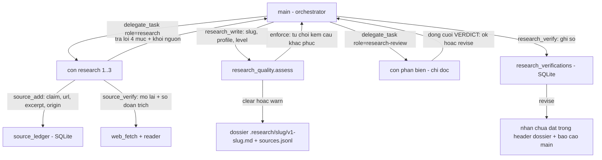

# Kế hoạch thi công — Vòng 27 Phạm vi B: Sổ nguồn, Thang nguồn, Hồ sơ việc, Cổng chất lượng, Pha phản biện research

> **TL;DR:** Biến việc research từ "trả lời dài" thành **hồ sơ có sổ nguồn kiểm được**: mỗi khẳng định gắn một dòng sổ (URL + đoạn trích nguyên văn + ngày lấy + tầng + nguồn tin gốc), thang 4 tầng cứng trong mã đổi được bằng biến môi trường, ba nhóm hồ sơ với trường bắt buộc riêng, cổng chất lượng riêng (`research_quality.py`, KHÔNG nhét vào `evidence_gate`), và một con phản biện `research-review` kiểu `plan-review` với `revise` chặn MỘT vòng.

Tài liệu này là **kế hoạch thi công** cho Phạm vi B (sổ nguồn / thang nguồn / hồ sơ việc / luật số nguồn / cổng chất lượng / pha phản biện / skill chết / chia đợt). Nguồn chân lý về ý chủ nhà: `/code/.plans/v27-owner-answers.md` (8 vòng, decision #5955–#5997). Đo lường nền: `/var/tmp/v27/feasibility-probes.md`, `/var/tmp/v27/research-agent-inventory.md`, `/var/tmp/v27/research-docs-history.md`, `/var/tmp/v27/research-tools-inventory.md`.

**Nhánh:** `vorflux/v22-peer-mesh`, HEAD `2add905`, cây sạch. Tài liệu này KHÔNG sửa mã nguồn.

---

## 1. Bất biến phải giữ (đọc trước khi thi công)

| # | Bất biến | Nguồn |
|---|---|---|
| I1 | **KHÔNG** thêm tiêu chí hình dạng/citation vào `evidence_gate.py`. Cổng cho research là **module riêng** (`research_quality.py`). | D-18, F1 |
| I2 | **KHÔNG** dựng khối/dải/huy hiệu quanh câu trả lời cuối; hình dạng sống trong **skill**, prompt chỉ một dòng bằng chứng cứng. | D-19…D-25, D-26…D-32, F2, F3, F6 |
| I3 | **KHÔNG** thêm giá trị `status` mới cho session; mọi trạng thái "chưa xong" đi qua `partial` + bản ghi; UI ánh xạ giá trị lạ thành `failed`. | `docs/tracking/owner-decisions.md` §5(1); `SubagentInspectorPanel.tsx:170` |
| I4 | Cổng tất định chạy **TRƯỚC khi ghi**, và **chỉ là lớp bổ sung** (không thay cổng cũ). | Work Description; khuôn `write_plan` (`runtime.py:4329`, `:4333`, `:4342`) |
| I5 | **Ghi sổ hỏng ⇒ chỉ log + đi tiếp**, không bao giờ giết một quyết định. | §6.34 keeps; khuôn `plan_verify` (`runtime.py:4550-4607`) |
| I6 | Mọi bảng SQLite mới phải **tự lọc theo `turn`**; `store.events()` chỉ trả tối đa **500 hàng** (`session_store.py:184-187`). | F11, §5(5) |
| I7 | Migration DB phải **cộng thêm** qua `_add_missing_columns()` (`session_store.py:115-135`), try/except, không bao giờ làm sập khởi động. | §5(4) |
| I8 | Thêm vai mới ⇒ sửa **4 chỗ**: `ROLES` (`roles.py:170-184`), enum `delegate_task` (`tool_contracts.py:131`), `ROLE_SKILLS` (`skills/commands.py:20-32`), `HARNESS_ROLES`/`ROLE_NAMES` (`frontend/src/lib/harnessRoles.ts:3,19`). | `test_plan_review_role.py:72-74` |
| I9 | Thêm tool mới ⇒ cập nhật `TOOL_GROUPS` (`tool_groups.py`) + **3 test ghim số 25 công cụ**: `test_journal_tools.py:63`, `test_runtime_info.py:141,154,164`. | đo trực tiếp |
| I10 | Đầu ra của research **100% là tệp**; chat chỉ có báo cáo ngắn của main. | #5973, #5980 |
| I11 | Bảng tầng/ngưỡng nằm **trong mã**, đổi bằng **biến môi trường**, **không cần giao diện**. | #5975 |
| I12 | Con **không bao giờ** được hỏi chủ nhà (`DECISION_UNAVAILABLE`, `runtime.py:3977-3979`); mọi câu hỏi đi qua main. | đo trực tiếp |
| I13 | Giữ nguyên `plan-review`, `plan_verify`, hai cổng kế hoạch. | F24, D-33/D-34/D-36/D-38/D-39 |

---

## 2. Hiện trạng đo được (căn cứ, không phải giả định)

| Mã | Hiện trạng | Bằng chứng (file:line) | Hệ quả |
|---|---|---|---|
| D1 | Không cổng nào kiểm câu trả lời research có nguồn hay không | `evidence_gate.py:122-124` (`REASONS` không có mã nguồn/URL); `:420-483` (`artifacts_from_calls` không sinh mảnh cho `web_search`/`web_fetch`); `:497-543` (`claim_paths` chỉ bắt đường dẫn tệp/lệnh) | Phiên research trả bài 8 000 ký tự **không một URL nào** và vẫn `sufficient` |
| D2 | Không có vòng phản biện độc lập nào cho research; vòng bắt buộc duy nhất là vòng **plan** | `runtime.py:4496-4607` (`plan_critique`/`plan_verify`), `:2510-2521` (`plan_approval_blocked`) | Hồ sơ research không có ai phản biện, không có nhãn "chưa đạt" |
| D3 | Kỹ năng chuyên môn có trong repo nhưng **không nối vào đường sống** | `vendor/hermes/skills/research/grounded-citations/SKILL.md` nhắc `web_extract` 5 lần (`:50,94,137,228,237`), tool thật tên là `web_fetch` (`tool_contracts.py:64-68`); `skill_view` không tự chạy script (`tool_contracts.py:69`); không chỗ nào trong `backend/src/agentbox` đặt `HERMES_HOME` | Máy sổ/verify của skill là **văn xuôi model có thể bỏ qua**; câu lệnh trong skill gọi tool không tồn tại |
| D4 | Văn bản chỉ dẫn đòi hình dạng nhưng **không ai đọc lại** | `roles.py:140-152` (`RESEARCH_INSTRUCTIONS`, 4 mục, `### Primary Sources & Citations` REQUIRED); `runtime.py:1067-1076` (`CHILD_RESULT_CONTRACT`, 4 mục) | Câu trả lời con sai hình dạng đi thẳng lên cha |
| D5 | Kết quả research bị nén ở CẢ HAI ĐẦU | `runtime.py:1015` (`CHILD_ANSWER_MAX_CHARS = 8000`); `limits.py:135` (`PEER_WAIT_RESULT_CHARS = 16000`); `compression.py:327-343`; `runtime.py:3369-3389` (trần 24 000) | Hồ sơ dài hơn 8 000 ký tự **không tồn tại ở phía cha** ⇒ phải ghi thành **tệp** |
| D6 | Ngân sách con bị nhiều trần chồng | `limits.py:30-31` (`CHILD_MAX_STEPS=40`, `CHILD_DEADLINE_SECONDS=420`), `:111-112` (`CHILDREN_PER_TURN_MAX=12`, fan-out 3/6/8) | Không thể "đọc nốt" trong một con; phải fan-out nhiều nhánh |
| D7 | Không cơ chế "đọc nốt"/"đọc sâu hơn": không offset, không đếm số nguồn, không đòi tối thiểu N nguồn | `web.py:497-528` (`fetch`, không tham số offset); `limits.py:207-214` (`BOXFOX_PARALLEL_READ_TOOLS` mặc định tắt) | "Đủ kỹ" hiện không có định nghĩa máy kiểm được |
| D8 | Lượt research không để lại dấu vết nguồn cho người đọc | `runtime.py:2683-2705` (`pin_evidence`: chỉ `file`/`command`/`image`/`child`); `session_journal.py:181-195` | Đọc lại lượt cũ không biết nguồn nào đã dùng |
| D9 | Đo sống: đầu đọc gzip nhị phân và trang lỗi giả | `web.py:510-518` chỉ gọi reader khi thân < 200 ký tự; probe: `nhandan.vn` 17 421 ký tự rác, `vbpl.vn` trang 404 giả 14 529 ký tự, `moh.gov.vn` trả 200 với **165–259 byte** | "Thành công giả" phải bị bắt bằng luật máy kiểm (A5) |
| D10 | Dossier hôm nay không tồn tại: research không có `file_write`, không có chỗ ghi | `roles.py:18` (`RESEARCH = READ \| {'browser_use','web_search','web_fetch'}`) | Cần đường ghi mới **ở phía main**, không mở quyền ghi cho con |

---

## 3. Kiến trúc và luồng mới



Thành phần mới (đều là **lớp bổ sung**, không thay thế cái đang chạy):

| Loại | Tên | Tệp / vị trí |
|---|---|---|
| Module thuần | `research_ledger.py` | `backend/src/agentbox/agent_core/research_ledger.py` |
| Module thuần | `source_tiers.py`, `research_profiles.py`, `research_quality.py`, `research_header.py` | cùng thư mục `agent_core/` |
| Bảng SQLite | `source_ledger`, `research_dossiers`, `research_verifications` | `backend/src/agentbox/memory/session_store.py` |
| Tool mới (6) | `source_add`, `source_list`, `source_verify`, `research_write`, `research_verify`, `research_status` | `tool_contracts.py` + handler trong `runtime.py` + nhóm `researchLedger` trong `tool_groups.py` |
| Vai mới (1) | `research-review` | `roles.py` (thêm ở CUỐI danh sách để không đảo thứ tự đang ghim) |
| Op phía box (1) | `research_write` | `backend/src/agentbox/sandbox/worker.py` + `deploy/docker/research_files.py` |
| Công tắc | `BOXFOX_RESEARCH_GATE` (`enforce`/`warn`/`off`), `BOXFOX_SOURCE_TIERS` (JSON inline hoặc đường dẫn tệp) | `limits.py` khối vòng 27, đọc bằng `mode_from_env` (`runtime.py:971-984`) |

Số công cụ orchestrator: **25 → 31** (xem I9).

---

## 4. Chi tiết 8 mục

### A1 — Sổ nguồn (`source_ledger`)

**(a) Hiện trạng.** Chưa có gì: `evidence_gate.REASONS` (`evidence_gate.py:122-124`) không có mã nguồn; `session_store.py` chỉ có `plan_reviews`/`plan_evaluations`/`plan_verifications`/`plan_owners` (`:52-82`); con research chỉ có `web_search`/`web_fetch` và **không có `file_write`** (`roles.py:18`). Cơ chế gần nhất là cổng nguồn của plan (`plan_quality.sources_issues` `plan_quality.py:341-374` + `runtime.plan_sources_evidence` `runtime.py:2422-2454`) — **tái dùng hàm thuần, KHÔNG tái dùng đường `write_plan`**.

**(b) Thay đổi đề xuất.**

1. Bảng `source_ledger` (thêm trong `SessionStore._init_schema`, cộng thêm, không phá DB cũ):
   ```sql
   CREATE TABLE IF NOT EXISTS source_ledger (
     id            INTEGER PRIMARY KEY AUTOINCREMENT,
     session_id    TEXT NOT NULL,
     child_id      TEXT,                  -- phiên con đã thêm dòng này (NULL = main tự thêm)
     job           TEXT,                  -- slug đang làm, để sau này tách sổ theo việc
     row_id        TEXT NOT NULL,         -- 's1', 's2'... duy nhất trong phiên
     claim         TEXT NOT NULL,         -- khẳng định mà dòng này đỡ
     url           TEXT NOT NULL,
     host          TEXT NOT NULL,
     tier          INTEGER NOT NULL,      -- 0 = tài liệu chủ nhà; 1..4 = thang nguồn
     type          TEXT NOT NULL,         -- 'normal' | 'host-doc' | 'official-social' | 'confirm'
     excerpt       TEXT NOT NULL,         -- ĐOẠN TRÍCH NGUYÊN VĂN (không phải tóm tắt)
     fetched_at    TEXT NOT NULL,         -- ISO8601 UTC, ngày lấy
     origin        TEXT,                  -- 'nguồn tin gốc' do con khai (#5996), nullable
     method        TEXT,                  -- 'web_search' | 'web_fetch' | 'reader' | 'workspace' | 'terminal'
     source_row_id TEXT,                  -- khi type='confirm': trỏ dòng gốc được xác nhận
     status        TEXT NOT NULL,         -- 'unverified' | 'ok' | 'stale'
     fingerprint   TEXT,                  -- sha256[:16] của tập shingle đoạn trích (research_ledger)
     payload       TEXT,                  -- JSON trường hồ sơ (docNumber, effectiveDate, validity, version...)
     turn          INTEGER NOT NULL,
     step          INTEGER,
     created       TEXT NOT NULL,
     UNIQUE(session_id, row_id)
   );
   CREATE INDEX IF NOT EXISTS idx_source_ledger_turn ON source_ledger(session_id, turn);
   ```
   `source_ledger` **nằm ngoài cascade `delete(sid)`** giống hai sổ kế hoạch (§6.33(c)): sổ là bằng chứng của một **tệp còn nằm trên đĩa**, không phải của phiên. `delete()` (`session_store.py:776-796`) xoá bằng **danh sách `DELETE` ghi tay** nên việc phải làm là **không thêm dòng DELETE nào** cho ba bảng mới + ghi một chú thích "cố ý" cùng chỗ với chú thích của vòng 25.
2. `SessionStore`: `next_source_row_id(sid)`, `source_add(...)`, `source_rows(sid, *, turns=None, child_id=None, limit=400)`, `source_row(sid, row_id)`, `source_counts_by_child(sid, turn)`, `delete` cập nhật danh sách bảng miễn cascade.
3. `agent_core/research_ledger.py` (thuần, không I/O, không bao giờ ném): `Row` dataclass; `SCHEMA_VERSION = 1`; `fingerprint(excerpt)` (shingle 5 từ, sha256[:16]); `origin_unit(row)`; `independent_count(rows)`; `key_claim(...)`; `assess_rows(session, rows, profile)` trả `list[Issue]`; hằng số `MIN_EXCERPT_CHARS = 80`, `MIN_FINGERPRINT_CHARS = 200`, `SHINGLE_SIZE = 5`, `JACCARD_MERGE = 0.85`, `MAX_LEDGER_ROWS = 400`.
4. Tool `source_add` (chỉ-ghi-vào-sổ; dùng được cho con research **và** main):
   `{claim, url, excerpt, origin?, method?, type?, sourceRowId?, payload?, tier?}` → trả `{rowId, tier, type, host, fetchedAt, counts}`.
   Từ chối bằng mã: `SOURCE_EXCERPT_EMPTY` (đoạn trích < `MIN_EXCERPT_CHARS`), `SOURCE_URL_INVALID`, `SOURCE_CLAIM_EMPTY`, `SOURCE_TIER_UNKNOWN` (host không xếp được tầng và không khai `type`).
5. Tool `source_list` `{turn?, childId?, tier?, limit?}` → `{rows, counts: {byTier, byChild, total}, window}`. **Không** đọc `store.events()`.
6. `roles.py`: `SOURCE_TOOLS = frozenset({'source_add','source_list'})`; `RESEARCH = READ | {'browser_use','web_search','web_fetch'} | SOURCE_TOOLS`; vai `research-review` (đợt 4) nhận `source_list` (không nhận `source_add`).
7. `tool_groups.py`: nhóm `researchLedger` = `('source_add','source_list','source_verify')`, `alwaysOn=False`; nhóm `researchDossiers` = `('research_write','research_verify','research_status')`, `alwaysOn=False`. Đặt ngay sau `delegationPlans`.
8. Phía main, sau mỗi lần ghi hồ sơ: `pin_source_ledger(sid, turn, dossier)` ghim **một hàng `E:`** (`session_journal.insert_row(..., 'evidence', ...)`) với con trỏ `{'type':'url','url':...,'tier':...}` — trả lời D8 **trong mô hình nhật ký đang có**, không thêm kind mới.

**(c) Cách đo nghiệm thu.**
- `backend/tests/unit/test_research_ledger.py`, `test_source_ledger_store.py` (danh sách ca ở §6).
- Sống: một lượt research thật, con gọi `source_add` 3 lần ⇒ `source_list` của main thấy đúng 3 dòng, `sqlite3` thấy cột `excerpt`/`fetched_at`/`tier` khác NULL; hàng `E:` của lượt có ≥1 con trỏ `type='url'`.
- Nghiệm thu máy: `.venv/bin/python -m pytest backend/tests/unit/test_research_ledger.py backend/tests/unit/test_source_ledger_store.py -q`.

---

### A2 — Thang nguồn 4 tầng + "tài liệu chủ nhà đưa vào"

**(a) Hiện trạng.** Không có bảng xếp tầng **nguồn** nào trong đường sống: chữ `tier` trong repo chỉ mang hai nghĩa khác — *risk tier* của tool (`tools/base.py:18`, `tools/registry.py:58`) và *3-tier prompt* của engine cũ (`agent_core/context.py:1-6`, không nằm trên đường sống của lượt); `web.py:63` chỉ có `UNTRUSTED_NOTE`. Đo sống (`/var/tmp/v27/feasibility-probes.md`): `vanban.chinhphu.vn` qua đầu đọc tốt 13 830 ký tự; `kcb.vn` 9 217; `vbpl.vn` trả **trang 404 giả**; `moh.gov.vn` **hết thời gian chờ** hoặc 165–259 byte; `thuvienphapluat.vn` **403 cứng**. Nghĩa là "bản gốc mở được hay không" phải là **kết quả đo**, không phải phán đoán của model.

**(b) Thay đổi đề xuất.**

1. `agent_core/source_tiers.py` (thuần): `TIERS = {0:'owner-supplied',1:'primary-official',2:'state-press',3:'secondary',4:'unverified'}`; `TIER_DEFAULTS` cứng trong mã theo #5983:
   - **Tầng 1**: hậu tố `.gov.vn`, `.g ov`? (không), `vanban.chinhphu.vn`, `vbpl.vn`, `chinhphu.vn`, `moh.gov.vn` + `.gov.vn`, `who.int`, `.europa.eu`, `doi.org`, `arxiv.org`, `*.github.com/<org>` (kho mã chính chủ), tài liệu hãng (`docs.*`, `.dev`).
   - **Tầng 2**: `nhandan.vn`, `baochinhphu.vn`, `vietnamplus.vn`, `vov.vn`, `vtv.vn`, `vnexpress.net`, `tuoitre.vn`, `thanhnien.vn`, `xaydungchinhsach.chinhphu.vn`.
   - **Tầng 3**: mặc định cho host không biết (`wikipedia.org`, `stackoverflow.com`, `developer.mozilla.org`, blog có tác giả…).
   - **Tầng 4**: `facebook.com`, `x.com`, `twitter.com`, `tiktok.com`, `youtube.com`, `reddit.com`, `medium.com`, `*.blogspot.com` **trừ khi** host nằm trong bảng `OFFICIAL_SOCIAL` (A2.3) — lúc đó `type='official-social'`.
   - **Tầng 0**: `type='host-doc'` khi `method='workspace'` (tệp người dùng đưa vào `.uploaded_artifacts`/`.generated_artifacts`) hoặc `type='host-doc'` khai tay; luôn ghi rõ "do chủ nhà cung cấp", **đứng trên tầng 1** (#5962).
2. `classify(url, *, type=None, method=None) -> Tier` (thuần): trả `{tier, type, host, reason}`; `reason` là chuỗi máy đọc được (`host-in-table`, `gov-vn-suffix`, `default-unknown`, `owner-supplied`, `official-social`, `env-override`).
3. `BOXFOX_SOURCE_TIERS` (#5975): giá trị là JSON inline hoặc đường dẫn tệp JSON có dạng `{"tiers": {"1": ["a.vn"], "2": ["b.vn"]}, "officialSocial": ["facebook.com/soyte.hcm"]}`. Hợp lệ ⇒ phủ lên bảng cứng (`env-override`). Sai/hỏng ⇒ **dùng bảng cứng + `system_log.write('source.tiers.mode_unknown')` + notice** (khuôn `mode_from_env`, hạ cấp im lặng bị cấm).
4. Luật #5984 (báo chí vs bản gốc) thành lời trong `RESEARCH_INSTRUCTIONS` (đọc ở đợt 2, ~10 dòng, không nhồi vào prompt hệ thống dài): *"Khẳng định về **nội dung văn bản** (điều/khoản, số hiệu, mức phí) phải trỏ **bản gốc** nếu mở được; báo chí chính thống đủ cho **sự kiện**; bản gốc không mở được thì ghi rõ **'chưa mở được bản gốc'** và hạ khẳng định xuống mức 'theo báo chí'."*
5. Luật #5991/#5997 (MXH chính thức) thành dữ liệu: `OFFICIAL_SOCIAL` là bảng host+đường dẫn (Sở Y tế, Bộ, toà soạn) ⇒ `type='official-social'`, **tính ngang chính thống** nhưng phải có **bản xác nhận thứ hai**: hoặc một dòng `type='confirm'` khác host cùng nội dung, hoặc một nguồn tầng ≤ 2 nhắc lại (khớp bằng `fingerprint`/`origin`). Ưu tiên bản web: nếu cùng nội dung có ở trang web của cơ quan thì **bắt buộc** dùng URL web làm dòng chính, bài MXH thành `type='confirm'`.
6. Tool `source_verify` `{rowId}` → mở lại URL bằng đường fetch hiện có (`web.py:fetch`), so đoạn trích:
   - khớp (Jaccard ≥ 0.85) ⇒ `status='ok'` + `matched: true`;
   - không khớp ⇒ `status='stale'` + `matched: false`;
   - không mở được ⇒ `status='unverified'` + `unreachable: true` + `viaReader: bool`;
   - **bắt "thành công giả"**: `http=200` mà thân < 300 ký tự, hoặc tiêu đề/từ chặn đầu là `Trang chủ`/`Warning: This page maybe not yet fully loaded` (`moh.gov.vn`, `vbpl.vn` đã đo) ⇒ trả `fakeSuccess: true`, **không** cho `status='ok'`.
7. `agent_core/research_header.py`: khối comment HTML đầu dossier (khuôn `plan_header.py:115-137`, **không** cần bản sao phía box ở đợt này):
   ```
   <!-- boxfox-research
   Version: v1
   ResearchId: health-insurance-admission
   Profile: official-document/health
   Level: 2
   Critique: none
   Gate: clear
   Rows: 12
   -->
   ```
   `parse_research_header(markdown) -> ResearchHeader | None`, `status ∈ {ok, invalid, missing}`, **không bao giờ ném**.
8. Đường ghi: **main** (không phải con) gọi `research_write`; op box `research_write` ghi `markdown` + `sourcesJsonl` + `sourcesMd` trong **một** lời gọi (xem A3/A5 cho thứ tự cổng-trước-ghi).

**(c) Cách đo nghiệm thu.**
- `backend/tests/unit/test_source_tiers.py`, `test_research_verify_source.py` (fixture HTTP ghi lại: thân gzip nhị phân, thân 200-byte, trang chủ giả, 403 cứng — dùng bảng đo ở `/var/tmp/v27/feasibility-probes.md`).
- Sống (ghi vào `docs/tracking/test-rounds.md`): chạy lại đúng 5 URL đã đo (`nhandan.vn`, `vanban.chinhphu.vn/?pageid=27160&docid=207396`, `vbpl.vn/TW/Pages/vbpq-toanvan.aspx?ItemID=1`, `moh.gov.vn`, `thuvienphapluat.vn`) qua `source_verify` ⇒ phải ra `fakeSuccess`/`unreachable` ở đúng những chỗ đã đo, **không** ra `ok`.
- Máy: `.venv/bin/python -m pytest backend/tests/unit/test_source_tiers.py backend/tests/unit/test_research_verify_source.py -q`.

---

### A3 — Hồ sơ việc: ba NHÓM + dạng "tài liệu chủ nhà đưa vào", trường bắt buộc riêng

**(a) Hiện trạng.** Không có khái niệm hồ sơ/loại việc trong mã. Thứ gần nhất là `plan_eval` P1–P8 (`plan_eval.py:60-70`, `RUBRIC='P1-P8/1'`) — rubric của **plan**, không có trường văn bản pháp lý. `write_plan` nhận `markdown` thuần; không có metadata nào ngoài khối `boxfox-plan` (`plan_header.py:115-137`).

**(b) Thay đổi đề xuất.**

1. `agent_core/research_profiles.py` (bảng khai báo, thuần):
   ```python
   FIELD = namedtuple('Field', 'key required kind label')   # required: 'hard' | 'soft'
   PROFILE = namedtuple('Profile', 'id group label fields validity key_kinds min_independent')
   ```
   Ba nhóm (#5988): `official-document` (luật/tài chính/y tế), `academic` (paper/tài liệu hãng/kho mã), `market` (giá/đối thủ/người dùng). Cộng `host-doc` là **loại trường**, không phải nhóm: mọi hồ sơ đều nhận dòng `type='host-doc'` (tầng 0) và dòng đó tự thoả luật hai nguồn (#5985).
   Profile khởi điểm (giá trị **nháp**, xem §7 cho chỗ chờ phỏng vấn): `official-document/law` (`docNumber` hard, `effectiveDate` hard, `validity ∈ in_force|expired` hard, `issuingBody` soft, `validity=True`), `official-document/health` (như luật + `appliesTo` soft), `official-document/finance` (`rate`/`fee` hard, `effectiveDate` hard, `validity=True`), `academic/paper` (`doi` hoặc `arxivId` hard, `year` hard, `venue` soft, `authors` soft, `validity=False`), `academic/vendor-doc` (`product`, `version`, `publishedAt` hard, `validity=False`), `academic/repo` (`repo`, `commit` hoặc `version`, `validity=False`), `market/price` (`price`, `currency`, `region`, `capturedAt` hard, `validity=False`), `market/competitor`, `market/users`.
2. **Cứng với trường then chốt, mềm phần còn lại** (#5989): `required='hard'` ⇒ thiếu thì cổng **từ chối** (`research-profile-field-missing`, kèm `field`); `required='soft'` ⇒ chỉ vào `data.softMissing`, **không** từ chối, chỉ hiện trong báo cáo.
3. **Hiệu lực văn bản chỉ áp cho usecase cần** (#5987): `validity=True` ⇒ mỗi dòng `type != 'confirm'` phải có `payload.docNumber` + `payload.effectiveDate` + `payload.validity` khi khẳng định là điều luật/số liệu có hiệu lực; thiếu ⇒ `research-validity-missing`. `validity=False` (paper/market) ⇒ **không bao giờ** đòi ngày hiệu lực; test ghim điều này.
4. **Main tự chọn hồ sơ và nói rõ trong báo cáo** (#5995): `research_write(args={researchId, profile, level, markdown, ...})`; tham số `profile` **bắt buộc**; tên hồ sơ + nhóm đi vào header dossier (`Profile:`) và vào câu trả lời `research_write` (`{'profile':..., 'group':..., 'label':'văn bản chính thống (y tế + luật)'}`) để main chép vào báo cáo ngắn. **Không** có `ask_user` trước khi chạy (đúng #5995).
5. **Không mở quyền ghi cho con**: con research vẫn không có `file_write`/`research_write` (`roles.py:18`); nó chỉ gọi `source_add`. Hồ sơ do main ghi.
6. Bảng `research_dossiers` (đợt 3):
   ```sql
   CREATE TABLE IF NOT EXISTS research_dossiers (
     research_id   TEXT NOT NULL,          -- slug, không có tiền tố vN
     version       INTEGER NOT NULL,
     session_id    TEXT NOT NULL,
     relative_path TEXT NOT NULL,          -- '.research/<slug>/v1-<slug>.md'
     profile       TEXT, level INTEGER, critique TEXT, gate TEXT, rows INTEGER,
     bytes         INTEGER, created TEXT NOT NULL,
     PRIMARY KEY (research_id, version)
   );
   ```
7. Đường ghi phía box: `deploy/docker/research_files.py` (`write_research(args)`, `RESEARCH_ROOM = '.research'`, `RESEARCH_MAX_BYTES = 1 MiB`, slug `[a-z0-9]+(-[a-z0-9]+)*`, **không** tự tăng version — trùng `RESEARCH_VERSION_TAKEN`), gọi qua `sandbox/worker.py` (mẫu `write_plan(args)` `sandbox/worker.py:467-508`).
   Tệp sinh ra: `.research/<slug>/v<N>-<slug>.md` (hồ sơ), `.research/<slug>/sources.jsonl` (mỗi dòng một nguồn, có `rowId/tier/origin/excerpt/fetchedAt`), `.research/<slug>/sources.md` (bản người đọc). Ghi 3 tệp trong **một** op; ghi tệp tạm rồi `rename`.
   `.research/` **không cần** sửa `box-entrypoint.sh`/`ide-proxy.py`: `workspace_files.list_directory` (`deploy/docker/workspace_files.py:420`) chỉ ẩn `.generated_artifacts`/trash, nên chủ nhà đọc được dossier ngay trong trình duyệt workspace hiện có.

**(c) Cách đo nghiệm thu.**
- `backend/tests/unit/test_research_profiles.py`, `test_research_write.py`; phía box `deploy/docker/tests/test_research_files.py`.
- Sống: `deploy/docker/tests` + một lượt thật ghi `.research/health-insurance-admission/v1-health-insurance-admission.md`, mở bằng đường workspace files thấy nội dung + `sources.jsonl` đếm đúng số dòng.
- Máy: `.venv/bin/python -m pytest backend/tests/unit/test_research_profiles.py backend/tests/unit/test_research_write.py -q && .venv/bin/python -m pytest deploy/docker/tests/test_research_files.py -q`.

---

### A4 — Luật số nguồn: hai nguồn độc lập, máy kiểm được

**(a) Hiện trạng.** Không có khái niệm số nguồn/độc lập ở đâu trong mã. Cổng nguồn của plan đếm **host** (`plan_quality.cited_hosts` `:331-338`, `_HOST_RE` `:285-291`) — đếm host **không** phải đếm nguồn độc lập: hai toà soạn cùng đăng một bản tin của TTXVN là **hai host, một nguồn** (#5996).

**(b) Thay đổi đề xuất.**

1. `research_ledger.independent_count(rows) -> int` + `origin_units(rows) -> list[Unit]`, thuật toán **máy kiểm được**:
   - **Bước 1 — gom theo "nơi đăng"**: mỗi dòng là một *place* = `(host, path)`; dòng `type='confirm'` **không** tính là place mới, nó chỉ đỡ dòng `source_row_id`.
   - **Bước 2 — gom theo *nguồn tin gốc* đã khai**: `origin_unit(row) = row.origin.strip().lower() or row.host`. Cùng `origin` ⇒ **một** unit, dù khác host (dòng `nguồn: TTXVN` của con, #5996).
   - **Bước 3 — gom theo **bản tin trùng**: hai dòng khác host có `fingerprint` và độ trùng shingle Jaccard ≥ `JACCARD_MERGE` (0.85) **và** đoạn trích ≥ `MIN_FINGERPRINT_CHARS` (200) ⇒ **một** unit, mang `reason='same-story'`. (Bản tin do một hãng phát lại sẽ trùng văn bản; hai nơi viết độc lập thì không.)
   - **Bước 4 — đếm** `independent_count = len(units)`.
2. **Khẳng định then chốt** (#5985): `key_claim(row, profile)` = đúng khi `row.payload` chạm trường then chốt của hồ sơ **hoặc** `claim`/`excerpt` khớp một trong các mẫu máy kiểm: số liệu (`_NUMBER_RE`), điều luật (`_LAW_RE = (điều|khoản|nghị định|thông tư|luật)\s+\d+` + số hiệu `\d+/\d{4}/[A-ZĐ-]+`), giá (`_PRICE_RE = (giá|vnd|usd|đồng)\b` kèm số), ngày (`_DATE_RE`), tên riêng (`payload.names` hoặc `_PROPER_RE` hai từ viết hoa liền nhau).
3. **Luật**: khẳng định then chốt cần `independent_count ≥ 2` cho **đúng nhóm unit của nó**, **TRỪ** khi mọi unit là **tầng 0 hoặc tầng 1** ⇒ một nguồn đủ (#5985). Vi phạm ⇒ issue `research-claim-single-source` với `detail = f'{row_id}: {origin_unit}'` + câu khắc phục.
4. **Dòng khai bắt buộc**: mọi dòng tầng 2–4 **phải** có `origin` (chuỗi) khi có ≥ 2 dòng cùng nội dung; thiếu khai mà máy phát hiện trùng bản tin ⇒ `research-origin-undeclared`. Con phản biện ở đợt 4 **kiểm lại phần khai này** (#5996) bằng cách đọc `sources.md` + `source_list` và đối chiếu chéo.
5. Không dùng lại `plan_quality.sources_issues` cho research, nhưng **tái dùng đúng ba hàm thuần** đã có tiền lệ và đã sửa BUG-81: `strip_www` (`plan_quality.py:304-315`), `normalize_path` (`:318-328`), `cited_hosts` (`:331-338`) — gọi từ `research_quality.py`, **không** sửa chúng.

**(c) Cách đo nghiệm thu.**
- Ca trong `test_research_ledger.py`: `test_the_same_story_published_at_two_places_counts_as_one_source`, `test_two_places_that_declare_the_same_origin_count_as_one_place`, `test_a_declared_origin_lets_two_different_hosts_count_as_two`, `test_a_tier_one_source_alone_satisfies_a_key_claim`, `test_a_key_claim_backed_by_one_place_is_reported_as_single_source`.
- Sống: một ca thật lấy tin TTXVN đăng lại ở 2 toà soạn ⇒ `independent_count == 1`, và cổng từ chối; thêm 1 nguồn khác nguồn gốc ⇒ qua.
- Máy: `.venv/bin/python -m pytest backend/tests/unit/test_research_ledger.py -q`.

---

### A5 — Cổng chất lượng cho câu trả lời research (`research_quality.py`)

**(a) Hiện trạng.** **Không cổng nào kiểm nguồn**: `evidence_gate.REASONS` (`evidence_gate.py:122-124`) chỉ có 11 mã về thay đổi/đường dẫn/ảnh; `artifacts_from_calls` (`:420-483`) không sinh mảnh cho `web_search`/`web_fetch`; `claim_paths` (`:497-543`) chỉ bắt đường dẫn/lệnh. Cổng nguồn duy nhất gắn `write_plan` (`runtime.py:4333-4350`) và đã có 15 ca test (`backend/tests/unit/test_plan_quality.py` — chạy được hôm nay: 15 passed).

**(b) Thay đổi đề xuất.** Hai tầng kiểm, **cả hai** ở ngoài `evidence_gate.py` (I1):

*Tầng con — CHÚ THÍCH tất định (không công tắc, không chặn):* khi một phiên con mang vai `research` kết thúc, `runtime` gọi `research_quality.annotate_child_answer(answer, ledgers, calls)`:
- hình dạng: đủ 4 mục của `RESEARCH_INSTRUCTIONS` (`roles.py:140-152`) — thiếu ⇒ `research-shape-missing` (detail = tên mục);
- nguồn: lượt con có gọi `web_search`/`web_fetch` mà câu trả lời **không** có URL nào ⇒ `research-sources-missing`;
- URL trong câu trả lời mà **không** có dòng sổ tương ứng ⇒ `research-sources-unproven` (bài học H7/BUG-88: chỉ tính dòng sổ, **không** tính tham số gọi tool);
- con `research` có trong `child_goals` của lượt mà số dòng sổ của nó `== 0` ⇒ `research-lineage-missing`.
Kết quả đi vào payload `child_finish`/`deliver_child_result` ở khoá `researchGate = {issues, remedy, rows, mode: 'note'}` + một `notice` (`RESEARCH_GATE_NOTE`). **Không** đổi `status` (I3), **không** viết lại câu trả lời của con (I2/D-18).

*Tầng hồ sơ — CỔNG có công tắc, chạy TRƯỚC khi ghi (I4):* `research_quality.assess(session, *, profile, level, markdown, rows, child_ids) -> Verdict{ok, issues[], counts, soft[]}` với 13 mã:

| Mã | Khi nào | Câu khắc phục (rút gọn) |
|---|---|---|
| `research-sources-missing` | Hồ sơ có khẳng định ngoài mà **không** dòng sổ nào | Thêm `source_add` cho từng khẳng định, hoặc ghi rõ "kết luận từ mã trong workspace" |
| `research-sources-unproven` | URL trong hồ sơ không có dòng sổ tương ứng | Mở URL bằng `web_fetch` rồi `source_add` kèm đoạn trích |
| `research-excerpt-missing` | Dòng sổ thiếu `excerpt` ≥ `MIN_EXCERPT_CHARS` | Lưu **đoạn trích nguyên văn** đã đọc, không phải tóm tắt |
| `research-tier-unknown` | Host không xếp được tầng và dòng thiếu `type` | Khai `type` (`host-doc`/`official-social`) hoặc dùng nguồn khác |
| `research-claim-single-source` | Khẳng định then chốt < 2 nguồn độc lập (A4) | Thêm nguồn khác nguồn tin gốc, hoặc hạ xuống "suy luận" |
| `research-origin-undeclared` | Trùng bản tin mà không khai `origin` | Khai một dòng `nguồn: TTXVN` (hoặc nguồn gốc thật) |
| `research-host-doc-unmarked` | Tệp chủ nhà dùng làm nguồn mà không khai `type='host-doc'` | Đánh dấu "do chủ nhà cung cấp" |
| `research-doc-pointer-missing` | Khẳng định nội dung văn bản, chỉ có báo chí, **bản gốc mở được** (`source_verify` ra `ok`) | Trỏ bản gốc; không mở được thì ghi "chưa mở được bản gốc" |
| `research-validity-missing` | Usecase `validity=True` thiếu số hiệu/ngày hiệu lực/dấu hiệu lực | Ghi số hiệu + ngày hiệu lực + còn/hết hiệu lực |
| `research-social-unconfirmed` | Dòng `official-social` thiếu bản xác nhận thứ hai | Thêm trang web của cơ quan hoặc báo chính thống nhắc lại |
| `research-profile-field-missing` | Thiếu trường `hard` của hồ sơ | Bổ sung/cập nhật hồ sơ sang hồ sơ đúng |
| `research-shape-missing` | Hồ sơ thiếu mục bắt buộc | Bổ sung mục còn thiếu của hồ sơ |
| `research-critique-missing` | `mode='enforce'` và hồ sơ chưa có phản biện `ok` cho version này | Giao `research-review` rồi `research_verify` |

Công tắc: `limits.py` thêm
```python
RESEARCH_GATE_ENV = 'BOXFOX_RESEARCH_GATE'
RESEARCH_GATE_MODES = ('enforce', 'warn', 'off')
RESEARCH_GATE_DEFAULT_MODE = 'enforce'
RESEARCH_QUALITY_PREFIX = 'RESEARCH_QUALITY_REJECTED'
RESEARCH_MIN_EXCERPT_CHARS = 80
RESEARCH_MAX_ROWS_PER_DOSSIER = 400
```
`mode` đọc bằng `mode_from_env` (`runtime.py:971-984`) ⇒ giá trị lạ ⇒ mặc định `enforce` + `RESEARCH_GATE_MODE_UNKNOWN` + `system_log.write('research.gate.mode_unknown')` + notice (`evidence.mode_unknown` là khuôn, `runtime.py:2524`).
`enforce` ⇒ `research_write` **ném** `RESEARCH_QUALITY_REJECTED` + danh sách `missing[]` (mã + detail + remedy), không ghi tệp, không cấp version. `warn` ⇒ ghi hồ sơ + `notice` + `system_log.write('research.gate.unbacked')`. `off` ⇒ không kiểm.
Mặc định `enforce` là **đề xuất** (khuôn `PLAN_SOURCES_DEFAULT_MODE = 'enforce'`, `limits.py:262`; chưa có tệp cũ nào để phá) — xem §7 nếu chủ nhà muốn khởi động bằng `warn`.
`runtime_info` nhóm gate thêm `researchGate: {mode, unknown}` + `researchTiers: {overrides, unknown}` (khuôn `runtime.py:3061-3066`).

**(c) Cách đo nghiệm thu.**
- Ba ca sống **phải bị từ chối** trong `enforce`: (i) hồ sơ có khẳng định + 0 dòng sổ; (ii) dòng sổ không có `excerpt`; (iii) khẳng định then chốt chỉ một nơi đăng, dù hai host.
- Ba ca **phải qua**: hồ sơ chỉ từ tệp chủ nhà (tầng 0); hồ sơ với văn bản luật tầng 1 một nguồn; hồ sơ paper không có ngày hiệu lực.
- `test_research_quality.py` (13 ca), `test_research_gate_runtime.py` (6 ca).
- Máy: `.venv/bin/python -m pytest backend/tests/unit/test_research_quality.py backend/tests/unit/test_research_gate_runtime.py -q`.

---

### A6 — Pha phản biện độc lập cho research

**(a) Hiện trạng.** Vòng bắt buộc duy nhất là vòng **plan**: vai `plan-review` (`roles.py:155-168`, kết thúc bằng đúng một dòng `VERDICT: ok|revise`), `plan_critique` (`runtime.py:4496-4549`, **bốn** điều kiện chống phê bình giả: bản ghi thật cho đúng `(identity, version)`; con mang vai `plan-review`; chạy SAU lần ghi (`store.plan_written_at`); `answer_chars ≥ PLAN_REVIEW_MIN_ANSWER_CHARS = 400`), `plan_verify` (`:4550-4607`) ghi `plan_verifications` (`session_store.py:618-647`, có `critic_session_id`/`critic_answer_chars`/`critic_verdict` làm dấu vết). `role='review'` là **code review** (`REVIEW_INSTRUCTIONS` `roles.py:98-113`, verdict `[APPROVED]`/`[CHANGES REQUESTED]`) — không có hợp đồng kiểm nguồn, nên **không** dùng lại vai này cho research.

**(b) Thay đổi đề xuất.**

1. Vai mới `research-review` — **thêm ở CUỐI** `ROLES` (`roles.py:170-184`) để không đảo thứ tự đang ghim:
   - `tools = READ | {'source_list','source_verify','research_status'}` — **thuần chỉ-đọc** (không `file_write`, không `terminal_exec`, không `web_fetch`? `web_fetch` **có** trong `READ`? Không: `READ` (`roles.py:14-15`) gồm `file_read`, `codebase_glob`, `codebase_grep`, `skills_list`, `skill_view`, `DECISION`, `PEER`; `web_fetch` thuộc `RESEARCH`. Quyết định: **cấp `web_fetch` cho con phản biện** để nó tự mở lại nguồn (kiểm chéo thật), cộng `source_list`/`source_verify`/`research_status`; vẫn không có đường ghi.
   - `skills = ('grounded-citations','codebase-inspection')`; `name = 'Research review'`.
   - `RESEARCH_REVIEW_INSTRUCTIONS` (mẫu `PLAN_REVIEW_INSTRUCTIONS`, `roles.py:155-168`): 5 bước — (1) đọc hồ sơ + `sources.md`/`sources.jsonl` **đầy đủ** trước khi phán; (2) mở lại **ngẫu nhiên nhưng cố định** ≥ 3 nguồn bằng `web_fetch`/`source_verify` và đối chiếu đoạn trích; (3) kiểm **phần khai `nguồn tin gốc`** (hai host khác nhau nhưng cùng bản tin phải bị coi là **một** nguồn, #5996); (4) kiểm trường cứng của hồ sơ (số hiệu, ngày hiệu lực, dấu còn/hết hiệu lực, DOI/năm, ngày lấy giá) + nhãn tầng có sai không; (5) kết thúc bằng **đúng một dòng cuối** `VERDICT: ok` hoặc `VERDICT: revise`. Mục: `### Findings by Severity` (mỗi phát hiện có `rowId`/đường dẫn, severity `high|medium|low`, cách sửa), `### Claims That Are Not Independent`, `### Profile Fields That Are Missing Or Wrong`, `### Sources That Could Not Be Reopened`, `### Unverified Claims`.
2. Bảng `research_verifications` (khuôn `plan_verifications` `session_store.py:71-77`):
   ```sql
   CREATE TABLE IF NOT EXISTS research_verifications (
     research_id TEXT NOT NULL, version INTEGER NOT NULL,
     verdict TEXT NOT NULL CHECK (verdict IN ('ok','revise')),
     issues TEXT, summary TEXT,
     critic_session_id TEXT, critic_answer_chars INTEGER, critic_verdict TEXT,
     gate TEXT, created TEXT NOT NULL,
     PRIMARY KEY (research_id, version)
   );
   ```
   Bảng này **cũng nằm ngoài cascade `delete()`** (§6.33(c)).
3. `runtime.research_critique(sid, research_id, version)` — bản sao **có chủ đích** bốn điều kiện của `plan_critique` (`:4496-4549`), cộng điều kiện thứ năm: **cổng sạch** (hồ sơ phải qua `research_quality.assess` ở chế độ hiện hành) và điều kiện thứ sáu: **sổ có ≥ 1 dòng**. Verdict đọc từ **DÒNG CUỐI** bằng `re.match(r'(?i)^VERDICT:\s*(ok|revise)$', lines[-1])` sau khi bỏ dòng trắng (bài học BUG-82 + ca `test_blank_lines_after_the_verdict_still_leave_a_compliant_critique_readable` trong `test_plan_verify.py:324`).
4. Tool `research_verify` (chỉ orchestrator, khuôn `plan_verify` `:4550-4607`): `{researchId, version, verdict, issues?, summary?}`; mã lỗi `RESEARCH_VERIFY_INVALID`, `RESEARCH_VERIFY_NO_CRITIC`, `RESEARCH_VERIFY_VERDICT_MISSING`, `RESEARCH_VERIFY_VERDICT_MISMATCH`, `RESEARCH_VERIFY_GATE_DIRTY`, `RESEARCH_VERIFY_NO_LEDGER`; hằng số `RESEARCH_REVIEW_MIN_ANSWER_CHARS = 400`, `RESEARCH_VERIFY_MAX_ISSUES = 30`, `RESEARCH_VERIFY_ISSUE_CHARS = 400`, `RESEARCH_VERIFY_SUMMARY_CHARS = 800`.
5. **`revise` chặn MỘT vòng rồi giao kèm nhãn** (#5968): `RESEARCH_VERIFY_REVISE_MAX = 1`. Lần `research_verify(verdict='revise')` đầu tiên ⇒ `answer` kèm `{'next': 'sửa hồ sơ thành v2 và giao lại research-review'}` và `research_write` của version kế **bắt buộc** kèm header `Critique: revise`. Lần thứ hai cho cùng `research_id` **trong cùng lượt** ⇒ trả `{'capped': True, 'label': 'chưa đạt phản biện'}` **và** hồ sơ version cuối được ghi với header `Critique: revise` (nhãn **do máy viết**, không do model) + báo cáo ngắn của main phải nêu nhãn.
   Máy đọc được: `store.research_dossier(research_id)` cho `critique='revise'`; `research_verify` từ chối `ok` khi `critique` đã là `revise` trong cùng lượt (không "gỡ nhãn" bằng cách phán lại).
6. `research_status {researchId}` (chỉ đọc): `{versions, latest: {version, path, profile, level, critique, gate, rows}, verifications: [...]}` — nguồn cho báo cáo ngắn của main **và** cho con phản biện.
7. `RESEARCH_SOP` trong `runtime.py` (mẫu SOP orchestrator `:98-101`, `:115-119`) — bốn câu, không nhồi khuôn: "việc ngoài ⇒ chọn hồ sơ + mức, chia nhánh con `research` theo NHÓM nhỏ; mỗi nhánh con **phải** `source_add`; ghi hồ sơ bằng `research_write`; giao `research-review` rồi `research_verify` trước khi báo chủ nhà".

**(c) Cách đo nghiệm thu.**
- Ca sống: (i) `research_verify` khi chưa giao con phản biện ⇒ `RESEARCH_VERIFY_NO_CRITIC`; (ii) con phản biện trả `VERDICT: revise` ⇒ `next` xuất hiện, hồ sơ v2 mang nhãn; (iii) lần `revise` thứ hai ⇒ `capped: true` + nhãn trong header; (iv) critique chạy **trước** khi ghi hồ sơ (dùng lại bản cũ) ⇒ bị từ chối.
- `test_research_review_role.py`, `test_research_verify.py`, `test_research_critique.py`.
- Frontend: `HARNESS_ROLES` + `ROLE_NAMES['research-review'] = 'Research Review'` (`frontend/src/lib/harnessRoles.ts:3,19`); `npm test` trong `frontend/` (không cần UI mới — nhãn vai hiện qua `SubagentInspectorPanel`).
- Máy: `.venv/bin/python -m pytest backend/tests/unit/test_research_review_role.py backend/tests/unit/test_research_verify.py backend/tests/unit/test_research_critique.py -q`.

---

### A7 — Skill chết phải sửa

**(a) Hiện trạng đo được.**
- `grounded-citations/SKILL.md` (257 dòng) nhắc `web_extract` **5 lần** (`:50,94,137,228,237`), `web_fetch` **0 lần**; tool ship tên là `web_fetch` (`tool_contracts.py:64-68`) ⇒ **câu lệnh trong skill gọi tool không tồn tại**. Cùng bệnh ở `arxiv` (6 lần), `duckduckgo-search` (3), `searxng-search` (3), `rss-feeds` (2), `blogwatcher` (1), `scrapling` (1); `blocked-page-recovery` và `pdf` sạch (0).
- `skill_view` **không tự chạy script** (`tool_contracts.py:69`: "Scripts are not auto-executed") ⇒ `grounded-citations/scripts/sources.py` (678 dòng) và `_hermes_home.py` (23 dòng) là **văn xuôi**, chưa bao giờ chạy trong phiên research.
- `HERMES_HOME` không được đặt ở đâu trong `backend/src/agentbox`; script tự resolve `--ledger` → `$HERMES_CITATION_LEDGER` → `$HERMES_HOME/cache/citations/ledger.json` (`sources.py:65`).
- `DEFAULT_SKILLS` (`skills/catalog.py:7-16`) = 8 skill; **không có** `blocked-page-recovery`, `pdf`, `arxiv`, `searxng-search`, `duckduckgo-search`, `scrapling`, `rss-feeds`, `blogwatcher` (đã kiểm bằng script với `.venv`: 210 skill, 6 skill research nói trên đều `enabled=False`).
- `ROLE_SKILLS['research']` (`skills/commands.py:31`) = `{'grounded-citations','arxiv','codebase-inspection'}` — khai `arxiv` nhưng `arxiv` **không enabled** ⇒ con research mặc định chỉ thật sự thấy `grounded-citations` + `codebase-inspection`.

**(b) Thay đổi đề xuất.** Phân loại theo **nguyên nhân chết**, mỗi loại một cách sửa:

| Skill | Nguyên nhân | Cách sửa (đợt) | Nghiệm thu |
|---|---|---|---|
| `grounded-citations` | tên tool sai + sổ sống trong script không ai chạy + không có `HERMES_HOME` | **Viết lại phần "cách làm"** sang đường harness-native: `source_add`/`source_verify`/`research_write`, marker `[s<N>]`, khối `**Nguồn:**` + đoạn trích; giữ `scripts/sources.py` làm **đường dự phòng** với câu "chỉ chạy được khi box có runner/terminal và `HERMES_HOME` đã đặt" (đợt 5) | `test_skill_tool_names.py::test_grounded_citations_teaches_the_ledger_tools_and_keeps_the_script_as_fallback` + ca thật: con research theo skill tạo được dòng sổ |
| `arxiv` | tên tool sai; lệnh dùng `curl` (con research **không có** `terminal_exec`, `roles.py:18`) | Viết lại lời gọi thành `web_fetch` trên `https://export.arxiv.org/api/query?...` (đo được 200; cần `-L` với curl nhưng `web_fetch` tự theo chuyển hướng, `web.py:98-102`) rồi **bật** trong `DEFAULT_SKILLS` (đợt 5) | `test_arxiv_skill_uses_the_fetch_tool_instead_of_curl` |
| `blocked-page-recovery` | **không** nằm trong `DEFAULT_SKILLS` (thang 5 bậc cực hợp việc research: Wayback → archive.today → Jina → API-first → real browser; có mục "Fake successes") | **Bật** (thêm vào `DEFAULT_SKILLS` + `ROLE_SKILLS['research']`), sửa 0 tên tool sai (đợt 5) | ca test ghim `'blocked-page-recovery' in DEFAULT_SKILLS` + nội dung skill có mục "Fake successes" |
| `rss-feeds`, `pdf`, `scrapling`, `duckduckgo-search`, `searxng-search`, `blogwatcher` | cần **cài gói / script trong box** (Dockerfile `deploy/docker/Dockerfile`, `.venv` không có `pdftotext/tesseract/pypdf`); #5977 **cấm cài gói**, và đường chạy script kiểm soát thuộc **Phạm vi A** | **Giữ tắt**, nhưng ghi **lý do có chữ** + ca test ghim trạng thái là **cố ý**, không phải bỏ quên (đợt 5). Khi Phạm vi A giao runner/allowlist ⇒ mở theo thứ tự: `rss-feeds` → `pdf` → `scrapling` | `test_the_disabled_research_skills_are_disabled_for_a_written_reason` |
| `HERMES_HOME` | chưa ai đặt | Đặt `HERMES_HOME=/home/agent/.hermes` (+ `mkdir -p`) trong `deploy/docker/box-entrypoint.sh`/`box-services.sh` để script skill chạy qua terminal/runner có chỗ cố định (đợt 5) | ca box: `deploy/docker/tests/test_session_files.py`-kiểu, hoặc smoke-test ghim biến tồn tại |
| Tên tool chết (chung) | không ai kiểm | `backend/tests/unit/test_skill_tool_names.py`: quét mọi `SKILL.md` (kể cả `optional-skills`), regex bắt tên trong backtick, đối chiếu **tập tên tool thật** suy từ `tool_contracts.SCHEMAS` + các op box ⇒ mọi tên không tồn tại là **test đỏ** (đợt 5) | `test_no_skill_mentions_a_tool_the_harness_does_not_ship` |

**(c) Cách đo nghiệm thu.** `.venv/bin/python -m pytest backend/tests/unit/test_skill_tool_names.py -q`; cộng một lần chạy script đo `SkillCatalog` in ra `enabled` cho 9 skill liên quan (đã có sẵn cách làm: `sys.path.insert(0, 'backend/src')` rồi nạp `SkillCatalog`).

---

## 5. A8 — Chia ĐỢT thi công

Sáu đợt, mỗi đợt **đứng một mình được** (có cách đo riêng) và **không** làm đỏ bộ test hiện có. Chú thích `[parallel]` = chạy song song được với đợt khác; `[after N]` = phải xong đợt N trước.

### Tasks

1. **[parallel] Đợt 1 — Sổ nguồn chạy được (A1).**
   - `agent_core/research_ledger.py` (mới, thuần): `Row`, `fingerprint`, `origin_unit`, `independent_count`, `key_claim`, `assess_rows`, hằng số.
   - `memory/session_store.py`: bảng `source_ledger` + `next_source_row_id`/`source_add`/`source_rows`/`source_row`/`source_counts_by_child`; **không** thêm dòng `DELETE` nào cho bảng mới trong `delete(sid)` (`:776-796`) + chú thích "cố ý".
   - `agent_core/limits.py`: khối vòng 27 (hằng số gate + tier env + `RESEARCH_MAX_ROWS_PER_DOSSIER`).
   - `agent_core/tool_contracts.py`: `source_add`, `source_list`; `agent_core/tool_groups.py`: nhóm `researchLedger`.
   - `agent_core/roles.py`: hằng `SOURCE_TOOLS`, cập nhật `RESEARCH`; `agent_core/runtime.py`: handler `source_add`/`source_list` + route trong `dispatch` (`:3479-3522`, đặt cạnh `journal_write` `:3510-3511`).
   - Test: `test_research_ledger.py`, `test_source_ledger_store.py`; cập nhật **số 25 → 27** ở `test_journal_tools.py:63` và `test_runtime_info.py:141,154,164` — chú ý `test_the_eight_groups_cover_the_orchestrator_exactly` ghim **danh sách khoá nhóm theo đúng thứ tự** (`repositoryReading, skills, filesTerminal, screenBrowser, webResearch, delegationPlans, peerMesh, questionsApprovals`) và `len(union) == 25`, nên phải chèn `researchLedger` ngay sau `delegationPlans` và sửa cả hai con số (đợt 1 ⇒ **9 nhóm, 27 công cụ**).
   - **Đo:** `.venv/bin/python -m pytest backend/tests/unit -q` xanh; một lượt thật: con research thêm 3 dòng, main đọc lại đúng 3 dòng.
2. **[after 1] Đợt 2 — Thang nguồn + đầu đọc (A2).**
   - `agent_core/source_tiers.py` (bảng cứng + `classify` + overlay `BOXFOX_SOURCE_TIERS`); `agent_core/research_header.py`.
   - `roles.py`: 10 dòng luật #5984/#5991/#5997/#5966 vào `RESEARCH_INSTRUCTIONS` (không nhồi prompt hệ thống).
   - Tool `source_verify` (+ nhóm `researchLedger` cập nhật ⇒ **27 → 28** công cụ; cập nhật tiếp hai test ghim số) dùng lại `web.py:fetch` (KHÔNG sửa `web.py` ở đợt này; nếu cần tham số đọc tiếp thì ghi thành yêu cầu Phạm vi A).
   - Test: `test_source_tiers.py`, `test_research_verify_source.py` (fixture HTTP: gzip rác, 200-byte, trang chủ giả, 403).
   - **Đo:** chạy lại đúng 5 URL đã đo trong `/var/tmp/v27/feasibility-probes.md` ⇒ `fakeSuccess`/`unreachable` đúng chỗ đã đo; ghi kết quả vào `docs/tracking/test-rounds.md`.
3. **[after 1, parallel với 2] Đợt 3a — Hồ sơ khai báo + cổng thuần (A3 bảng + A4 + A5 thuần).**
   - `agent_core/research_profiles.py`, `agent_core/research_quality.py` (+ `REMEDIES` một câu mỗi mã), tái dùng `plan_quality.strip_www/normalize_path/cited_hosts`.
   - Test thuần: `test_research_profiles.py`, `test_research_quality.py`.
   - **Đo:** 6 ca sống ở A5(c) chạy ở mức **hàm thuần** (không cần ghi tệp).
4. **[after 2, 3a] Đợt 3b — Ghi hồ sơ + cổng chặn trước khi ghi (A3 đường ghi + A5 công tắc).**
   - `deploy/docker/research_files.py` (op `write_research`), `sandbox/worker.py` (route `research_write`, mẫu `write_plan` `:467-508`), bảng `research_dossiers` + `record_research_dossier`/`research_dossier`/`research_written_at`/`research_dossiers_for` trong `session_store.py`.
   - `runtime.research_write` (cổng TRƯỚC khi ghi, cấp version sau cổng), `pin_source_ledger` (hàng `E:` với con trỏ URL), `research_quality.annotate_child_answer` nối vào `child_finish`/`deliver_child_result` (`runtime.py:5130-5149`), `runtime_info` thêm `researchGate`/`researchTiers`.
   - Tool `research_write` + nhóm thứ mười `researchDossiers` ⇒ **28 → 29** công cụ, **10 nhóm** (cập nhật lại hai test ghim số).
   - Test: `test_research_write.py`, `test_research_gate_runtime.py`, `deploy/docker/tests/test_research_files.py`.
   - **Đo:** lượt thật sinh `.research/<slug>/v1-<slug>.md` + `sources.jsonl` + `sources.md`; ba ca vi phạm bị **từ chối** (`RESEARCH_QUALITY_REJECTED`) và **không** tạo tệp, **không** cấp version.
5. **[after 4] Đợt 4 — Pha phản biện (A6).**
   - Vai `research-review` (4 chỗ: `roles.py` cuối danh sách, enum `delegate_task` `tool_contracts.py:131`, `ROLE_SKILLS` `skills/commands.py:20-32`, `frontend/src/lib/harnessRoles.ts:3,19`).
   - `runtime.research_critique` (6 điều kiện), `runtime.research_verify`, `runtime.research_status`, bảng `research_verifications`, hằng `RESEARCH_VERIFY_*`, quy tắc `revise` chặn một vòng + nhãn trong header.
   - Tool mới `research_verify`/`research_status` (hai cái còn lại) ⇒ **29 → 31** công cụ; cập nhật lại 3 test ghim số + `test_plan_review_role.py:72-74` (thêm `research-review` vào cuối danh sách).
   - Test: `test_research_review_role.py`, `test_research_verify.py`, `test_research_critique.py`; frontend `harnessRoles.test.ts` thêm ca tên vai.
   - **Đo:** ca sống (i)–(iv) ở A6(c).
6. **[after 4, parallel] Đợt 5 — Skill sống (A7) + tài liệu.**
   - Đổi `web_extract` → `web_fetch` trong 7 SKILL.md; viết lại `grounded-citations` (harness-native + script là dự phòng); viết lại `arxiv` sang `web_fetch`; bật `blocked-page-recovery` + `arxiv` trong `DEFAULT_SKILLS`/`ROLE_SKILLS`; ghi lý do có chữ cho 6 skill giữ tắt; `HERMES_HOME` trong box-entrypoint/box-services; test `test_skill_tool_names.py`.
   - Tài liệu: `docs/naming.md` thêm quy tắc `.research/<slug>/vN-<slug>.md` + `s<N>`; `docs/architecture/decisions/0004-research-ledger-and-critique.md` (ADR, ghi rõ ba mảng còn **chờ phỏng vấn**); một dòng vào `docs/tracking/bug-register.md` cho lỗi skill gọi tool không tồn tại.
   - **Đo:** `test_skill_tool_names.py` xanh; script `SkillCatalog` in `enabled=True` cho `blocked-page-recovery`, `arxiv`, `grounded-citations`.
7. **[after 5] Đợt 6 — Đo độ KỸ rồi chỉnh ngưỡng.**
   - Viết 3 ca `benchmark/cases/` (thư mục hôm nay **rỗng**, chỉ `.gitkeep`): (i) luật/y tế VN — hồ sơ phải trỏ ≥ 1 bản gốc tầng 1 + ≥ 2 nguồn độc lập cho khẳng định then chốt; (ii) paper/kỹ thuật — trường DOI/năm + không bị đòi ngày hiệu lực; (iii) thị trường — ngày lấy giá + ≥ 2 kênh.
   - Chạy tay một lượt, ghi số đo vào `docs/tracking/test-rounds.md`; **không** hứa có benchmark tự động (F19: `scripts/eval/` chưa chạy lượt nào, `judge.JudgeRunner.request()` còn `NotImplementedError`).
   - Điều chỉnh từ **số đo**: `MIN_EXCERPT_CHARS`, `JACCARD_MERGE`, mặc định `RESEARCH_GATE_DEFAULT_MODE`.
   - **Đo:** 3 ca có số cụ thể (số dòng sổ, tỉ lệ mở lại được, số trường hard thiếu) ghi vào tài liệu theo dõi.

**Việc thuộc Phạm vi A (không làm ở đây, nhưng đây là giao diện phải khớp):** đọc tiếp trang dài (offset), gọi đầu đọc khi PDF/không-2xx (`web.py:510-518`), terminal danh sách trắng hẹp cho research (#5977), runner script cho skill, `BOXFOX_PARALLEL_READ_TOOLS` (`limits.py:207-214`) — Phạm vi B **tiêu thụ** chứ không dựng lại; nếu Phạm vi A đổi `web.py` thì `source_verify` chỉ cần giữ nguyên chữ ký.

---

## 6. Testing (danh sách ca mới)

Khuôn đặt tên theo bộ test hiện có: câu mô tả **hành vi**, ví dụ đã có `test_a_cited_host_that_starts_with_w_is_not_cut_by_a_character_set_strip` (`test_plan_sources_gate.py:201`).

| Tệp | Ca (rút gọn) | Ghim điều gì |
|---|---|---|
| `backend/tests/unit/test_research_ledger.py` | `test_a_source_row_keeps_the_verbatim_excerpt_the_tier_and_the_fetch_date`; `test_a_declared_origin_lets_two_different_hosts_count_as_two`; `test_the_same_story_published_at_two_places_counts_as_one_source`; `test_two_places_that_declare_the_same_origin_count_as_one_place`; `test_a_tier_one_source_alone_satisfies_a_key_claim`; `test_a_key_claim_backed_by_one_place_is_reported_as_single_source`; `test_a_workspace_document_used_as_a_source_is_marked_as_owner_supplied`; `test_row_ids_are_unique_per_session_and_stable_across_turns` | A1 + A4 |
| `backend/tests/unit/test_source_ledger_store.py` | `test_the_ledger_table_is_added_without_dropping_an_older_database`; `test_the_ledger_survives_a_session_delete_like_the_plan_ledgers_do`; `test_a_ledger_read_asks_for_a_turn_window_not_the_whole_event_log`; `test_ledger_rows_come_back_in_insertion_order` | I6, I7, §6.33(c) |
| `backend/tests/unit/test_source_tiers.py` | `test_a_government_portal_host_lands_in_tier_one`; `test_a_state_press_agency_host_lands_in_tier_two`; `test_an_anonymous_aggregator_host_lands_in_tier_four`; `test_an_unknown_host_is_tier_three_not_tier_four`; `test_a_social_page_of_an_official_agency_is_official_social_not_tier_four`; `test_an_env_override_rescues_a_host_that_is_not_in_the_built_in_table`; `test_a_broken_env_override_falls_back_to_the_built_in_table_and_says_so`; `test_the_built_in_table_matches_the_owner_four_tier_definition` | A2 |
| `backend/tests/unit/test_research_verify_source.py` | `test_a_gzip_body_is_not_accepted_as_a_page`; `test_a_two_hundred_byte_success_is_a_fake_success`; `test_a_page_whose_title_says_home_is_not_the_article`; `test_a_hard_forbidden_host_is_reported_as_unreachable_not_verified`; `test_an_excerpt_that_no_longer_appears_marks_the_row_stale`; `test_a_row_that_matches_keeps_its_fetch_date` | A2.6, D9 |
| `backend/tests/unit/test_research_profiles.py` | `test_every_profile_names_a_group_and_its_hard_fields`; `test_the_law_profile_demands_number_effective_date_and_validity`; `test_the_paper_profile_does_not_demand_a_validity_wording`; `test_the_market_profile_is_marked_as_waiting_for_the_interview`; `test_an_unknown_profile_is_refused_with_the_list_of_known_profiles` | A3, #5987/#5989, §7 |
| `backend/tests/unit/test_research_quality.py` | `test_a_research_answer_with_no_source_line_is_refused`; `test_a_url_that_no_call_opened_is_not_a_source`; `test_a_child_that_returned_sources_without_ledger_rows_gets_a_lineage_gap`; `test_the_dossier_that_leans_on_one_place_for_a_key_claim_is_refused`; `test_a_dossier_with_only_owner_supplied_documents_is_not_gated`; `test_an_expired_document_is_refused_when_the_use_case_needs_validity`; `test_a_paper_dossier_is_not_asked_for_an_effective_date`; `test_warn_mode_writes_the_dossier_and_names_what_is_unbacked`; `test_off_mode_does_not_check_at_all`; `test_an_unknown_gate_mode_falls_back_to_enforce_and_says_so`; `test_every_issue_code_has_a_remedy_sentence`; `test_the_gate_never_reads_the_model_call_args_as_evidence` | A5, I4, BUG-88 |
| `backend/tests/unit/test_research_write.py` | `test_the_dossier_lands_under_dot_research_with_its_slug_and_version`; `test_a_second_write_of_the_same_slug_becomes_v2_and_keeps_v1`; `test_the_dossier_header_carries_research_id_level_profile_and_critique_state`; `test_the_ledger_is_rendered_next_to_the_dossier_as_jsonl_and_markdown`; `test_a_failed_box_write_leaves_no_dossier_row_and_burns_no_version`; `test_the_ledger_render_is_a_session_snapshot_and_says_how_many_rows` | A3.7 |
| `backend/tests/unit/test_research_gate_runtime.py` | `test_the_gate_reads_the_mode_missing_env_as_the_default`; `test_the_gate_mode_is_readable_from_runtime_info`; `test_a_research_child_that_never_touched_the_ledger_is_flagged_on_delivery`; `test_the_flag_never_changes_the_child_status_word`; `test_the_flag_is_a_note_not_a_rewrite_of_the_answer`; `test_a_research_child_that_added_rows_is_not_flagged` | A5 tầng con, I2, I3 |
| `backend/tests/unit/test_research_review_role.py` | `test_the_research_critic_role_exists_and_can_only_read`; `test_the_research_critic_instructions_demand_a_final_verdict_line`; `test_only_the_orchestrator_may_record_a_research_verification`; `test_the_role_enum_and_the_role_table_are_the_same_list_in_the_same_order` | A6.1, I8 |
| `backend/tests/unit/test_research_critique.py` | `test_a_critique_that_ran_before_the_dossier_write_cannot_decide`; `test_a_critique_shorter_than_the_minimum_is_not_accepted`; `test_a_verdict_the_critique_only_quotes_does_not_decide_the_outcome`; `test_a_verify_for_a_dossier_with_a_dirty_gate_is_refused`; `test_a_verify_with_no_ledger_rows_is_refused` | A6.3, BUG-82 |
| `backend/tests/unit/test_research_verify.py` | `test_a_revise_verdict_blocks_one_round_and_then_labels_the_dossier`; `test_the_second_revise_in_one_turn_is_reported_as_capped`; `test_the_stored_verification_keeps_the_critic_session_and_answer_length`; `test_a_broken_journal_write_does_not_kill_the_recorded_verdict` | A6.5, I5 |
| `backend/tests/unit/test_skill_tool_names.py` | `test_no_skill_mentions_a_tool_the_harness_does_not_ship`; `test_grounded_citations_teaches_the_ledger_tools_and_keeps_the_script_as_fallback`; `test_arxiv_skill_uses_the_fetch_tool_instead_of_curl`; `test_the_disabled_research_skills_are_disabled_for_a_written_reason` | A7 |
| `deploy/docker/tests/test_research_files.py` | `test_research_write_refuses_a_slug_that_is_not_dash_separated`; `test_research_write_refuses_a_dossier_over_the_size_limit`; `test_research_write_refuses_to_overwrite_an_existing_version`; `test_the_ledger_files_are_written_next_to_the_dossier`; `test_research_write_creates_the_room_when_it_is_missing` | A3.7 |
| `frontend/src/lib/harnessRoles.test.ts` (thêm ca) | `it('names the research critic role with a readable label')` | A6, I8 |

**Test hiện có phải cập nhật (đã đo, không đoán):** `test_journal_tools.py:63` (`== 25` → `== 31`), `test_runtime_info.py:141,154,164` (25 → 31, 8 nhóm → 9 nhóm, tổng nhóm = 31), `test_plan_review_role.py:72-74` (danh sách enum/`ROLES` thêm `research-review` ở **cuối**), `test_brain_cognition.py:90-91` (giữ `{'web_search','web_fetch'} <= ORCHESTRATOR_TOOLS`).

**Chạy nghiệm thu (từ gốc repo):**
```bash
.venv/bin/python -m pytest backend/tests/unit -q
.venv/bin/python -m pytest deploy/docker/tests -q
cd frontend && npm test
```
Lưu ý: `pytest.ini` ở gốc repo đặt `pythonpath = backend/src`, nên chạy từ gốc (đã kiểm: `test_plan_quality.py` = **15 passed** hôm nay).

---

## 7. [MỞ — chờ phỏng vấn] (chủ nhà chốt sau, không tự quyết thay)

Chủ nhà nguyên văn (#5998): *"chúng ta mới xong cho phần luật, y tế,… còn thị trường và paper/kỹ thuật, phương pháp thì chưa. tạo plan trước, ghi vào plan trước rồi tiếp tục interview"*. Cơ chế ở A3/A4/A5 **đã dựng xong và test được** với các giá trị **nháp** dưới đây; chốt xong chỉ là đổi **một bảng khai báo**, không đổi kiến trúc.

### MỞ-1 — Nhóm 3 Thị trường (giá, đối thủ, người dùng)
1. **Nguồn gốc của giá**: (a) trang giá/niêm yết của hãng + sàn TMĐT + báo cáo thị trường trả tiền; (b) chỉ trang chính thức + báo chí chính thống; (c) thêm diễn đàn/khảo sát người dùng là nguồn tầng 3. *Trade-off:* (a) phủ rộng nhưng dễ lẫn giá cũ/khuyến mãi; (c) phủ nhu cầu người dùng nhưng tầng 3 nên không đỡ được khẳng định then chốt.
2. **Trường bắt buộc của một dòng giá**: (a) `capturedAt` + `region` + `currency`; (b) thêm `product/version` + `channel` (kênh bán); (c) tối thiểu `capturedAt` + URL sản phẩm. *Trade-off:* (b) kiểm được chặt nhưng làm mỗi dòng sổ nặng; (c) nhẹ nhưng khó so sánh chéo.
3. **Số ước lượng/khảo sát**: (a) cho phép nhưng bắt buộc ghi "ước lượng" + phương pháp + cỡ mẫu; (b) cấm dùng cho khẳng định then chốt, chỉ dùng làm bối cảnh; (c) hạ xuống nguồn dẫn đường (không tính là nguồn độc lập). *Trade-off:* (a) gần nghề nghiên cứu thật; (b) an toàn nhưng có thể mất dữ liệu thị trường quý.
4. **Ngưỡng "đủ kỹ" cho một việc thị trường**: (a) ≥ 3 kênh độc lập; (b) ≥ 2 kênh + 1 báo cáo thị trường; (c) chủ nhà khai theo từng việc rồi lưu vào hồ sơ. *Trade-off:* (a) chặt, tốn thời gian; (c) linh hoạt nhưng không so sánh được giữa các việc.

### MỞ-2 — Nhóm 2 Học thuật và kỹ thuật (paper, tài liệu hãng, kho mã)
1. **Trường bắt buộc của paper**: (a) `doi` hoặc `arxivId` + `year` + `venue` + `authors`; (b) (a) + **bản PDF đã mở được** + số trang đã đọc; (c) chỉ `doi/arxivId` + `year`. *Trade-off:* (b) đo được "đã đọc thật" nhưng nặng; (c) nhanh nhưng không chứng minh đã đọc.
2. **Luật săn đuổi trích dẫn ở mức 3 — tiêu chí bão hoà**: (a) hai vòng liên tiếp không thêm bài mới; (b) trần cứng 30 bài/vòng (tài liệu tham chiếu + bài trích dẫn); (c) trần thời gian 20 phút/nhánh. *Trade-off:* (a) đúng nghề nhưng khó ước lượng thời gian; (b)(c) dễ dừng nhưng có thể dừng sớm.
3. **Tài liệu hãng/phiên bản**: (a) bắt buộc `version` + `publishedAt`; (b) chỉ `version`; (c) `version` + đối chiếu `changelog` khi khẳng định về hành vi. *Trade-off:* (c) chặt nhất, tốn công.
4. **Đọc PDF/bảng biểu**: (a) qua đầu đọc keyless (markdown; **mất cấu trúc bảng** — đo được: PDF arXiv 15 trang → 40 895 byte markdown); (b) (a) + bắt buộc trích bảng dạng văn bản và **đánh dấu "bảng có thể sai định dạng"**; (c) tải PDF về box rồi OCR — **trái #5977** (không cài gói). *Trade-off:* (b) trung thực và làm được ngay.

### MỞ-3 — Phương pháp nghiên cứu
1. **Bốn pha (bản đồ → chốt → đào sâu → phản biện) chạy thế nào**: (a) mỗi pha một lượt con riêng; (b) pha 1–2 gộp một con, pha 3 một con, pha 4 là con phản biện; (c) chỉ ghi nhật ký, main tự do. *Trade-off:* (a) sạch nhất nhưng tốn trần 12 con/lượt (`limits.py:111`).
2. **Số nhánh con tối đa theo mức**: (a) mức 1: 1 nhánh, mức 2: 3, mức 3: 8; (b) mức 1: 0 (main tự làm), mức 2: 2, mức 3: 6; (c) giữ nguyên trần kỹ thuật hiện có (3/cha, 8 toàn cục, fan-out 3/6/8) và **không** buộc theo mức. *Trade-off:* (c) không cần mã mới; (a) đúng tinh thần #5960 hơn.
3. **Trần thời gian/chi phí mặc định mỗi mức**: (a) mức 1: 2'/0.2$, mức 2: 15'/1$, mức 3: 60'/5$; (b) gấp đôi (a); (c) chủ nhà khai theo từng việc, không đặt mặc định. *Trade-off:* (c) tốn một câu hỏi mỗi việc; (a) che được phần lớn việc.
4. **Nhịp kiểm chứng + cách nới trần**: (a) dùng nhịp ~10 phút (#5969) + duyệt kiểu plan cho việc lớn (#5964); (b) main tự nới một lần như D-35 (`PLAN_TURN_EXTENSION_SECONDS = 420`); (c) chỉ chủ nhà nới. *Trade-off:* (b) nhanh nhưng giấu việc đang đội chi phí.

> Ba mảng này **không chặn** thi công đợt 1–6: bảng khai báo đã có chỗ, giá trị nháp đã có test ghim (`test_the_market_profile_is_marked_as_waiting_for_the_interview`).

---

## 8. Tài liệu & bàn giao UI

**Tài liệu phải viết/sửa (đợt 5):**
- `docs/naming.md`: thêm quy tắc cho `.research/<slug>/vN-<slug>.md` + `sources.jsonl` + `sources.md` + mã dòng `s<N>` (khuôn BOX-1…BOX-4 đang có).
- `docs/architecture/decisions/0004-research-ledger-and-critique.md` (ADR mới, ADR-0003 là cái cuối): ghi **bốn tầng + dạng tài liệu chủ nhà**, sổ nguồn, luật hai nguồn, cổng `BOXFOX_RESEARCH_GATE`, pha phản biện + `revise` một vòng; phần profile **thị trường/học thuật/phương pháp** ghi rõ *"chờ phỏng vấn"*.
- `docs/tracking/bug-register.md`: một dòng cho lỗi "skill hướng dẫn model gọi `web_extract` — tool không tồn tại" (kèm 26 lần nhắc đã đếm).
- `docs/tracking/test-rounds.md`: số đo đợt 2 và đợt 6.
- `docs/research/README.md`: chỉ sửa nếu phần nào **thật sự** đã giao (tránh F20 — tài liệu này đang là *proposal*).

**UI:** Phạm vi B **không** đòi màn hình mới. Chủ nhà đọc hồ sơ bằng trình duyệt workspace hiện có (`.research/` hiện qua `workspace_files.list_directory`, `deploy/docker/workspace_files.py:420`), nhãn vai mới hiện qua `SubagentInspectorPanel` khi thêm vào `HARNESS_ROLES`.
**Bàn giao design (nếu main muốn làm ở vòng sau):** dạy model viết `[s<N>]` + khối `**Nguồn:**` mà **chat không có renderer nào** — đo được: `frontend/src` chỉ có **1** lần chữ "citation" (`frontend/src/components/panels/SubagentInspectorPanel.tsx:87`, một câu mô tả vai) và **0** chỗ dựng chỉ số `[n]`/chú thích cuối trang ⇒ nếu muốn hiện đẹp trong chat thì **phải dispatch một design subagent** và đính artefact ở tab Design; xem đó là việc **ngoài** phạm vi này (F3, I2).

---

## 9. Rủi ro và cách chặn (đối chiếu 25 xung đột F1–F25)

| Rủi ro | Chặn bằng |
|---|---|
| Nhồi tiêu chí citation vào `evidence_gate` (F1) | Module riêng `research_quality.py`; ca `test_the_gate_never_reads_the_model_call_args_as_evidence` + không sửa một dòng nào trong `evidence_gate.py` |
| Dựng khối/dải quanh câu trả lời cuối (D-19…D-25, F2/F6) | Chỉ **chú thích trong payload tool** + notice + hàng `E:`; hình dạng nằm trong skill |
| Mở `file_write` cho con research (D5) | `roles.py:18` **không** đổi; chỉ main có `research_write` |
| Bắt con hỏi chủ nhà (I12) | Không dùng `ask_user` trong con; main tự chọn hồ sơ (#5995) |
| Bảng mới đọc cả event log (F11) | `source_rows(sid, turns=...)` + `idx_source_ledger_turn`; ca `test_a_ledger_read_asks_for_a_turn_window_not_the_whole_event_log` |
| Cổng chặn oan làm hỏng lượt thật (D-14 tinh thần) | `warn`/`off` bằng một biến môi trường; đợt 6 đo rồi mới chốt mặc định |
| Đổi `web.py`/đường đọc (F7/F23) | Đợt 2 **không** sửa `web.py`; nhu cầu đọc tiếp/PDF ghi thành yêu cầu Phạm vi A |
| Cổng kế hoạch bị "nới" để lượt đo chạy xanh (F13) | Không chạm `plan_quality`/`plan_verify`; chỉ **tái dùng ba hàm thuần** `strip_www`/`normalize_path`/`cited_hosts` |
| Mở rộng sang ảnh/tệp bằng chứng (F15/F17) | Không đụng store ảnh; hàng `E:` chỉ thêm con trỏ `type='url'` |
| Trình bày như đã có benchmark (F19) | Đợt 6 ghi "chưa đo" trước khi đo; `benchmark/cases/` hiện rỗng |

---

## 10. KHÔNG làm trong phạm vi này

- Không sửa `evidence_gate.py`, `compression.py`, `web.py`, `plan_quality.py`, `plan_eval.py`.
- Không thêm giá trị `status`; không viết lại câu trả lời của con.
- Không UI mới, không renderer trích dẫn trong chat, không đụng `MarkdownRenderer`/`HarnessStepView`.
- Không cài gói trong box; không đổi Dockerfile.
- Không bật `enforce` cho `boxfox_evidence_gate` (D-14 vẫn cần 20 session + tỉ lệ oan < 10%).
- Không đụng model/tham số của router; không bật `BOXFOX_PARALLEL_READ_TOOLS` (F7).

---

## 11. Câu hỏi cho main (không chặn thi công)

1. **Mặc định của `BOXFOX_RESEARCH_GATE`**: kế hoạch chọn `enforce` (khuôn `PLAN_SOURCES_DEFAULT_MODE`, chưa có tệp research cũ nào để phá) — đổi sang `warn` chỉ là **một dòng** trong `limits.py`. Nếu main muốn "đo trước rồi siết", nói một câu là plan đổi mặc định.
2. **Đợt 5 có bật `arxiv` + `blocked-page-recovery`** trong `DEFAULT_SKILLS` (đổi danh sách skill của **mọi** phiên) — nếu main muốn giới hạn chỉ ở `ROLE_SKILLS['research']` thì nói; ảnh hưởng nhỏ nhưng là thay đổi hành vi mặc định.
3. **Ba mảng [MỞ] ở §7** là nội dung cho vòng phỏng vấn kế tiếp (thị trường, học thuật/kỹ thuật, phương pháp) — main chuyển thành câu hỏi cho chủ nhà khi tới vòng đó.


---

## Phụ lục — điều chỉnh đã chốt ở vòng 9–11 (#6002–#6014, 2026-09-23)

> Bản kế hoạch chính `v1-research-rework.md` (bản 2) đã cập nhật; mục dưới đây **bổ sung** chi tiết cho tệp này.

1. **Sổ nguồn thêm hai trường:** *loại bản đã đọc* (`html` · `jats` · `pdf-table` · `reader-text` · `page-image`) và
   *phiên bản/tag hoặc commit + ngày truy cập* (bắt buộc cho nhóm học thuật/kỹ thuật — tài liệu hãng, kho mã; #6014).
2. **Nhóm 2 — học thuật/kỹ thuật, trường bắt buộc:** mã bài (DOI/arXiv) · năm · nơi công bố · tác giả · **đã mở toàn văn**;
   căn cứ **trích nguyên văn từ thân bài** (phương pháp/kết quả/kết luận); **số liệu lấy từ bảng/hình** (#6002, #6003).
3. **Nhóm 3 — thị trường:** giữ **10 usecase TM-1…TM-10** (#6005); **TM-2 trần đối thủ 10–15** (#6007);
   **TM-3 dùng archetype C2′** = ba tầng ĐẾM → LẤY MẪU → LUẬT với **hai tầng số** (sàn 20 lượt/10 cùng chủ đề/≥2 nền tảng
   + 1 nguồn tổng hợp — #6013; đích 30–50/≥15/≥3 nền tảng — #6012) và **luật chống deadlock** (hết trần thử ⇒ ghi
   "tín hiệu, chưa kiểm" + lý do cụ thể rồi đi tiếp — #6012).
4. **Số ước lượng:** chỉ dùng khi ghi rõ "ước lượng · ai ước lượng · năm nào · cỡ mẫu nếu có" **và** có nơi thứ hai
   cùng nói (#6000).
5. Bảng khai báo `v27-market-usecases.md` §Phần 3 đã cập nhật `C2′` + hai tầng số + `tran_thu_nen_tang: 3`.

---

## Phụ lục 2 — điều chỉnh đã chốt ở vòng 12 (#6016, #6019, #6020, 2026-09-23)

1. **Luật gap hai tầng số CHỐT** (#6016): sàn 20/10/≥2 + 1 nguồn tổng hợp cho mọi việc; đích 30–50/≥15/≥3 khi mức 3 hoặc khi
   dữ liệu đủ; hết trần thử ⇒ kết luận, đi tiếp. Cổng chất lượng cần mã lỗi riêng cho **"tín hiệu, chưa kiểm"**.
2. **Hồ sơ CHỐT** (#6019): 1/3/6 tệp theo mức; `review.md` ghi **hai loại phản biện** — kiểm lại nguồn và **soi ý kiến chủ nhà**.
3. **Công cụ tìm kiếm/tải: tự dựng, KHÔNG mua khoá** (#6020); chỗ cắm khoá giữ trong mã nhưng mặc định tắt.
