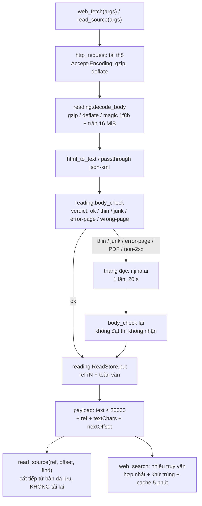

# Kế hoạch chi tiết — Vòng 27 · Phạm vi A: lớp đọc nguồn và lớp tìm kiếm (harness)

> **Trạng thái:** chờ chủ nhà duyệt. Chủ nhà chốt ở #5998: *"tạo plan trước, ghi vào plan trước rồi tiếp tục interview"*.
> **Phạm vi đụng vào:** `agent_core/web.py` (+ module mới `agent_core/reading.py`), `sandbox/worker.py` (`file_read`),
> `tool_contracts.py` / `roles.py` / `tool_groups.py` / `api/server.py` (khai báo công cụ mới), tài liệu.
> **KHÔNG đụng:** `evidence_gate.py`, `plan_quality.py`, `compression.py`, `limits.py:207-214` (cờ parallel read).
> **KHÔNG** rebuild box, **KHÔNG** restart/kill tiến trình chủ nhà (3100/3101/3102/3112/3120/3199, container `agentbox-box`).
> Kế hoạch này là **tài liệu**; không nhánh nào của nó sửa mã trong lúc viết plan.

### Summary

Lớp đọc nguồn hiện tại (host-side `web.py`) hỏng ở bốn chỗ đo được: không giải nén gzip (Nhân Dân 17 421 ký tự rác,
Báo Chính phủ 46 692), không đọc được phần tiếp của tài liệu dài (8 000/113 936 = 7 %), gọi đầu đọc `r.jina.ai` chỉ khi
thân bài < 200 ký tự, và tin mọi `http=200` kể cả trang 404 giả. Phạm vi A vá đúng bốn chỗ đó cộng ba đòn bẩy keyless
đã đo (PDF qua đầu đọc, OpenAlex `select`/`filter=cites:`, Firecrawl `site:`/`tbs`/`lang`), thêm công cụ `read_source`
đọc theo khoảng, và giao cho Phạm vi B một hàm kiểm thân bài dùng chung để `source_verify` không phải đoán.

## 0. Trạng thái đo được hôm nay (HEAD `2add905`, đo 2026-09-23, không suy đoán)

| # | Sự thật đo được | Bằng chứng |
| --- | --- | --- |
| 1 | `Accept-Encoding` **không** được gửi; urllib nhận `Content-Encoding: gzip` và giải mã bằng `raw.decode(...)` ⇒ rác nhị phân | `web.py:147` (chỉ có `Accept`, `Accept-Language`), `web.py:155` (`raw = response.read(...)`), `web.py:173` (`raw.decode(charset, errors='replace')`) |
| 2 | Nhân Dân: `status=200 CE=gzip CT=text/html;charset=utf-8 len=20732 magic=b'\x1f\x8b'`; đo qua `WebTools.fetch` ⇒ `textChars=17421`, đầu văn bản `'\x1f\xef\xbf\xbd\x08\x00...'` | probe hôm nay + `/var/tmp/v27/probe7.log` |
| 3 | Cùng ba trang đó, sau khi **giải nén thủ công**: 20 732 → 90 475 byte, `textChars=8264`, mở đầu `'Danh mục\n\nBáo Nhân Dân điện tử...'` — đúng thân bài | `/var/tmp/v27p2/p14_junk_refine.py` |
| 4 | Gửi tường minh `Accept-Encoding: identity` **không** đổi gì: server vẫn `CE=gzip` | đo hôm nay (probe1) |
| 5 | Báo Chính phủ `text=46692`, VietnamPlus `text=37798` — đều là rác (cùng nguyên nhân) | `/var/tmp/v27/probe6.log` |
| 6 | Chỉ số tách rác/văn bản thật (đo hôm nay): `junk = (U+FFFD + Cc trừ \t\n\r + Cf/Cs/Co/Cn)/1000 ký tự đầu` ⇒ **rác 0,550 / 0,517** (gzip, PDF), **thật 0,0000** (kcb.vn, `docs.python.org`, Nhân Dân sau giải nén) | `/var/tmp/v27p2/p13_junk.py`, `p14_junk_refine.py` |
| 7 | Tài liệu dài bị cắt phía TA: `docs.python.org/3/whatsnew/3.13.html` ⇒ `textChars=113936`, model nhận 8 000 (**7 %**) và 8 000 đầu là râu ria điều hướng (`'## Navigation / index / modules'` rồi `next`/`previous`) | tại `web.py:56-57` (`MAX_TEXT_DEFAULT=8000`, `MAX_TEXT_HARD=20000`), `web.py:505` |
| 8 | Đầu đọc trả **cả tài liệu** trong một lời gọi (246 743 byte) và header `x-start: 8000` **không** cắt ⇒ nút thắt nằm phía ta | đo hôm nay |
| 9 | Đầu đọc đọc được PDF: `r.jina.ai/https://arxiv.org/pdf/1706.03762v7` ⇒ `200`, **40 895 byte** markdown, 2,3 s, có `Title/URL Source/Published Time/Number of Pages: 15` | `/var/tmp/v27/feasibility-probes.md` §1 |
| 10 | Đầu đọc chỉ được gọi khi thân bài < 200 ký tự; HTTP non-2xx ném lỗi **trước** nhánh đó ⇒ `thuvienphapluat.vn` 403 mất nguồn dù đầu đọc có bản đọc được (**91 032 byte**) | `web.py:510-518` (nhánh quyết định), `web.py:159-166` (`HTTPError → WebError` trước), `/var/tmp/v27/probe6.log` |
| 11 | `application/pdf` **không** có nhánh riêng ⇒ rơi vào `html_to_text`: `%PDF-1.4...` thành `textChars=10205` **rác** (junk 0,517) vì > 200 nên đầu đọc không được gọi | `web.py:510-513` |
| 12 | Thành công giả đo được: `moh.gov.vn` trực tiếp `timed out`, qua đầu đọc `200` nhưng **165–259 byte** (`Warning: This page maybe not yet fully loaded`) hoặc **503 sau 18,5 s**; `vbpl.vn/TW/Pages/vbpq-toanvan.aspx?ItemID=1` đầu đọc `200` **27 378 byte** nhưng tiêu đề **"Trang chủ"**; `vbpl.vn/van-ban/chi-tiet/nghi-quyet-so-68...` `200` nhưng thân bài là **ảnh 404 Error** + "Văn bản không tồn tại" | `/var/tmp/v27/probe3.log`, `probe4.log`, `probe7.log` |
| 13 | `vanban.chinhphu.vn/?pageid=27160&docid=207396` qua đầu đọc ⇒ 15 314 byte, có `Title: Luật số 15/2023/QH15…` (**toàn văn luật đọc được keyless**) | đo hôm nay + `probe7.log` (13 830 ký tự) |
| 14 | `_provider_papers` gọi OpenAlex **không** `mailto`, **không** `select`, **không** `filter=`; chỉ một nhà cung cấp, không fallback | `web.py:368-382`, `web.py:386-391` |
| 15 | `select=` là đòn bẩy thật: work đầy đủ **33 226 byte** → `select=id,doi,display_name,publication_year,referenced_works,referenced_works_count,cited_by_count,best_oa_location` = **2 967 byte**, và `referenced_works` **sống** qua `select` (n=54) | đo hôm nay (`p15_papers.py`) |
| 16 | Săn đuổi TIẾN keyless chạy: `filter=cites:W2741809807&per-page=2&select=…` ⇒ `200`, `count=1255`, 891 byte | đo hôm nay |
| 17 | `cited_by_api_url` **không có** trong bản trả về hiện tại ⇒ không được dùng làm đường tiến | `/var/tmp/v27/probe4.log` |
| 18 | Nguồn học thuật chập chờn: arXiv `search_query=all:referral` ⇒ **406** (3 lần, thân bài rỗng, không `Retry-After`), `all:electron` ⇒ 200 (2 938 byte) cùng phiên; Europe PMC search `200` rồi `503`; Crossref `429` rồi `200` (18 384 byte khi có `mailto`); Semantic Scholar `429` **lặp lại**; Europe PMC `fullTextXML` ⇒ `200`, **38 088 ký tự** | đo hôm nay + `probe3.log`, `probe4.log` |
| 19 | Tìm kiếm chỉ còn **một chân keyless** (Firecrawl): `site:` chạy, `tbs=qdr:m` chạy, `lang=vi` chạy, `location=Vietnam` chạy; `sources=['news']` ⇒ **400**, `page=2` ⇒ **400** | đo hôm nay + `probe4.log` |
| 20 | Kết quả tìm lẫn YouTube/Facebook cho truy vấn tiếng Việt | `probe3.log` |
| 21 | Không retry/backoff/cache/dedupe ở bất kỳ đâu: mỗi provider **một** lần, lỗi là rơi sang provider kế | `web.py:464-483` |
| 22 | Khoá: `env` lọc theo `FIRECRAWL`, `BRAVE`, `TAVILY`, `EXA_`, `SERP`, `OPENALEX`, `SEMANTIC`, `JINA` ⇒ **rỗng**; `/proc/474143/environ` chỉ có `BOXFOX_HARNESS_PORT=3102` | đo hôm nay |
| 23 | Trần vào ngữ cảnh: kết quả tool > 24 000 ⇒ cắt còn **20 000**; batch tối đa **16** lời gọi/bước | `runtime.py:3376-3377`, `runtime.py:3338-3339` |
| 24 | `file_read` trong box: 30 000 ký tự, **không** `offset`; `codebase_grep` ≤100 dòng × 300 ký tự | `sandbox/worker.py:100`, `:122`, `:600-604` |
| 25 | Box **không có Internet** (`iptables -P OUTPUT DROP`, chỉ `lo` + 4 luật sport 5900/6080/8080/8081); công tắc mạng duy nhất là `deploy/docker/box-firewall`, mặc định **OFF**, cần shared-secret `X-BoxFox-Api-Key` | đo trong container + `docs/architecture/sandbox.md:203-210` |
| 26 | `browser_use` trong box dùng CDP `127.0.0.1:9222`; `/json/version` hiện **rỗng** (Chromium desktop chưa mở); host **có** Chrome 144 nhưng **không** có `playwright`/`bs4`/`lxml`/`pypdf`/`fitz` | `worker.py:199-266`, `deploy/docker/capture.py:55`, đo hôm nay |
| 27 | Box có `curl`, `wget`, `node` nhưng **không** có `pdftotext`/`tesseract`/`pypdf`/`pdfplumber`/`bs4`/`lxml`; terminal là danh sách trắng hẹp, **không cài gói** (#5977) | đo hôm nay + `/code/.plans/v27-owner-answers.md` #5977 |
| 28 | Khuôn công tắc ba mức đã có sẵn: `mode_from_env(env, modes, default) -> (mode, unknown)` + hai chỗ dùng + notice giá trị lạ một lần | `runtime.py:971`, `:2376-2383`, `:2418-2420`, `:4007-4013`, `:4334-4340`, `limits.py:255-262` |
| 29 | Đường thu bằng chứng đã có sẵn cho B: `plan_sources_evidence` + `source_strings` (chỉ đọc `result`, không đọc `args` — BUG-88 đã vá) | `runtime.py:2422-2470` |
| 30 | Ba test ghim số công cụ: `len(ORCHESTRATOR_TOOLS) == 25` và union tám nhóm == 25 | `backend/tests/unit/test_journal_tools.py:63`, `test_runtime_info.py:153,165` |

## 1. Bất biến phải giữ (đọc trước khi thi công)

1. **D-13 / F7:** không cho nhiều tool chạy **song song** trong một bước. Cờ `BOXFOX_PARALLEL_READ_TOOLS` (`limits.py:162`, `:207-214`) **giữ nguyên trạng thái trơ** — Phạm vi A **không** hiện thực nó. Tăng tốc bằng fan-out con (đã có: 3/cha, 8 toàn cục, `limits.py:105-107`).
2. **D-18 / F1:** không thêm tiêu chí citation vào `evidence_gate.py`. Mọi luật "đọc sâu / nguồn" sống ở prompt + skill hoặc ở cổng **mới** của Phạm vi B.
3. **F23:** `web.py:fetch` giữ **chữ ký gọi được** cho `source_verify` của B. Mọi tham số mới phải có mặc định ⇒ `fetch(args)` cũ vẫn chạy, kết quả cũ vẫn đủ khoá.
4. **F14 / R10-6:** không âm thầm bỏ `web_search`/`web_fetch` khỏi `ORCHESTRATOR_TOOLS`; nhóm `webResearch` (`tool_groups.py:27-30`) vẫn tắt được bằng giao diện.
5. **F2 / F4–F6 / D-19–D-25:** không thêm khối/dải/huy hiệu quanh câu trả lời cuối; không sửa `MarkdownRenderer`/HarnessStepView.
6. **§5(1):** không thêm giá trị `status` mới của phiên; **§5(5):** `events()` trần 500 hàng ⇒ mọi bảng mới phải tự lọc.
7. **D-14 / F12:** cổng bằng chứng ở `warn`; kế hoạch này không đổi mặc định cổng nào.
8. **F19:** không được nói "đã có benchmark research" — `benchmark/cases/` rỗng, `scripts/eval/judge.py:176` còn `NotImplementedError`. Mọi số trong kế hoạch này ghi rõ **ngày đo** và **tệp đo**.
9. **F20:** mỗi thay đổi trong `docs/research/**` phải ghi rõ "đã có trong mã" hay "đề xuất" — cập nhật tài liệu theo **từng đợt đã xong**, không viết trước.
10. **F22:** `docs/architecture/tools-and-skills.md:126-132` **đã cũ** (`web_extract`, `max_results`); nguồn sự thật là `tool_contracts.py`. Sửa luôn trong đợt có công cụ mới.
11. **#5978:** chưa mua khoá ⇒ mọi đường chính phải chạy **keyless**; khoá chỉ là chỗ cắm, không được là điều kiện bắt buộc.
12. **#5966:** "đọc nguồn" = mở thật + lấy **đoạn liên quan**; **cấm** kiểu trích snippet như đã đọc. Thiết kế `read_source` phải phục vụ đúng câu này.
13. **An toàn SSRF:** `assert_public_url` (`web.py:113-137`) và `_GuardedRedirects` (`web.py:97-102`) phải **ném lỗi**, không được lùi về đầu đọc. Đầu đọc là bên thứ ba ⇒ chỉ gửi URL công khai, và mọi payload phải giữ `untrusted: true` + `note` (`web.py:63`).
14. **Nhật ký DEV không chứa truy vấn/URL** (`web.py:441-447`, `_log_error`): mọi dòng log mới giữ đúng ranh giới này.

## 2. Kiến trúc và luồng mới

Bốn lớp, mỗi lớp là một hàm thuần hoặc một nhánh nhỏ để đo được:



Ba điểm chèn then chốt:

- **`http_request` (`web.py:140-173`)** là **chỗ duy nhất** biết `Content-Encoding` ⇒ giải nén phải nằm ở đây, trước `decode`, và trả về thêm cờ đã giải nén để payload nói thật.
- **`fetch` (`web.py:497-528`)** là chỗ quyết định *có gọi đầu đọc hay không*; quyết định đó tách thành hàm thuần trong `reading.py` để test không cần mạng.
- **`ReadStore`** là bản đã tải, sống trong tiến trình harness (không ghi đĩa), khoá theo URL chuẩn hoá + `ref`. Nó phục vụ cùng lúc ba nhu cầu: đọc tiếp (`offset`), đọc lại (cache), và biết "trang này đã đọc rồi" khi tìm kiếm.

Điểm giao với hai phạm vi kia:

- **Cho B:** `reading.body_check(text, url=…, status=…, content_type=…, reader=…) -> {'verdict', 'reason', 'junkRatio', 'textChars'}` — `source_verify` gọi đúng hàm này để ra `ok` / `fakeSuccess` / `unreachable`; A giữ chữ ký, B không chép lại luật.
- **Cho C:** `web_fetch` nhận `offset`, và `read_source(ref, offset)` là công cụ C dùng ở ca `R3` (`v27-flow-plan.md:284`). Trần mỗi lần đọc **giữ 20 000** vì trần ngữ cảnh là 20 000 (`runtime.py:3376-3377`) — C chỉ ghi được tối đa 20 000 ký tự mỗi lời gọi vào hồ sơ.

### Tasks

#### 1. **[song song]** A-1 — Giải nén `Content-Encoding` + đọc chịu lỗi ở `http_request`

**Hiện trạng đo được.** `http_request` (`web.py:140-173`) đặt `Accept` (`:147`) và `Accept-Language` (`:148`) nhưng **không** đặt `Accept-Encoding`; đọc `raw = response.read(max_bytes)` (`:155`) rồi `raw.decode(charset, errors='replace')` (`:173`). Server vẫn trả `CE=gzip` (Nhân Dân `len=20732 magic=b'\x1f\x8b'`), và gửi tường minh `Accept-Encoding: identity` **không** đổi kết quả (đo hôm nay). Hệ quả: 17 421 / 46 692 / 37 798 ký tự rác, junk 0,55–0,59 theo chỉ số ở A-2. Trong cây mã **không có** `zlib`/`gzip` ở đường sống (grep: chỉ có trong `vendor/`). Ca `vnexpress.net` còn nổ `IncompleteRead(76722 bytes read)` (`probe6.log`).

**Thay đổi đề xuất.** Trong `web.py`:

1. Thêm hằng: `MAX_INFLATED_BYTES = 8 * MAX_BODY_BYTES` (16 MiB, trần chống bom nén — cùng lớp rủi ro mà `vendor/hermes/skills/productivity/google-workspace/scripts/setup.py:68` ghim `httplib2==0.32.0` vì `GHSA-j5g9-f88f-gfj3`).
2. `http_request`: thêm `request.add_header('Accept-Encoding', 'gzip, deflate')` ngay sau `Accept-Language` (`:148`), và thay dòng `:173` (`raw.decode(...)`) bằng `decode_body(raw, response.headers)`.
   - **Không đổi kiểu trả về** (bốn chỗ gọi cũ phải giữ nguyên): thêm hàm `http_request_meta(url, **kw) -> tuple[int, str, str, str, dict]` chứa toàn bộ thân hàm hiện tại và trả thêm `meta`; `http_request(...)` gọi nó rồi bỏ phần tử thứ năm. `_read_through_reader` (`web.py:530-543`) và `WebTools.fetch` không phải sửa chữ ký.
3. `decode_body(raw: bytes, headers) -> (str, dict)` (đặt trong `reading.py` để test thuần), gọi khi `web_decode_mode() == 'on'` (mặc định `on`; `off` = đúng hành vi trước A-1):
   - `encoding = (headers.get('Content-Encoding') or '').strip().lower()`;
   - `gzip` **hoặc** `raw[:2] == b'\x1f\x8b'` (server có thể trả gzip mà thiếu header) ⇒ `obj = zlib.decompressobj(16 + zlib.MAX_WBITS)`; `out = obj.decompress(raw, MAX_INFLATED_BYTES)`; `decodeTruncated = bool(obj.unconsumed_tail)`;
   - `deflate` ⇒ thử `zlib.decompress(raw)` rồi `zlib.decompress(raw, -zlib.MAX_WBITS)`;
   - `br` (brotli) ⇒ **không** có trong thư viện chuẩn: ném `WebError('WEB_FETCH_FAILED', '… answered with brotli compression this reader cannot decode', 'the host answered with br')` — thà lỗi rõ còn hơn trả rác (đo: `r.jina.ai` là đường lui đọc được trang đó);
   - còn lại ⇒ `raw.decode(charset, errors='replace')` như cũ;
   - trả `{'contentEncoding': encoding or 'identity', 'decoded': bool, 'decodeTruncated': bool}`.
4. `http.client.IncompleteRead`: bắt trong `opener.open(...)`, dùng `exc.partial` làm thân bài và đánh `partial: true` trong meta (đo được ở `vnexpress.net`).
5. Payload `fetch` thêm `contentEncoding`, `decoded`, `partial` (khoá mới, không đổi khoá cũ).

**Cách đo nghiệm thu.**
- Đơn vị (`backend/tests/unit/test_web_reading.py`, mới): `gzip.compress` thân bài HTML ⇒ `text` là văn bản thật, `decoded is True`; thân bài gzip **không** có header `Content-Encoding` ⇒ vẫn giải nén; `deflate` cả hai biến thể; `br` ⇒ `WebError` (không rác); bom nén (thân 2 MiB toàn `\x00`) ⇒ `decodeTruncated is True` và không dài quá trần; `IncompleteRead(partial=…)` ⇒ `partial is True` và text đọc được.
- Sống (`scripts/probe-reading.py --only gzip`): ba trang `nhandan.vn` / `baochinhphu.vn` / `vietnamplus.vn` ⇒ in ra `textChars`, `junkRatio`, 120 ký tự đầu. **Đạt** khi: junkRatio = 0,0000 cho cả ba, và `textChars` rơi vào ngưỡng thật đã đo (Nhân Dân ≈ 8 264, Báo Chính phủ ≈ 8 079, VietnamPlus ≈ 16 455), **không** còn 17 421/46 692/37 798.

#### 2. **[song song]** A-2 — `reading.py`: kiểm thân bài (rác / thành công giả) + hợp đồng cho Phạm vi B

**Hiện trạng đo được.** Không có chỗ nào kiểm thân bài: `web.py:514-518` chỉ so độ dài < 200; `web.py:510-513` đẩy mọi `content-type` lạ qua `html_to_text`; payload chỉ có `textChars`/`truncated` (`:523-527`). Vì vậy ba ca thành công giả đi thẳng vào ngữ cảnh như sự thật: `moh.gov.vn` (đầu đọc `200`, **165–259 byte**, `Warning: This page maybe not yet fully loaded`), `vbpl.vn` trang chủ (`200`, 27 378 byte, tiêu đề **"Trang chủ"**), `vbpl.vn` chi tiết văn bản (`200`, 18 938 byte, thân bài là ảnh **404 Error** + "Văn bản không tồn tại"). Chỉ số `isprintable()` mà một vòng đo trước dùng **không** tách được (kcb.vn thật 81 % so với Nhân Dân rác 84 %) vì nó loại luôn ký tự tiếng Việt.

**Thay đổi đề xuất.** Module mới `backend/src/agentbox/agent_core/reading.py` (thuần, không I/O, không import `runtime`):

```python
JUNK_CATEGORIES = {'Cf', 'Cs', 'Co', 'Cn'}          # Cc xét riêng để tha \t \n \r
JUNK_RATIO_MAX = 0.10                                # đo: rác 0,52–0,55 · thật 0,0000
BODY_MIN_CHARS = 500                                 # đo: thân bài giả nhỏ nhất 403 ký tự (trang 404 của vbpl.vn)
ERROR_MARKERS = ('404 error', 'văn bản không tồn tại', 'warning: this page maybe not yet fully loaded',
                 'cached snapshot', 'just a moment', 'attention required', 'đang tải dữ liệu',
                 'enable javascript', 'please wait while we load', 'meta http-equiv="refresh"',
                 'window.location.replace')

def junk_ratio(text: str, sample: int = 1000) -> float: ...
def body_check(text: str, *, url: str = '', status: int | None = None,
               content_type: str = '', reader: str | None = None) -> dict: ...
```

`body_check` trả `{'verdict', 'reason', 'junkRatio', 'textChars'}` với `verdict` ∈ `{'ok', 'thin', 'junk', 'error-page', 'wrong-page', 'empty'}`:
- `empty` — `not text.strip()`;
- `junk` — `junk_ratio > JUNK_RATIO_MAX` (đo: gzip 0,550; PDF 0,517; thật 0,0000 ⇒ biên rất rộng);
- `thin` — `len(text.strip()) < BODY_MIN_CHARS`;
- `error-page` — khớp một `ERROR_MARKERS`;
- `wrong-page` — tiêu đề trang (dòng `Title:` của đầu đọc, hoặc `<title>` đã trích) **không** chia sẻ token nào với slug cuối của URL trong khi URL có ≥ 2 token slug (đo: `vbpq-toanvan` vs `Trang chủ` ⇒ bắt đúng).

`thin` là kết luận **khuyến cáo**, không phải án tử: một thông báo ngắn thật (300 ký tự) vẫn được trả về kèm `verdict: 'thin'`, và bên dùng (B/C) quyết định có cần nguồn thứ hai hay không. `junk`/`error-page`/`wrong-page` mới là những kết luận nói "đừng tin nội dung này".

Ngoài ra: `fetch` gắn thêm `quality: {...}` vào payload để model và cổng sau này đọc được sự thật; `_log_ok` (`web.py:432-447`) thêm `verdict` vào dòng `web.fetch` (chỉ số, không nội dung).

**Hợp đồng cho Phạm vi B (chốt trước, không đổi sau):** `source_verify` gọi `reading.body_check(text, url=…, status=…, content_type=…, reader=…)` và ánh xạ: `verdict == 'ok'` ⇒ `ok`; `verdict in {'junk','error-page','wrong-page'}` ⇒ `fakeSuccess`; `thin` + `status` non-2xx hoặc lỗi mạng ⇒ `unreachable`; còn lại `thin`. A giữ **nguyên chữ ký và tập giá trị `verdict`**; B không chép lại luật, chỉ đọc.

**Cách đo nghiệm thu.**
- Đơn vị (bảng dữ liệu, `test_web_reading.py`): 6 chuỗi mẫu đo hôm nay — đầu văn bản Nhân Dân sau giải nén (junk 0,0000), đầu văn bản Nhân Dân **trước** giải nén (junk 0,5500), đầu PDF `%PDF-1.4` (0,5170), dòng `Warning: This page maybe not yet fully loaded` (⇒ `thin` + `error-page`), đầu trang `vbpl.vn` 404 `'![Image 2: 404 Error]…Văn bản không tồn tại'` (⇒ `error-page`), tiêu đề `Trang chủ` với URL slug `vbpq-toanvan` (⇒ `wrong-page`).
- Ghim chống hồi quy: ca `kcb.vn` (tiếng Việt có dấu, junk 0,0000) **không** bị gắn `junk`; ca `docs.python.org` (junk 0,0000) **không** bị gắn `junk`.
- Sống: chạy `source_verify` của B trên 5 URL đã đo (`nhandan.vn`, `vanban.chinhphu.vn/?pageid=27160&docid=207396`, `vbpl.vn/TW/Pages/vbpq-toanvan.aspx?ItemID=1`, `moh.gov.vn`, `thuvienphapluat.vn`) ⇒ **không** URL nào ra `ok`.

#### 3. **[sau 1, 2]** A-3 — Thang đọc dự phòng: gọi đầu đọc khi PDF / non-2xx / rác / thiếu chữ

**Hiện trạng đo được.** Đầu đọc chỉ được gọi ở đúng một nhánh `if len(text.strip()) < 200:` (`web.py:514-518`); HTTP non-2xx ném `WebError` ở `web.py:159-166` **trước** nhánh đó; `application/pdf` rơi vào `html_to_text` (`web.py:510-513`) thành rác 10 205 ký tự. Đo phần đã mất: `thuvienphapluat.vn` 403 nhưng `r.jina.ai` trả **91 032 byte**; PDF arXiv 15 trang ⇒ **40 895 byte** markdown trong 2,3 s; `vanban.chinhphu.vn/?pageid=27160&docid=207396` ⇒ 15 314 byte có `Title: Luật số 15/2023/QH15…`. Đầu đọc cũng **không** cắt theo `x-start` (đo: 246 743 byte y hệt khi có và không có header) ⇒ phải tự giữ bản đã tải.

**Thay đổi đề xuất.**
1. `reading.ladder_plan(status=…, content_type=…, verdict=…, direct_error=…, mode=…) -> {'use_reader': bool, 'reason': str}` (thuần) với `reason` ∈ `{'thin','junk','error-page','pdf','http-status','unreachable','none'}`.
2. `fetch` (`web.py:497-528`) đổi nhánh: bọc `http_request` trong `try/except WebError`; **luôn ném lại** `WEB_URL_INVALID`/`WEB_URL_FORBIDDEN` (SSRF, `assert_public_url` `web.py:113-137`) — không được lùi về bên thứ ba; các lỗi khác (`WEB_FETCH_FAILED`: status 4xx/5xx, timeout, DNS) thì **một** lần thử đầu đọc.
3. PDF: `ctype == 'application/pdf'` hoặc `body[:5] == '%PDF-'` ⇒ đi thẳng đầu đọc (không phí một lần trích rác).
4. `_read_through_reader` (`web.py:530-543`) nhận `timeout=READER_TIMEOUT` (**20 s**, đo: arXiv PDF 2,3 s; `moh.gov.vn` trả 503 sau 18,5 s ⇒ phải có trần) và trả `(text, meta)`; chỉ **nhận** kết quả nếu `body_check` xếp hạng tốt hơn bản trực tiếp (thứ tự `ok > thin > wrong-page/error-page > junk > empty`), ngược lại giữ bản trực tiếp và ghi `quality` theo bản trực tiếp.
5. Payload thêm `readerReason`; giữ nguyên `reader` (`'r.jina.ai'`), `status` (status của lần gọi trực tiếp, `0` nếu không tới được), `finalUrl`.
6. Không thêm `content-type` nào vào nhóm "đọc thô" (`web.py:510-513`) ngoài: `application/xml`, `text/xml`, `application/atom+xml`, `application/rss+xml` (đo: arXiv trả `application/atom+xml`; đi qua `html_to_text` thì XML bị bóc tag, mất cấu trúc entry).

**Cách đo nghiệm thu.**
- Đơn vị: 6 ca (ladder quyết định đúng theo từng `verdict`; SSRF vẫn ném lỗi **dù** đầu đọc đọc được; PDF đi thẳng đầu đọc; đầu đọc trả rác ⇒ **không** nhận và `quality` phản ánh bản trực tiếp; đầu đọc timeout ⇒ lỗi gốc được giữ; `mode='thin'` ⇒ hành vi y hệt `2add905` — ca hồi quy quan trọng nhất).
- Sống: (i) `thuvienphapluat.vn` ⇒ `reader='r.jina.ai'`, `textChars ≥ 20000`; (ii) `arxiv.org/pdf/1706.03762v7` ⇒ `reader='r.jina.ai'`, `textChars ≈ 40895`; (iii) `vbpl.vn` chi tiết ⇒ **không** ra `ok` (ra `error-page`); (iv) `moh.gov.vn` ⇒ lỗi hoặc `thin`, **không bao giờ** `ok`. Bốn dòng này ghi vào `docs/tracking/test-rounds.md`.

#### 4. **[sau 1, 2, 3]** A-4 — Bộ đệm đọc + công cụ `read_source` + `offset` cho `web_fetch`

**Hiện trạng đo được.** `WebTools.fetch` trả `text[:max_chars]` với `max_chars` kẹp `[500, MAX_TEXT_HARD=20000]` (`web.py:505`), **không** có `start`/`offset`, **không** cache (`web.py:523-527`); trần ngữ cảnh 20 000 (`runtime.py:3376-3377`). Ca đo: `docs.python.org/3/whatsnew/3.13.html` `textChars=113936` ⇒ model thấy **7 %**, và 8 000 đầu là râu ria. Đầu đọc trả cả tài liệu một lần nhưng `x-start` không cắt ⇒ **ta** phải giữ bản tải.

**Thay đổi đề xuất.**
1. `reading.ReadStore` (trong bộ nhớ tiến trình, **không ghi đĩa**): `{ref: 'r1'…'rN', url, finalUrl, host, status, contentType, title, text, reader, fetchedAt, quality}`; caps `READ_STORE_MAX_ENTRIES = 24`, `READ_STORE_ENTRY_MAX_CHARS = 400_000`, `READ_STORE_MAX_CHARS = 4_000_000`; LRU theo lần chạm; chỉ mục theo URL chuẩn hoá (bỏ fragment, giữ query, bỏ `utm_*`/`fbclid`). `WebTools.__init__` (`web.py:399-400`) thêm `self.store = ReadStore(...)`.
2. `web_fetch` thêm hai tham số **tuỳ chọn**: `offset` (≥ 0, kẹp `[0, READ_OFFSET_MAX = 5_000_000]`) và `ref`; khoá mới trong payload: `ref`, `offset`, `nextOffset` (`None` khi hết), `more`, `storedChars`, `fromStore`. Luật: `ref` có ⇒ phục vụ từ bộ đệm, **không** gọi mạng; `offset > 0` ⇒ phục vụ từ bộ đệm nếu đã có bản lưu (đó chính là nghĩa "đọc tiếp"), ngược lại tải mới rồi cắt; `offset = 0` giữ nguyên hành vi hôm nay (luôn tải mới) ⇒ không phá test hiện có.
3. Công cụ mới `read_source` (schema cạnh `web_fetch` trong `tool_contracts.py:69-72`): `{ref, url, offset, maxChars, find}` — **không** tham số nào bắt buộc, nhưng phải có `ref` **hoặc** `url`, thiếu cả hai ⇒ `WebError('WEB_READ_REF_MISSING', …)`; `find` là mảng ≤ 4 từ khoá.
   - `find` phục vụ thẳng #5966 ("lấy **đoạn liên quan**"): so khớp **bỏ dấu** (`unicodedata.normalize('NFD')` + bỏ `Mn`, cộng bảng `đ→d`, `Đ→D` vì NFD không tách `đ`) nên `chuyen tuyen` khớp `chuyển tuyến`; trả `matches: [{'term', 'offset'}]` (≤ 4) + `nextOffset` = offset của hit đầu; không khớp ⇒ `matches: []` + `hint` nói tổng độ dài tài liệu.
   - Mọi mảnh trả về vẫn mang `untrusted: true` + `note` (`web.py:63`).
4. Khai báo công cụ: thêm `read_source` vào `RESEARCH` (`roles.py:18`), `ORCHESTRATOR_TOOLS` (`roles.py:172-173`), nhóm `webResearch` (`tool_groups.py:27-30`), route `runtime.py:3502` ⇒ `{'web_search','web_fetch','read_source'}`, và **ba** chỗ ghim số 25 phải lên **26**: `test_journal_tools.py:63`, `test_runtime_info.py:153`, `:165` (A-6 thêm `paper_citations` ⇒ sau đó ba chỗ này lên **27**). Vì con chỉ có giao của cha (`runtime.py:1432`, `:5000`), công cụ **bắt buộc** nằm trong một nhóm — nếu không, research không bao giờ thấy nó.
5. **Không** nâng `MAX_TEXT_HARD` (20 000): trần ngữ cảnh cắt ở 20 000 (`runtime.py:3376-3377`) nên nâng chỉ tạo payload bị cắt âm thầm. Phần dài nằm ở **bộ đệm**, không nằm ở một lời gọi.

**Cách đo nghiệm thu.**
- Đơn vị: trang 113 936 ký tự ⇒ 6 lời gọi `read_source(offset=0/20000/…)`, nối lại **bằng đúng** bản gốc (`storedChars == 113936`); `find=['Improved Error Messages']` trả đúng offset của mục đó trong tài liệu; `ref` sai ⇒ `WEB_READ_REF_MISSING`; vượt cap ⇒ LRU đuổi đúng bản cũ nhất; `web_fetch(url, offset=0)` sau khi có bản lưu **vẫn** gọi mạng (ghi `fromStore: false`); `web_fetch` **không** có `offset` cho ra payload byte-đối-byte như hôm nay (trừ ba khoá mới).
- Sống: `docs.python.org/3/whatsnew/3.13.html` — đọc được phần "Improved Error Messages" mà **không** phải tải lại trang (đo số giây lần hai: kỳ vọng < 0,1 s).
- Ghim hợp đồng B: `WebTools().fetch({'url': …})` vẫn chạy và vẫn đủ `url/finalUrl/host/status/contentType/title/text/textChars/truncated/links/reader/untrusted/note/fetchedAt`.

#### 5. **[song song]** A-5 — `file_read` trong box có `offset`/`limit`

**Hiện trạng đo được.** `read_file_payload` (`sandbox/worker.py:103-133`) trả `target.read_text(...)[:BINARY_READ_CHARS]` (30 000, `:100`, `:122`); nhánh nhị phân base64 cắt ở 30 000 ký tự base64; **không** có `offset`/`limit` trong hợp đồng (`tool_contracts.py:35` chỉ có `path`). Hệ quả: tệp 300 KB chỉ thấy phần đầu, không có đường đọc tiếp — đúng thứ B (D7) và C (`v27-flow-plan.md:41`, `:144`) ghi là thiếu.

**Thay đổi đề xuất.** `read_file_payload(target, offset=0, limit=BINARY_READ_CHARS)`; `worker.execute('file_read', args, session)` đọc `args.get('offset')`, `args.get('limit')`; hợp đồng: `{'path': STRING, 'offset': INTEGER, 'limit': INTEGER}`. Luật:
- nhánh văn bản: `text[offset:offset+limit]`, `truncated = offset + len(slice) < len(text)`, thêm `sizeChars`, `nextOffset` (`None` khi hết);
- nhánh nhị phân: `offset` làm tròn **xuống** bội số 3 (base64 thẳng hàng) và nói rõ trong payload (`offsetAlignedTo: 3`), `bytesRead`/`sizeBytes` giữ như cũ, thêm `nextOffset`;
- thiếu cả hai tham số ⇒ hành vi **y hệt** hôm nay (test cũ phải xanh nguyên: `test_worker_file_read.py`, `test_file_tools.py`);
- `offset` vượt cuối tệp ⇒ `content: ''`, `truncated: False`, `nextOffset: None` (không được nói "thiếu" khi thực ra đã hết).

**Cách đo nghiệm thu.** Đơn vị: tệp `.md` 100 000 ký tự (sinh trong `tmp_path`) đọc bằng 4 lời gọi, nối lại bằng đúng tệp; ảnh PNG 1 KiB giữ nguyên hình dạng cũ; `offset` âm/ký tự lạ ⇒ kẹp về 0; nhánh base64 với `offset=1` ⇒ căn về 0 và có `offsetAlignedTo`. Sống: hồ sơ dài trong `.research/` đọc được từng phần qua `file_read` (đúng đường C cần).

#### 6. **[song song]** A-6 — Nguồn học thuật keyless: OpenAlex (thêm `select`/`mailto`/đuổi trích dẫn), Crossref, Europe PMC; arXiv là đường phụ

**Hiện trạng đo được.** `_provider_papers` (`web.py:368-382`) gọi `api.openalex.org/works?search=…&per-page=…` — **không** `mailto`, **không** `select`, **không** `filter=cites:`; `SOURCE_PROVIDERS['papers']` chỉ có nó (`web.py:386-391`). Đo hôm nay: work đầy đủ **33 226 byte** so với `select=id,doi,display_name,publication_year,referenced_works,referenced_works_count,cited_by_count,best_oa_location` = **2 967 byte**; `referenced_works` n=54 sống qua `select` (⇒ săn **lùi** làm được); `filter=cites:W2741809807&per-page=2` ⇒ `count=1255`, 891 byte (⇒ săn **tiến** làm được keyless); `cited_by_api_url` **không có** trong bản trả về hiện tại (`probe4.log`); Crossref `429` rồi `200` — khi có `mailto` thì `200` 18 384 ký tự; Europe PMC search `200` rồi `503`; Europe PMC `fullTextXML` ⇒ `200` **38 088 ký tự**; Semantic Scholar `429` **lặp lại** (2 lần); arXiv `406` cho `all:referral`/`all:health` (thân rỗng, không `Retry-After`) nhưng `200` cho `all:electron` cùng phiên.

**Thay đổi đề xuất.**
1. `_provider_papers` ⇒ OpenAlex có `mailto` (từ `BOXFOX_OPENALEX_MAILTO`, mặc định một địa chỉ trung tính của dự án, **không** địa chỉ cá nhân), `select=` danh sách trường thật cần (`id,doi,display_name,publication_year,cited_by_count,best_oa_location,primary_location`), `per-page` kẹp theo `count`.
2. Thêm `_provider_crossref` (`api.crossref.org/works?query.bibliographic=…&rows=…&mailto=…&select=` khả dụng) và `_provider_europepmc` (`.../search?query=…&format=json&pageSize=…`) vào chuỗi `SOURCE_PROVIDERS['papers']` ⇒ `(openalex, crossref, europepmc, arxiv?)`; arXiv để **sau cùng** và có retry, kèm header `Accept: application/atom+xml` (đo được: cùng URL, `Accept` khác nhau cho kết quả khác nhau).
3. Công cụ mới `paper_citations` (`{workId | doi, direction: 'backward' | 'forward', limit}`):
   - `backward` ⇒ `api.openalex.org/works/{id}?select=…,referenced_works` rồi phân giải ≤ 50 id bằng **một** lời gọi `filter=openalex_id:W1|W2|…&select=…` (đo: 54 tham chiếu, payload 2 967 byte cho phần work);
   - `forward` ⇒ `filter=cites:{id}&select=…&per-page=limit` (đo `count=1255`, 891 byte cho 2 kết quả);
   - trả `{work, direction, total, results: [{id, doi, title, year, citedByCount, url}]}`; **không** dùng `cited_by_api_url` (không tồn tại trong bản trả về hiện tại).
4. Toàn văn PDF: **không** cần phụ thuộc mới — sau A-3, `web_fetch` trên URL `.pdf` trả markdown của đầu đọc (đo: 40 895 byte cho bài 15 trang). Ghi rõ trong mô tả công cụ: **PDF qua `web_fetch`, không cần `pdftotext`**.
5. Kết quả `papers` **phải** mang `doi`, `year`, `url` (hợp đồng với "trường cứng" của hồ sơ học thuật ở Phạm vi B: DOI/mã + năm).
6. Khai báo `paper_citations` đi **đúng đường** của `read_source` ở A-4: `RESEARCH`, `ORCHESTRATOR_TOOLS`, nhóm `webResearch` (đặt cạnh `read_source`), route trong `runtime.dispatch`; ba chỗ ghim số công cụ đi tiếp **26 → 27**. Nếu chủ nhà muốn ít công cụ mới hơn, có thể gộp vào `web_search` bằng `source='papers'` + tham số `citesOf` (xem MỞ-D); mặc định kế hoạch là công cụ riêng vì C cần gọi nó như một bước riêng.

**Cách đo nghiệm thu.** Đơn vị: `select` có mặt trong URL thật (fake `http_request` bắt tham số); chuỗi provider rơi đúng khi provider đầu trả 429/mất khoá; `paper_citations` dựng URL đúng cho cả hai chiều; `limit` kẹp `[1, 25]`; payload không vượt 20 000 ký tự với `limit=25`. Sống (ghi số vào `docs/tracking/test-rounds.md`): lùi `W2741809807` ⇒ n=54; tiến ⇒ `count=1255`; Crossref có `mailto` ⇒ `200`; Europe PMC `fullTextXML` ⇒ `200`; và ghi **đúng sự thật** về arXiv: "406 với `all:referral` (3 lần), 200 với `all:electron` cùng phiên ⇒ chập chờn, chỉ là đường phụ".

#### 7. **[song song]** A-7 — Tìm kiếm: nhiều truy vấn, hợp nhất/khử trùng, lọc ngày–ngôn ngữ–tên miền, cache, retry, chỗ cắm khoá

**Hiện trạng đo được.** `web_search` chỉ có `query`/`count`/`source` (`tool_contracts.py:55-68`); `count` kẹp 1..10; **không** dedupe, **không** cache, **không** retry (`web.py:464-483`: mỗi provider đúng một lần). Chỉ Firecrawl chạy keyless (`web.py:385`), Brave/Tavily ném `WEB_SEARCH_UNAVAILABLE` khi thiếu khoá (`:293-295`, `:305-307`). Đo tham số Firecrawl: `site:` OK, `tbs=qdr:m` OK, `lang=vi` OK, `location=Vietnam` OK; **`sources=['news']` ⇒ 400**, **`page=2` ⇒ 400**. Kết quả lẫn `youtube.com`/`facebook.com` (`probe3.log`). Khoá trong môi trường: **rỗng**.

**Thay đổi đề xuất.**
1. Schema `web_search` (`tool_contracts.py:55-68`) thêm (giữ `query` là bắt buộc — test `test_web_tools.py:50-56` ghim `required == ['query']` và ghim **đúng** tập `source`): `queries` (mảng ≤ 2 truy vấn **thêm**, tổng ≤ 3), `site` (tên miền), `freshness` ∈ `{'day','week','month','year'}`, `lang`, `exclude` (mảng tên miền loại trừ). **Không** thêm giá trị mới cho `source` (sẽ phá test ghim enum; `site:` đã làm được việc giới hạn tên miền).
2. `search` (`web.py:451-493`): chạy tuần tự từng truy vấn (một lời gọi công cụ, **không** song song — D-13), hợp nhất, khử trùng theo URL chuẩn hoá (bỏ `www.`, fragment, `utm_*`, `fbclid`) + tiêu đề/đoạn trích gần trùng (Jaccard ≥ 0,8 ⇒ giữ bản đầu, ghi `alsoFrom: [urls]`), trả `perQuery` (số kết quả mỗi truy vấn) và `deduped` (số bị gộp).
3. `freshness` ⇒ `tbs=qdr:d|w|m|y`; `lang`/`location` truyền qua; **không bao giờ** gửi `sources=`/`page=` (đo được: 400) — ghim bằng test đọc body của request giả.
4. `_retry(call, attempts=2, base=0.6, cap=5.0)`: thử lại khi 429/500/502/503/504/timeout, tôn trọng `Retry-After` ≤ 5 s, log `web.retry` (**chỉ số đếm**, không truy vấn — luật ở `web.py:441-447`).
5. Cache tìm kiếm trong tiến trình: TTL `SEARCH_CACHE_TTL_SECONDS = 300`, ≤ 16 mục, khoá theo args đã chuẩn hoá; payload thêm `cached: true` + `fetchedAt` gốc. Đây là chỗ chống đốt chân keyless duy nhất (đo: cùng truy vấn tốn ~0,7 s mỗi lần).
6. Chỗ cắm khoá: giữ `FIRECRAWL_API_KEY` (tuỳ chọn) / `BRAVE_API_KEY`|`BOXFOX_BRAVE_API_KEY` / `TAVILY_API_KEY`; thêm `EXA_API_KEY` và `PARALLEL_API_KEY` vào **chuỗi** (provider trả `[]` hoặc ném lỗi thì rơi tiếp). Khi **mọi** chân hỏng, thông báo phải **kể tên các khoá thiếu** (hiện chỉ nói chung "Every provider was refused or empty").
7. `exclude`: **không** bật mặc định. Đo được là kết quả lẫn YouTube/Facebook, nhưng #5991 chốt *trang mạng xã hội chính thức của cơ quan **được dùng*** ⇒ cấm mặc định sẽ chặn oan. Đây là công tắc cho model/skill, không phải luật cứng ở A.
8. Mô tả công cụ nói rõ: **không có phân trang** ⇒ muốn sâu hơn thì thêm truy vấn/`site:`; `count` ≤ 10.

**Cách đo nghiệm thu.** Đơn vị: `queries` gộp đúng và khử trùng đúng; `freshness='month'` ⇒ body chứa `tbs=qdr:m`; body **không** chứa `sources=`/`page=`; gọi hai lần y hệt ⇒ lần hai `cached is True` và không gọi provider (đếm số lần gọi provider giả); provider đầu 429 hai lần rồi 200 ⇒ có kết quả, log `web.retry`; thiếu hết khoá ⇒ thông báo kể tên `BRAVE_API_KEY`/`TAVILY_API_KEY`. Sống: `queries=['hồ sơ chuyển tuyến bảo hiểm y tế','site:chinhphu.vn hồ sơ chuyển tuyến']` ⇒ ≥ 6 kết quả, 0 trùng URL.

#### 8. **[sau 1–4, và sau khi chủ nhà chốt MỞ-B]** A-8 — Đường trong box: `browser_use` có tiền kiểm, terminal hẹp, runner script cho skill

**Hiện trạng đo được.** Box **không có Internet**: `iptables -S OUTPUT` = `-P OUTPUT DROP`, chỉ `lo` + 4 luật sport 5900/6080/8080/8081; công tắc duy nhất là `deploy/docker/box-firewall` (mặc định OFF, cần `X-BoxFox-Api-Key`; `docs/architecture/sandbox.md:203-210`). `browser_use` (`worker.py:199-266`) nối CDP `127.0.0.1:9222` (timeout 15 000 ms) — `/json/version` trong box hiện **rỗng** (Chromium desktop chưa mở). Host có `google-chrome` 144 nhưng **không** `playwright`; host Chrome render được `nhandan.vn` nhưng **treo** trên `vbpl.vn` và trắng trang trên `moh.gov.vn`. Box có `curl`/`wget`/`node`, **không** có `pdftotext`/`tesseract`/`pypdf`/`pdfplumber`/`bs4`/`lxml`, và #5977 chốt "**không cài gói**". `terminal_exec` nằm ngoài `RESEARCH` (`roles.py:18`) và `shell()` chạy `bash -lc` bất kỳ trong box với `cwd=ROOT` (`worker.py:142-163`).

**Thay đổi đề xuất (đường **phụ**, không phải đường chính).**
1. Tiền kiểm `browser_use` **trong box**: trước khi nối CDP, kiểm (a) `/json/version` còn sống, (b) egress (TCP tới một IP công cộng, timeout 3 s). Không đạt ⇒ trả lỗi **có mã** trong thông điệp (`BOX_NETWORK_OFF:` / `CDP_CLOSED:`) thay vì treo 15 s rồi báo lỗi chung. Đồng thời `runtime.py:3504` giữ nguyên luật chỉ-đọc của research.
2. `reading/allowlist.py::research_command_allowed(command) -> (bool, reason)` — hàm **thuần**, test được: chỉ cho `curl`/`wget` **có** `-o`/`-O` ghi trong workspace, `python3|bash <script>` nằm **trong thư mục skill đã bật**, và nhóm đọc cục bộ `ls|cat|head|tail|wc|file|sha256sum`; cấm `|`, `;`, `&&`, `$(`, backtick, `>`, `sudo`, `apt|apt-get|pip|npm|yarn`, `rm -rf`, `chmod`, `curl` không `-o`. Đấu vào `runtime.dispatch` **chỉ cho `session['role'] == 'research'`** ⇒ vai research mới được `terminal_exec`, và mọi lệnh phải qua hàm này (vai khác giữ nguyên hành vi cũ).
   - Nói thẳng trong tài liệu: đây là **hàng rào thô** (kiểm ở tầng chuỗi), không phải sandbox; ranh giới thật là box không có egress mặc định + chạy non-root + chỉ ghi trong workspace.
3. Công cụ mới `run_skill_script` `{skillId, script, args?}`: chạy `python3 <skill_dir>/scripts/<script> <args…>` trong box, `cwd = ROOT`, thời gian ≤ 120 s, đầu ra cắt như `shell()` (`worker.py:165-168`), từ chối skill **chưa bật** hoặc script thoát khỏi thư mục skill (dùng lại `path()` `worker.py:83-88`). Đây là "runner script cho skill" mà B/C giao cho A.
4. `browser_use` khi chạy được: mảnh văn bản `page.locator('body').inner_text()[:12000]` được host **đưa vào cùng `ReadStore`** với `reader='box-chromium'` ⇒ trích dẫn được bằng `read_source` (giữ `untrusted`).
5. **Không** hiện thực `BOXFOX_PARALLEL_READ_TOOLS` (D-13/F7) — cờ giữ nguyên trạng thái trơ.

**Cách đo nghiệm thu.** Đơn vị: bảng ca cho `research_command_allowed` gồm **đúng** các mẫu vượt rào kinh điển (`curl https://x -o y; rm -rf /`, `curl $(id) -o y`, `apt-get install pdftotext`, `cat /etc/passwd`, `curl -o /etc/x https://y`, `python3 /boxfox/skills/…` hợp lệ, `python3 /tmp/x.py` bị từ chối); ca vai không-research giữ nguyên hành vi cũ; ca `run_skill_script` từ chối skill tắt/đường dẫn thoát. Sống (chỉ khi box đã bật mạng — xem MỞ-B): `browser_use(action='navigate')` tới một trang phục vụ trong box ⇒ `200`-tương đương; và khi box **tắt** mạng ⇒ lỗi `BOX_NETWORK_OFF` trong < 5 s (thay vì 15 s).

#### 9. **[sau 1–8]** A-9 — Công tắc ba mức, điểm phơi trạng thái, tài liệu, thước đo

**Hiện trạng đo được.** Khuôn đã có: `mode_from_env(env, modes, default) -> (mode, unknown)` (`runtime.py:971`), dùng ở `plan_verify_mode()` (`:2376-2383`) và `plan_sources_mode()` (`:2418-2420`); hằng số ở `limits.py:255-262`; notice giá trị lạ **một lần** ở `runtime.py:4007-4013` / `:4334-4340`; trạng thái phơi ở `runtime_info().limits` (`api/server.py:225-250`) và **được ghim bằng so khớp từ điển chính xác** ở `test_runtime_info.py:207-240`.

**Thay đổi đề xuất.**
1. `limits.py` (cạnh `PARALLEL_READ_ENV` `:162`): `WEB_READER_ENV = 'BOXFOX_WEB_READER'`, `WEB_READER_MODES = ('auto', 'thin', 'off')`, `WEB_READER_DEFAULT_MODE = 'auto'`; `WEB_READ_STORE_ENV = 'BOXFOX_WEB_READ_STORE'`, `WEB_READ_STORE_MODES = ('on', 'off')`, `WEB_READ_STORE_DEFAULT_MODE = 'on'`; `WEB_DECODE_ENV = 'BOXFOX_WEB_DECODE'`, `WEB_DECODE_MODES = ('on', 'off')`, `WEB_DECODE_DEFAULT_MODE = 'on'`; hàm đọc `web_reader_mode()` / `web_read_store_mode()` / `web_decode_mode()`.
   - Nghĩa ba mức của thang đọc: `auto` = luật mới (PDF/non-2xx/rác/thiếu chữ); `thin` = **đúng hành vi `2add905`** (chỉ khi < 200 ký tự) — công tắc hồi quy; `off` = không bao giờ gọi đầu đọc.
   - `WEB_DECODE=off` = trả về đúng hành vi trước A-1 (không giải nén) — cần có vì A-1 chạm **mọi** lượt đọc, và một công tắc lùi làm cho "quay về `2add905`" trở thành một lệnh thay vì một bản revert.
   - `WEB_READ_STORE` chỉ có hai giá trị vì không có mức giữa nào có nghĩa (hoặc lưu, hoặc không) — ghi rõ lý do này trong tài liệu thay vì bịa một giá trị thứ ba.
   - Cả ba đọc qua `limits.py` (chỉ import `os`) ⇒ `web.py` import được `from .limits import …` mà **không** tạo vòng import với `runtime.py`.
2. `runtime.py`: hai hàm mode theo đúng khuôn; hai notice `WEB_READER_MODE_UNKNOWN` / `WEB_READ_STORE_MODE_UNKNOWN` cạnh hai notice sẵn có; `runtime_info().limits` thêm khối `web`: `{'readerMode', 'readerModes', 'readerDefault', 'readStoreMode', 'readStoreModes', 'readStoreDefault', 'textHardChars', 'storeMaxEntries'}` — **và mở rộng** `test_runtime_info.py:207` cho khớp.
3. Tài liệu: `docs/research/host-web-tools.md` (bảng §2 thêm Crossref/Europe PMC/`select`/`filter=cites:`; bảng §3 đổi dòng "Trần dữ liệu" + thêm dòng thang đọc/bộ đệm/công tắc — cập nhật **theo từng đợt đã xong**, ghi ngày); `docs/architecture/tools-and-skills.md:126-132` (sửa `web_extract`/`max_results` đã cũ, thêm `read_source`/`paper_citations`); `docs/architecture/sandbox.md` (danh sách trắng terminal cho research + phụ thuộc công tắc mạng box); `docs/tracking/test-rounds.md` (mọi số đo của A).
4. Thước đo tay `scripts/probe-reading.py` (**không** vào CI, chỉ chạy khi có mạng): `--only gzip|reader|store|papers|search`, in bảng `nhãn · status · textChars · junkRatio · reader · verdict · giây`, thoát mã khác 0 khi một ngưỡng đã chốt bị phá. Đây là công cụ để chủ nhà tự đo lại khi nghi ngờ, và để sinh số cho `test-rounds.md`.

**Cách đo nghiệm thu.**
- Đơn vị: `BOXFOX_WEB_READER=thin` ⇒ chạy **đúng** bộ test hành vi cũ (ca hồi quy `2add905`); giá trị lạ `'chặt-vừa-thôi'` ⇒ mức mặc định **kèm** notice một lần; `runtime_info()['limits']['web']['readerMode']` bằng mức đang áp.
- Sống: `curl -s localhost:3102/api/agent/runtime-info | jq '.limits.web'` trên harness đang chạy (không restart) — khối `web` xuất hiện và nói đúng mức đang áp.

### Testing

Chạy từ gốc repo (`.venv` đã có `pytest`; `pytest.ini` đặt `pythonpath = backend/src`):

```bash
cd /code/minndty3-design/BoxFox-Agent-Box
.venv/bin/python -m pytest backend/tests/unit/test_web_reading.py backend/tests/unit/test_web_tools.py \
    backend/tests/unit/test_worker_file_read.py backend/tests/unit/test_runtime_info.py \
    backend/tests/unit/test_journal_tools.py -q
```

| Tệp | Ca mới (rút gọn) | Ghim điều gì |
| --- | --- | --- |
| `test_web_reading.py` **(mới)** | `test_a_gzip_answer_is_inflated_before_it_reaches_the_model` | Nhân Dân/Báo Chính phủ/VietnamPlus trả văn bản thật, junk 0,0000 |
| | `test_gzip_is_still_inflated_when_the_header_lies` | nhận diện bằng magic `\x1f\x8b` |
| | `test_a_brotli_answer_is_an_explicit_error_not_junk` | không bao giờ trả rác như văn bản |
| | `test_a_compressed_bomb_is_bounded` | `MAX_INFLATED_BYTES`, `decodeTruncated` |
| | `test_a_body_that_stops_early_is_kept_as_partial` | `IncompleteRead` ⇒ `partial: true` |
| | `test_junk_ratio_separates_measured_junk_from_measured_prose` | 0,55/0,52 (rác) vs 0,0000 (kcb.vn, docs.python, Nhân Dân đã giải nén) |
| | `test_an_error_page_is_named_and_a_wrong_page_is_named` | `error-page` (vbpl 404, moh warning), `wrong-page` (slug `vbpq-toanvan` vs "Trang chủ") |
| | `test_the_reader_is_tried_for_pdf_and_for_http_status_before_it_is_given_up` | 403/PDF/non-2xx đi vào đầu đọc |
| | `test_the_reader_never_launders_a_blocked_address` | SSRF vẫn ném `WEB_URL_FORBIDDEN` |
| | `test_the_reader_answer_is_only_kept_when_it_is_better` | không nhận bản đầu đọc rác/thin |
| | `test_the_old_thin_page_policy_is_still_reachable_by_switch` | `mode='thin'` == `2add905` |
| | `test_a_long_document_is_read_in_slices_from_the_store` | 6 slice nối lại bằng đúng 113 936 ký tự |
| | `test_the_store_evicts_the_least_recently_used_copy` | trần 24 mục / 4 M ký tự |
| | `test_reading_without_a_ref_says_so_instead_of_fetching_something_else` | `WEB_READ_REF_MISSING` |
| | `test_find_reaches_a_heading_without_diacritics` | `chuyen tuyen` khớp `chuyển tuyến` |
| `test_web_tools.py` (mở rộng) | `test_read_source_is_held_by_research_and_the_orchestrator` | `RESEARCH` + `ORCHESTRATOR_TOOLS` + nhóm `webResearch` |
| | `test_web_fetch_keeps_its_old_shape_when_no_new_argument_is_passed` | hợp đồng cho `source_verify` của B |
| | `test_firecrawl_is_never_asked_for_sources_or_page_two` | đo được: 400 |
| | `test_three_queries_are_merged_and_deduplicated` | `perQuery`, `deduped`, 0 URL trùng |
| | `test_freshness_becomes_the_provider_time_window` | `tbs=qdr:m` |
| | `test_a_rate_limited_provider_is_retried_before_the_next_one` | retry 429 + log `web.retry` (chỉ số) |
| | `test_the_same_search_twice_is_served_from_the_cache` | TTL 300 s, không gọi provider lần hai |
| | `test_citation_chase_builds_the_two_directions` | `referenced_works` (lùi) vs `filter=cites:` (tiến) |
| `test_worker_file_read.py` (mở rộng) | `test_a_long_file_is_read_in_chunks_that_rebuild_it` | `offset`/`limit`/`nextOffset`, ghép lại bằng đúng tệp |
| | `test_reading_past_the_end_is_not_reported_as_missing` | `content: ''`, `truncated: False` |
| | `test_the_base64_path_aligns_its_offset` | nhánh nhị phân |
| `test_reading_allowlist.py` **(mới)** | `test_shell_pipes_and_installs_are_refused_for_research` | 8 mẫu vượt rào ở A-8 |
| `test_runtime_info.py` / `test_journal_tools.py` (sửa) | số công cụ 25 → **26** (A-4) → **27** (A-6); khối `limits.web` | ba chỗ ghim + so khớp từ điển chính xác |

Nguyên tắc test: **không ca nào cần mạng** — mọi thứ đi qua `monkeypatch` của `web.http_request` / `socket.getaddrinfo` (khuôn đã có ở `test_web_tools.py:17-35`). Số liệu sống chỉ nằm ở `scripts/probe-reading.py` và `docs/tracking/test-rounds.md`.

### [MỞ — chờ phỏng vấn]

Sáu điều dưới đây **chặn hoặc đổi hình dạng** thi công; không tự chốt thay chủ nhà. MỞ-A…MỞ-D là câu hỏi kỹ thuật, phải chốt trước hoặc trong lúc thi công; MỞ-E gắn với mục 2 của `v27-owner-answers.md` §3 (kỹ thuật/học thuật), MỞ-B gắn với mục "phương pháp nghiên cứu" cùng mục (vì nó quyết định có đọc được trang JS hay không).

**MỞ-A — Ngân sách đọc theo từng mức và trần mỗi đoạn.** Câu hỏi: mức 1/2/3 được đọc bao nhiêu?
- (a) Trần mỗi đoạn **20 000 ký tự** cho mọi mức, khác nhau ở **số lần đọc** (mức 1: 1–2 đoạn, mức 2: 3–5, mức 3: không trần mềm). *Ưu:* không đụng trần ngữ cảnh (`runtime.py:3376-3377`), C tự đặt số lần. *Nhược:* mức 3 phải gọi nhiều lời.
- (b) Nâng trần vào ngữ cảnh cho mức 3. *Ưu:* ít lời gọi. *Nhược:* đụng trần 20 000 của runtime + nén ngữ cảnh ⇒ phải sửa `runtime.py`/`compression.py` (ngoài phạm vi A) và làm mờ ranh giới với C.
- (c) Theo mức: 8 000 / 20 000 / 20 000 + bộ đệm không giới hạn theo mức. *Ưu:* khớp cảm giác "việc nhẹ đọc ít". *Nhược:* thêm một bảng số nữa phải đồng bộ với C.
- **Khuyến nghị: (a).** Trần ngữ cảnh là ràng buộc cứng của hệ, không phải lựa chọn thiết kế.

**MỞ-B — Có bật mạng box để dùng `browser_use`/terminal không?** (điều kiện thi công A-8)
- (a) **Không bật**; `browser_use` chỉ là đường phụ có tiền kiểm, trả lỗi `BOX_NETWORK_OFF` trong < 5 s. *Ưu:* giữ nguyên bất biến "box kín", không mở bề mặt tấn công. *Nhược:* cổng JS (`moh.gov.vn`, `vbpl.vn`) vẫn không đọc được.
- (b) Chủ nhà **tự bật** bằng nút có sẵn khi cần, rồi tắt. *Ưu:* không thêm mã; vẫn là quyết định của người. *Nhược:* không phải quy trình cho agent research chạy tự động.
- (c) Cho **main xin bật** trong một cửa sổ thời gian (ví dụ 10 phút) rồi tự tắt, có bản ghi. *Ưu:* research tự chủ hơn. *Nhược:* mở bề mặt rò dữ liệu từ box; cần một quyết định D-number mới; `POST /__box/network` đòi shared-secret nên phải đi qua backend.
- **Khuyến nghị: (a) cho vòng này**, giữ (c) làm đề xuất vòng sau sau khi có số đo thật về số trang JS cần mở.

**MỞ-C — Chỗ cắm khoá: mua gì trước, thứ tự dự phòng ra sao?** (#5978: chưa mua)
- (a) **Brave** rồi **Tavily**: đã có sẵn mã (`web.py:292-314`), chỉ cần khoá ⇒ 0 dòng mã mới, hai chân dự phòng thật.
- (b) **Exa** (tìm theo ngữ nghĩa) / **Parallel** (hướng agent): chất lượng cao hơn cho research nhưng **phải viết provider mới** và chưa đo được gì hôm nay.
- (c) Giữ nguyên keyless, không mua.
- **Khuyến nghị: (a).** Rẻ nhất và biến "một chân keyless" thành ba chân; (b) để sau khi có số so sánh chất lượng.

**MỞ-D — Ngưỡng "bão hoà" cho săn đuổi trích dẫn** (dùng chung với C, #5967).
- (a) Dừng khi **2 vòng liên tiếp** không thêm bài mới **hoặc** chạm trần bài (30/50/100 theo mức).
- (b) Dừng theo **thời gian** (ví dụ 5 phút cho mức 3).
- (c) Dừng theo **ngân sách** (số lời gọi OpenAlex).
- **Khuyến nghị: (a)**, có thêm (c) làm lưới an toàn. A giao *công cụ* + *số đếm* (`total`, `newCount`), C sở hữu ngưỡng.
- Kèm một câu hỏi nhỏ: săn đuổi nên là **công cụ riêng** `paper_citations` (bước riêng, dễ đếm vòng bão hoà, +1 công cụ) hay **tham số** `citesOf` trên `web_search` (0 công cụ mới, nhưng trộn hai việc vào một công cụ). Khuyến nghị: công cụ riêng.

**MỞ-E — Mở skill web/research nào?** Có 14 skill trong `vendor/hermes/optional-skills/research/` đang tắt và `skills/web/blocked-page-recovery` cũng đang tắt (`skills/catalog.py:7-14`).
- (a) Mở **`blocked-page-recovery`** (nó đã có đúng học thuyết "Fake successes — routes that LIE", trùng ý A-2) sau khi A-3 xong.
- (b) Mở `rss-feeds` (đọc nguồn có cấu trúc — A-3 vừa cho XML đi thẳng), rồi `pdf`, rồi `scrapling`.
- (c) Mở `duckduckgo-search`/`searxng-search`: **không** — đã đo và ghi sẵn trong `docs/research/host-web-tools.md` (DuckDuckGo HTML/lite = bot challenge, mojeek 403, `searx.be` + 7 instance = 429/bot, `s.jina.ai` = 401).
- **Khuyến nghị: (a) + (b)**, thứ tự `blocked-page-recovery` → `rss-feeds`; (c) đóng vĩnh viễn, kèm một dòng lý do ngay trong skill để lần sau không ai mở lại.

**MỞ-F (nhỏ) — Bộ đệm đọc có ghi ra đĩa không?**
- (a) **Trong bộ nhớ tiến trình** (mất khi harness restart). *Ưu:* nội dung không tin cậy không nằm trên đĩa; không có mã dọn. *Nhược:* restart giữa lượt là mất bản đã tải.
- (b) Ghi vào `~/BoxFox/reads/` có TTL. *Ưu:* sống qua restart. *Nhược:* rác nội dung bên thứ ba trên đĩa + phải dọn.
- **Khuyến nghị: (a).**

### Đợt thi công, điều kiện dừng

| Đợt | Việc | Điều kiện dừng (đo được) |
| --- | --- | --- |
| **1 — Nền đọc** | A-1, A-2, A-3, phần công tắc của A-9 | Ba trang gzip: junk 0,0000 và `textChars` ≈ 8 264 / 8 079 / 16 455. `thuvienphapluat.vn` 403 ⇒ đọc được ≥ 20 000 ký tự. PDF arXiv ⇒ ≈ 40 895 ký tự. `vbpl.vn`/`moh.gov.vn` ⇒ **không** ra `ok`. `BOXFOX_WEB_READER=thin` chạy xanh toàn bộ test cũ |
| **2 — Đọc sâu** | A-4, A-5 | Trang 113 936 ký tự đọc trọn bằng 6 lời gọi, ghép lại bằng đúng bản gốc; tệp 100 000 ký tự trong box đọc trọn bằng 4 lời gọi |
| **3 — Tìm & nguồn** | A-6, A-7 | Tiến `count=1255`; lùi n=54; Crossref/Europe PMC `200` (có retry); 3 truy vấn ⇒ 0 URL trùng; gọi lặp ⇒ `cached: true` |
| **4 — Trong box + tài liệu** | A-8 (chỉ khi MỞ-B chốt "bật"), phần tài liệu của A-9 | Chỉ chạy khi có quyết định; nếu không, đợt 4 chỉ là tài liệu + `test-rounds.md` |

Điều kiện dừng chung: **mỗi đợt phải xanh toàn bộ test cũ** trước khi sang đợt sau; riêng đợt 1 đổi hành vi **mọi** lượt `web_fetch` nên phải chạy lại 32 ca của `test_web_tools.py` và ba ca ghim số công cụ.

Lưu ý khi chia người: A-5 (box) tách hẳn tệp, chạy song song an toàn. A-1, A-3, A-4, A-6, A-7 đều **cùng tệp `web.py`** và A-4/A-6 cùng chạm ba chỗ ghim số công cụ ⇒ nếu chia nhiều người thì chia theo tệp, không chia theo việc, nếu không sẽ đánh nhau ở cùng dòng.

### Hằng số mới (một chỗ để rà soát)

| Hằng | Tệp | Giá trị đề xuất | Vì sao số đó |
| --- | --- | --- | --- |
| `MAX_INFLATED_BYTES` | `web.py` | `8 * MAX_BODY_BYTES` = 16 MiB | chống bom nén (cùng lớp `GHSA-j5g9-f88f-gfj3`) |
| `READER_TIMEOUT` | `web.py` | `20.0` s | arXiv PDF 2,3 s; `moh.gov.vn` 503 sau 18,5 s |
| `MAX_TEXT_DEFAULT` / `MAX_TEXT_HARD` | `web.py` | **giữ** 8 000 / 20 000 | trần ngữ cảnh là 20 000 (`runtime.py:3376`) |
| `READ_OFFSET_MAX` | `web.py` | `5_000_000` | chặn offset vô lý |
| `READ_STORE_MAX_ENTRIES` / `_ENTRY_MAX_CHARS` / `_MAX_CHARS` | `reading.py` | 24 / 400 000 / 4 000 000 | đo: tài liệu dài nhất gặp hôm nay 246 743 byte |
| `JUNK_RATIO_MAX` | `reading.py` | `0.10` | đo: rác 0,52–0,55 · thật 0,0000 |
| `BODY_MIN_CHARS` | `reading.py` | `500` | thân bài giả nhỏ nhất đo được là 403 ký tự (trang 404 của `vbpl.vn`) |
| `SEARCH_CACHE_TTL_SECONDS` / `_ENTRIES` | `web.py` | 300 / 16 | chống đốt chân keyless duy nhất |
| `RETRY_ATTEMPTS` / `RETRY_BASE_SECONDS` / `RETRY_MAX_SECONDS` | `web.py` | 2 / 0,6 / 5,0 | Crossref 429→200; Europe PMC 503 |
| `WEB_READER_ENV` / `_MODES` / `_DEFAULT_MODE` | `limits.py` | `BOXFOX_WEB_READER` / `('auto','thin','off')` / `'auto'` | `thin` = hành vi `2add905` |
| `WEB_READ_STORE_ENV` / `_MODES` / `_DEFAULT_MODE` | `limits.py` | `BOXFOX_WEB_READ_STORE` / `('on','off')` / `'on'` | không có mức giữa nào có nghĩa |
| `WEB_DECODE_ENV` / `_MODES` / `_DEFAULT_MODE` | `limits.py` | `BOXFOX_WEB_DECODE` / `('on','off')` / `'on'` | công tắc lùi cho thay đổi chạm **mọi** lượt đọc |
| `BOXFOX_OPENALEX_MAILTO` | `web.py` | địa chỉ trung tính của dự án | "polite pool" của OpenAlex/Crossref |

### Ranh giới và hợp đồng với Phạm vi B và C

| Việc | Ai sở hữu | Ai dùng đến |
| --- | --- | --- |
| Giải nén gzip, thang đọc, `offset`, provider, công cụ đọc | A | B, C |
| Kiểm thân bài (`reading.body_check`) — hàm **dùng chung** | A | B (để ra `ok`/`fakeSuccess`/`unreachable`), C |
| Công cụ `read_source` + `web_fetch.offset` cho ca `R3` | A | C |
| Sổ nguồn, thang 4 tầng, hồ sơ việc, cổng chất lượng, con phản biện | B | — |
| Ba mức, trần theo mức, `research_brief`, nhịp tiến độ, steer | C | A (biết số lần đọc mà chia đoạn) |
| Terminal hẹp + runner script cho skill | A | B, C |
| `BOXFOX_PARALLEL_READ_TOOLS` | **không hiện thực** (D-13/F7) | — |

**Hợp đồng phải giữ nguyên chữ ký:**
- `web.http_request(url, *, method, body, headers, timeout, max_bytes) -> (status, ctype, text, finalUrl)` — 4 phần tử như cũ; hàm mới `http_request_meta(...)` trả thêm meta cho `fetch`.
- `WebTools.fetch(args) -> dict` — khoá cũ nguyên vẹn; ba khoá mới (`contentEncoding`, `quality`, `ref`/`offset`/`nextOffset`) là phần **thêm**.
- `reading.body_check(text, *, url, status, content_type, reader) -> {'verdict','reason','junkRatio','textChars'}` — tập `verdict` đóng băng sau đợt 1 (B ghim theo nó).
- `reading.ladder_plan(...)` — thuần, không I/O.

### Việc phải nhớ khi build (đừng vi phạm)

1. Không thêm tiêu chí citation vào `evidence_gate.py` (D-18/F1).
2. Không cho tool chạy song song trong một bước; không hiện thực `BOXFOX_PARALLEL_READ_TOOLS` (D-13/F7).
3. Không bỏ `web_search`/`web_fetch` khỏi `ORCHESTRATOR_TOOLS` (F14/R10-6); nhóm `webResearch` vẫn tắt được.
4. Không thêm giá trị `status` mới (§5(1)); không UI quanh câu trả lời cuối (§5(4), F2/F4–F6, D-19–D-25).
5. Không ghi truy vấn/URL vào nhật ký (`web.py:441-447`).
6. Không nới trần ngữ cảnh, không sửa `compression.py` — đường dài là **bộ đệm + đọc theo khoảng**.
7. Không thêm giá trị mới vào enum `source` (test `test_web_tools.py:50-56` ghim đúng tập đó) — dùng `site:`.
8. Mọi payload còn nguyên `untrusted: true` + `note` (`web.py:63`), kể cả mảnh `read_source` thứ sáu.
9. Không cài gói trong box, không rebuild image, không restart tiến trình chủ nhà.
10. Số đo phải ghi ngày + tệp; không gọi "đã có benchmark" (F19).

### KHÔNG làm trong phạm vi này

- Không sửa `evidence_gate.py`, `plan_quality.py`, `compression.py`, `plan_eval.py`, `limits.py:207-214`.
- Không hiện thực `parallelReadTools`; không cho con đẻ con (D-11).
- Không viết sổ nguồn/thang 4 tầng/hồ sơ việc (B); không viết ba mức/nhịp tiến độ/steer (C).
- Không thêm khối UI, không renderer trích dẫn trong chat, không đụng `MarkdownRenderer`/`HarnessStepView`.
- Không ghi bộ đệm đọc ra đĩa (MỞ-F mặc định (a)).
- Không hứa đọc được trang JS ở vòng này (MỞ-B).
- Không dùng thư viện ngoài: chỉ `zlib`, `gzip`, `html.parser`, `urllib` (venv **không** có `playwright`/`bs4`/`lxml`/`pypdf`/`fitz` ở host).

### Bàn giao UI (cho main)

Phạm vi A **không có mặt giao diện mới** — và theo F2/F4–F6/§5(4) thì cũng **không được** thêm khối/dải/huy hiệu quanh câu trả lời cuối. Hai chạm nhỏ, không cần dispatch design subagent:

1. `frontend/src/components/settings/HarnessEditor.tsx:40-41` — câu ghi chú nhóm `webResearch` đang viết *"web_search · web_fetch run on the host…"*; thêm `read_source` khi công cụ đó vào nhóm (một dòng chữ).
2. `frontend/src/components/settings/HarnessEditor.test.tsx:34` — fixture nhóm `webResearch`; chỉ cần cập nhật nếu muốn mock khớp backend (test hiện tại tự nhất quán).

Nếu main muốn có **chỉ báo "đang đọc nguồn"**, đó là mục nhịp tiến độ của Phạm vi C (`v27-flow-plan.md` C-4), không phải việc của A.
