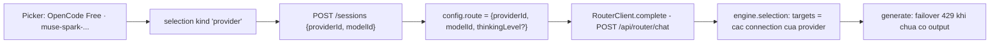

# Kế hoạch thi công — Vòng 29: chọn model theo **provider + model** (một dòng cho mỗi model, router tự chuyển connection/khoá)

> **TL;DR:** Thêm một dạng route thứ ba — `providerId + modelId` — đi hết đường từ picker tới router: picker gộp các connection cùng provider + model thành **MỘT dòng**, phiên lưu `{providerId, modelId}`, `RouterClient` gửi nguyên cặp đó lên `/api/router/chat`, và **router không phải sửa gì** vì `engine.selection()` đã dựng target list cho provider kèm `connectionOrder`/`roundRobin` và vòng `generate()` đã failover trước khi có output.

**Nhánh:** `vorflux/v27-research-rework`, HEAD `deda6e8`. Tài liệu này KHÔNG sửa mã nguồn, không chạy build/test.
**Bản đồ nền:** `/code/.generated_artifacts/v29-keys-map.md` (§2, §3, §6) — số dòng dưới đây đã đọc lại tại chỗ.

---

## 1. Mục tiêu và ranh giới

| # | Mục tiêu | Cách đo |
|---|---|---|
| M1 | Danh sách model trong picker chỉ còn **một dòng cho mỗi (provider, model)** | test đơn vị trên danh sách option: 4 connection opencode cùng model ⇒ 1 dòng |
| M2 | Phiên chọn **provider + model**, router tự chuyển connection/khoá khi hết hạn mức | một lượt thật sống qua 429 (bước kiểm ở §7) |
| M3 | Ghim **đúng một connection** vẫn chọn được | cú pháp `model:<connectionId>:<modelId>` giữ nguyên, nằm trong danh sách con của dòng provider |
| M4 | Phiên cũ `{connectionId, modelId}` chạy y như trước | test back-compat (§7.1, §8) |

**Ngoài phạm vi (đã có kế hoạch riêng, KHÔNG làm ở đây):** key ring (một connection chứa nhiều khoá), luật xoay khoá khi 429, cooldown 30 s / `retry-after` ≤ 2 phút, và việc gộp bốn connection opencode. Kế hoạch này chỉ **chuẩn bị mặt bằng** để sau khi gộp, một dòng provider vẫn định tuyến được và tự thử các khoá còn hạn mức.

---

## 2. Quyết định đã chốt (không mở lại)

| # | Nội dung | Nguồn |
|---|---|---|
| O1 | Mặc định chọn theo `provider + model`; ghim một connection vẫn được | `/code/.plans/v29-interview.json` câu 4; `v29-interview2.json` câu 1 |
| O2 | Bốn connection opencode sẽ gộp thành một connection ba khoá; connection "OpenCode Free" trùng bị bỏ | Work Description |
| O3 | Key ring + luật xoay khoá là kế hoạch riêng | Work Description |

---

## 3. Hiện trạng đo được (căn cứ, có dòng mã)

| Mã | Hiện trạng | Bằng chứng |
|---|---|---|
| D1 | Picker dựng option từ `snapshot.connections`, một dòng cho **mỗi connection** | `frontend/src/components/chat/HarnessModelPicker.tsx:66-83` (`liveModels`, `id: model:${c.id}:${m.id}`) |
| D2 | Danh sách option của composer cũng một dòng mỗi connection | `frontend/src/components/panels/RouterTestChat.tsx:26-32` (`routerChatOptions`), dùng bởi `ChatPanel.tsx:296` |
| D3 | Selection chỉ có hai dạng `model` / `alias`, và `'model'` ⇒ `{connectionId, modelId}` | `frontend/src/store/routerChatStore.ts:11-13`, `harnessChatStore.ts:642-643` |
| D4 | Route của phiên giữ đúng bốn khoá, không có `providerId` | `backend/src/agentbox/agent_core/runtime.py:1424` |
| D5 | `route_for()` biết `model:` và `alias:`, không biết `provider:` | `runtime.py:644-652` |
| D6 | Metadata model tra theo `connectionId` + `modelId` lúc tạo phiên | `backend/src/agentbox/api/server.py:400-403`; `runtime.py:494-511` |
| D7 | Vòng sửa cửa sổ ngữ cảnh lúc khởi động bỏ qua phiên không có `route.connectionId` | `runtime.py:1357, 1383-1398` |
| D8 | Router **đã** nhận `providerId` + `modelId` và dựng target list cho provider (thứ tự `connectionOrder`, tuỳ chọn `roundRobin`) | `router/src/engine.mjs:11`, `:23-35`; `router/src/service.mjs:198-216`; `router/CONTRACT.md:13` |
| D9 | Vòng `generate()` đã failover sang target kế khi lỗi retryable **và chưa có output**; target đang cooldown bị bỏ qua | `router/src/engine.mjs:71-74`, `:179` |
| D10 | Connection "dùng được" = enabled + `authState ready` + model enabled + `health !== 'unavailable'` (+ project ready cho antigravity) | `router/src/service.mjs:634-644` (`validTarget`); bản sao phía UI: `RouterTestChat.tsx:15` |

**Kết luận từ bảng trên:** phần còn thiếu **chỉ nằm ở hai đầu** — phía UI (gộp dòng + dạng selection thứ ba) và phía harness (route + metadata). Router không cần sửa (D8, D9).

---

## 4. Hình dạng route end to end (chốt)



| Chặng | Giá trị | Ghi chú |
|---|---|---|
| Option trong picker | `value: provider:<providerId>:<modelId>`; `selection: {kind:'provider', providerId, modelId}` | thêm dạng thứ ba, hai dạng cũ giữ nguyên |
| Ghim connection (con của dòng provider) | `value: model:<connectionId>:<modelId>`; `selection: {kind:'model', connectionId, modelId}` | **không** đổi cú pháp — `route_for()` đã hiểu |
| `POST /api/agent/sessions` (harness) | `{providerId, modelId}` + (chế độ single-model) `model`/`singleModel` = `provider:<providerId>:<modelId>` | `runtime.py:1424` whitelist thêm `providerId` |
| `config['route']` của phiên | `{providerId, modelId, [thinkingLevel]}` | JSON tự do, không migration |
| `POST /sessions/{id}/turns` | route y hệt + `thinkingLevel` **chỉ khi** biết mức chung | xem §5.4 |
| Wire `POST /api/router/chat` | `{providerId, modelId, [thinkingLevel], messages, tools, stream, max_tokens}` | `{**route, ...}` (`runtime.py:534`) — không đổi cách gửi |
| Router | `selection()` nhánh provider → target list → failover trong `generate()` | **không sửa dòng nào** |

### 4.1 Vì sao thêm `providerId` vào route, KHÔNG để harness tự phân giải thành alias/target list

Đây là câu hỏi trung tâm của kế hoạch; chọn **thêm `providerId`**, bốn lý do:

1. **Router đã làm đúng việc này rồi** (D8): `selection()` ưu tiên `aliasId` → `providerId+modelId` → `connectionId` → `model`, lọc bằng `validTarget` và sắp theo `provider_config.connectionOrder`. Harness phân giải lại là **chép luật thứ hai** cho cùng một câu hỏi ("connection nào dùng được"), đúng thứ mà repo này đã hai lần gỡ bỏ (bảng đoán cửa sổ theo tên model, `thinkingLevels` của alias).
2. **Harness không có quyền ghi cấu hình router.** Alias là một record trong `store.list('alias')` và chỉ có API admin của router/UI tạo được (`router/src/server.mjs:301-305`). Muốn "harness tự phân giải" thì phải thêm đường ghi mới hoặc migration alias cho từng cặp provider+model — việc nhiều hơn, quyền nhiều hơn, không thêm khả năng nào.
3. **Target list phải được tính tại thời điểm gọi.** Alias là danh sách **đóng băng**: thêm một connection mới (khoá dự phòng) không tự vào vòng, connection bị disable vẫn nằm trong danh sách tới khi ai đó sửa alias. `providerId` để router tự tính lại mỗi request.
4. **Back-compat rẻ nhất.** Route là dict tự do (D4); thêm một khoá là thay đổi cộng thêm, phiên cũ không bị chạm, không cần migration, và `/v1/*` (ingress ngoài) giữ nguyên hợp đồng.

Dạng `provider:` cũng là thứ **duy nhất** đi được qua `route_for()` cho chế độ single-model (§5.5) mà không phải nhét cả danh sách target vào một chuỗi.

---

## 5. Quyết định chi tiết

### 5.1 Gộp dòng trong picker

Gom theo khoá ghép **`(providerId, modelId)`**, chỉ xét connection "dùng được" theo đúng luật `eligible()` hiện có (`RouterTestChat.tsx:15`).

- `providerModelRows()` (hàm thuần, chỗ mới `frontend/src/lib/routeOptions.ts`) trả về mỗi nhóm: `providerId`, `modelId`, `name` (tên model của hàng đầu), `providerName`, `connectionIds[]`, `thinkingLevels` (xem §5.4).
- Dòng provider **luôn** dùng dạng `provider:` khi nhóm có ≥ 1 connection — kể cả khi chỉ có một. Lý do: sau khi gộp (O2) nhóm opencode chỉ còn một connection, mà vẫn phải là route provider để lần sau thêm connection/khoá mới là tự vào vòng, không phải chọn lại.
- **Nhãn:** `<providerName> · <model.name>` (tên từ `snapshot.providers`; `opencode` ⇒ "OpenCode Free", `router/src/catalog.mjs:39`), KHÔNG dùng tên connection — tên connection là thứ đang lặp bốn lần. Số connection không nhét vào nhãn (nhãn bị `displayModelName` cắt theo `·`, `HarnessModelPicker.tsx:119-135`); hiện ở dòng phụ trong hàng (chỗ đang ghi "Live Provider"): `Live Provider · 2 connections`, chỉ khi ≥ 2.
- Option của alias giữ nguyên, vẫn xếp trước.
- Một nguồn luật: `HarnessModelPicker` **bỏ** `liveModels` tự dựng (`:66-83`) và dùng chính `routerChatOptions(snapshot)` khi prop `routerModels` rỗng; prop còn lại là đường chính (ChatPanel/RouterTestChat đều truyền, `ChatPanel.tsx:712`).

### 5.2 Ghim một connection

- Nhóm có **≥ 2** connection ⇒ dòng provider mang thêm `pins: [{value:'model:<c>:<m>', label:<tên connection>}]`.
- Trong popover: hàng provider có nút mở nhỏ ("Ghim một connection"); mở ra thì các `pins` là hàng con, nhãn = tên connection (chỗ duy nhất còn hiện "key 1/2/3"). Bấm hàng con ⇒ `onRouterModelChange(pin.value)` + `setActiveModel(pin.value)` — **đúng đường cũ**, `selection` là `{kind:'model', connectionId, modelId}`.
- Hàng provider được coi là **đang chọn** khi `activeRouterModelId === value` **hoặc** bằng một trong các `pins`; khi ghim thì danh sách con **mở sẵn** để thấy đang ghim cái nào.
- Nhóm **1** connection ⇒ không có `pins`, không có nút ghim (đúng trạng thái sau khi gộp; ghim connection duy nhất là việc vô nghĩa).
- `snapshot.defaultRoute` (dạng `connectionId/modelId` hoặc alias) vẫn phải chọn được: tra option phải tìm **cả trong `pins`** — dùng một helper `findRouteOption(options, value)` thay cho `options.find(o => o.value === key)` ở `ChatPanel.tsx:305-306` và `RouterTestChat.tsx:113`.

### 5.3 Metadata model khi route mang provider (`server.py:400`)

Router là nơi duy nhất biết số thật (D6). Với route provider, harness gom metadata của **mọi connection dùng được của provider đó có model ấy** (luật `validTarget`, D10 — bản Python một chỗ, hàm thuần `aggregate_model_metadata(rows)`), rồi lấy:

| Trường | Luật | Vì sao |
|---|---|---|
| `contextWindow` | **min** của các số công bố; `contextWindowSource` đi theo hàng cho số min | Router có thể chạy lượt trên **bất kỳ** target nào (failover 429 là điều ta muốn). Hứa số của target đẹp nhất ⇒ lượt chết vì tràn ngữ cảnh sau khi đã chuyển target; hứa số nhỏ nhất chỉ khiến nén sớm hơn một chút |
| `thinkingLevels` | **giao** các danh sách công bố (so khớp hoa/thường, giữ cách viết của hàng đầu); rỗng ⇒ bỏ hẳn trường | mức gửi đi phải hợp lệ với **mọi** target, nếu không `resolve_thinking_level` ném `THINKING_LEVEL_UNSUPPORTED` (`runtime.py:856-887`) |
| `thinkingType` | `'none'` chỉ khi **mọi** hàng nói `none`; còn lại lấy hàng đầu | một target tắt thinking không được kéo cả nhóm về `none` |
| `id`, `name`, `defaultThinking` | hàng đầu | chỉ để hiển thị |
| không hàng nào dùng được | trả `None` | rơi về đường cũ: `contextWindow` = số đã khai, hoặc sàn `fallback` (`runtime.py:820-853`) |

Ba chỗ dùng cùng một luật: `server.py:400-403` (lúc tạo phiên), `runtime.py:1564-1587` (`route_metadata` cho một LƯỢT đổi model — nhánh `providerId` gọi bản provider), `runtime.py:1383-1398` (vòng sửa lúc khởi động — chỉ chạy lượt đọc snapshot thứ hai **khi** tồn tại phiên route provider).

**Điều gì hiện lên giao diện:** số min này chính là số harness nén theo và cũng là số thanh ngữ cảnh hiển thị, nên không có hai con số khác nhau; connection **thật sự** chạy lượt vẫn nhìn được ở khung `boxfox` của event `usage` (⇒ `turn.target.connectionId`, `HarnessStepView.tsx:1523-1528`) — không thêm bịa đặt nào. Phía UI, `findRouterContextWindow` (`ContextUsageBar.tsx:131-163`) thêm nhánh provider **cùng luật min**.

### 5.4 Mức thinking cho route provider

Luật, phát biểu một câu: **route provider mang `thinkingLevel` chỉ khi mức đang chọn nằm trong giao mức công bố của mọi connection dùng được của provider đó; không biết giao (rỗng) thì KHÔNG gửi mức nào** — giống hệt luật đã chốt cho alias (`harnessChatStore.ts:706-713`, bug-register R14-3), lý do cũng y hệt: gửi một mức cho đích chưa biết là đoán bừa. Hệ quả: picker chỉ mời các mức trong giao (`thinkingLevels` của dòng provider, §5.3), harness đối chiếu lại đúng giao đó nên không thể lệch.

### 5.5 Chế độ single-model

`harnessChatStore.ts:653` dựng `singleModelId`; với selection provider: `singleModelId = 'provider:<providerId>:<modelId>'`, đi vào `subagents[].model` và `model`/`singleModel` của phiên. Vì thế `route_for()` (D5) **phải** thêm nhánh `provider:` → `{'providerId': ..., 'modelId': ...}`; thiếu nhánh này thì `route_for` rơi xuống `{'model': 'provider:...'}` và router trả `404 MODEL_NOT_FOUND` (`engine.mjs:18`). `isRoutableModel` (`frontend/src/lib/harnessRoles.ts:34-41`) **không đổi** — nó chỉ áp cho `mainModel` của harness trong Settings, nơi vẫn dùng `model:`/`alias:`.

---

## 6. Nhiệm vụ thi công

### T1. [parallel] Harness: route provider + metadata gộp

**Sửa** `backend/src/agentbox/agent_core/runtime.py`:

1. `RouterClient` (:459+): thêm hàm thuần cấp module `aggregate_model_metadata(rows)` (§5.3) và `RouterClient.provider_model_metadata(provider_id, model_id)` — đọc **một** snapshot, lọc `snapshot['connections']` theo luật `validTarget` (enabled, `authState == 'ready'`, `projectState` cho antigravity, model enabled & `health != 'unavailable'`), gom hàng đúng `model_id`, trả aggregate hoặc `None`. `model_metadata()` (:494-511) giữ nguyên.
2. `route_for()` (:644-652): thêm
   ```python
   if value.startswith('provider:'):
       _, provider, model = value.split(':', 2)
       return {'providerId': provider, 'modelId': model}
   ```
3. `create()` (:1424): whitelist thêm `'providerId'`:
   ```python
   route = {k: values[k] for k in ('connectionId', 'providerId', 'modelId', 'aliasId', 'thinkingLevel') if isinstance(values.get(k), str)}
   ```
   Không thêm luật nào khác: `resolve_context_window`/`resolve_thinking_level` đọc `modelMetadata` y như cũ.
4. `route_metadata()` (:1564-1587): khi `route` có `providerId` và model khác model đã lưu ⇒ tra bằng `provider_model_metadata`; vẫn dùng `getattr(..., None)` để client giả cũ (không có hàm) trả `None` — giữ hành vi cũ.
5. `heal_context_windows()` (:1383-1398): phiên có `route.providerId` ⇒ gom theo provider từ snapshot **một lần** (`provider_metadata_map()`), chỉ gọi khi thật sự có phiên dạng đó (giữ số lời gọi router như cũ trong đường thường).

**Sửa** `backend/src/agentbox/api/server.py` (:400-403): nếu không có `connectionId` mà có `providerId` + `modelId` thì `value['modelMetadata'] = await runtime.client.provider_model_metadata(...)`.

**Sửa** `router/CONTRACT.md` (:13): một câu nói `/api/router/chat` (đường harness) nhận cùng bộ khoá chọn route như `/v1/router/generate`, trong đó `providerId`+`modelId` là dạng chọn theo nhà cung cấp.

**Test mới:** `backend/tests/unit/test_provider_route.py` (~180 dòng) — xem §7.1.

**Không đụng:** `router/src/*` (không một dòng), `failures.py`, `session_store.py` (route là JSON trong `config`, không có schema).

### T2. [parallel] Frontend: dạng selection thứ ba + gộp dòng + payload route

1. **Mới** `frontend/src/lib/routeOptions.ts` (~95 dòng, thuần, chỉ import type): `eligible(connection)`, `providerModelRows(connections, providers)`, `aliasThinkingLevels(...)` (chuyển từ `RouterTestChat.tsx:39-53`), `routerChatOptions(snapshot)` (dời từ `RouterTestChat.tsx:26-32`, thêm nhánh provider + `pins` + `connections`), `selectionKey(selection)`, `findRouteOption(options, value)` (tìm cả `pins`). Kiểu `RouterChatOption` giữ tên, thêm `pins?: Array<{value: string; label: string; selection: RouterChatSelection}>` và `connections?: number`. Dời hàm sang `lib/` để `HarnessModelPicker` (components/chat) import được mà **không tạo vòng** `RouterTestChat → ChatInputBar → HarnessModelPicker → RouterTestChat`. Vì là dời nên phải sửa **ba chỗ import**: `RouterTestChat.tsx` (giữ nguyên phần render), `ChatPanel.tsx:55`, và `frontend/src/components/panels/routerChatOptions.test.ts:8`; `RouterChatOption` hiện không được tệp nào khác import nên đổi chỗ là an toàn.
2. `frontend/src/store/routerChatStore.ts`: thêm dạng `{kind:'provider'; providerId: string; modelId: string}` (:11-13) và nhánh trong `selectionBody()` (:71-75) → `{providerId, modelId}`.
3. `frontend/src/lib/routerStream.ts` (:14-20): `RouterGenerateBody` thêm `providerId?: string`.
4. `frontend/src/store/harnessChatStore.ts`: `openSession` route (:642-643) thêm `{providerId: selection.providerId, modelId: selection.modelId}`; `singleModelId` (:653) thêm `provider:${...}`; route của LƯỢT (:707-713) thêm nhánh provider với luật §5.4 (`selection?.kind === 'provider' && !levelKnown ⇒ undefined`).
5. `frontend/src/components/panels/RouterTestChat.tsx` + `frontend/src/components/panels/ChatPanel.tsx`: import từ `lib/routeOptions` (`routerChatOptions`, `selectionKey`), bỏ bản sao `selKey` (:297), dùng `findRouteOption` khi auto-chọn mặc định (:305-306) và trong `onModelChange` (:382). `ChatPanel.selectedConnection` (:311-322) nhánh provider ⇒ cảnh báo chỉ khi **mọi** connection dùng được của provider đều `inferenceState === 'failed'`, nhãn nêu tên provider.
6. `frontend/src/components/panels/ContextUsageBar.tsx` (:131-163): nhánh provider, cửa sổ = **min** trên các connection dùng được của provider (cùng luật §5.3).
7. `frontend/src/components/chat/HarnessStepView.tsx` (:1523-1530, `resolveProvider` :987-998): ternary của `targetModelId` hiện rơi về hằng `'gemini-3.7-flash-high'` khi selection lạ ⇒ thêm nhánh `selection?.kind === 'provider' ⇒ selection.modelId`; `targetConnId` giữ nguyên `turn.target?.connectionId` (connection thật router đã dùng); `resolveProvider` trả thẳng `selection.providerId` cho selection provider (đừng dò ngược theo `connectionId`).
8. `frontend/src/components/settings/HarnessFlowVisualizer.tsx` (:138-141,158): tên hiển thị cho id `provider:` — tra `routerChatOptions` là rẻ nhất; nếu không, để nguyên nhãn thô (ghi chú lại, không chặn).

**Test:** cập nhật + thêm ở `frontend/src/components/panels/routerChatOptions.test.ts`, `frontend/src/store/harnessChatStore.openSession.test.ts`, `frontend/src/store/harnessChatStore.retry.test.ts`, `frontend/src/components/panels/ContextUsageBar.test.tsx` — xem §7.2.

### T3. [after 2] Picker: một dòng mỗi model + nhánh ghim

`frontend/src/components/chat/HarnessModelPicker.tsx`:

1. Bỏ `liveModels` (:66-83); `effectiveModels` lấy từ `routerModels` prop, rỗng thì `routerChatOptions(snapshot)` (picker đã giữ `useProviderStore`), cuối cùng mới tới `AVAILABLE_MODELS`.
2. `RouterSingleModel` (:28-33) thêm `pins?: Array<{id: string; name: string}>` (adapter đổi tên trường: `value → id`, `label → name`, đúng khuôn `models` đang dùng); ChatPanel/RouterTestChat truyền `pins` khi map `routerOptions` → adapter (`ChatPanel.tsx:371-378`, `RouterTestChat.tsx:107`).
3. Hàng provider: dòng phụ đổi từ "Live Provider" thành `Live Provider · N connections` khi `N ≥ 2`; nút "Ghim một connection" (chevron) chỉ hiện khi có `pins`; danh sách con nằm dưới hàng, mỗi hàng con nhãn = tên connection, bấm ⇒ `onRouterModelChange?.(pin.id)` + `setActiveModel(pin.id)`.
4. `isSelected` của hàng cha = khớp `value` **hoặc** khớp một `pins.id`; khi khớp pin thì mở sẵn danh sách con và đánh dấu hàng con đó.
5. Giữ nguyên luật "mở panel ở lại khi model có thinking" (`:392-394`) cho cả hàng con.

**Test mới:** `frontend/src/components/chat/HarnessModelPicker.providerRows.test.tsx` (~90 dòng) — xem §7.2.

---

## 7. Kiểm thử

### 7.1 Backend (pytest)

`backend/tests/unit/test_provider_route.py` (mới), dựng stub theo khuôn `test_turn_route_thinking_level.py:20-67` (StubModel + StubExecutor + `SessionStore(tmp_path)`):

| Ca | Nội dung |
|---|---|
| `test_aggregate_takes_the_smallest_context_window` | hai connection cùng model: 1 000 000 vs 200 000 ⇒ 200 000, `contextWindowSource` của hàng min |
| `test_aggregate_intersects_thinking_levels` | `['low','medium','high']` ∩ `['LOW','high']` ⇒ `['low','high']`; rỗng ⇒ bỏ trường |
| `test_aggregate_ignores_connections_that_are_not_usable` | connection `authState:'expired'` / model `health:'unavailable'` không vào phép gộp |
| `test_provider_route_is_stored_verbatim` | `create({'providerId':'opencode','modelId':'m1'})` ⇒ `config['route'] == {'providerId':'opencode','modelId':'m1'}`, **không** có `connectionId` |
| `test_route_for_understands_the_provider_prefix` | `route_for('provider:opencode:m1') == {'providerId':'opencode','modelId':'m1'}`; `route_for('model:c1:m1')` vẫn như cũ |
| `test_single_model_mode_keeps_the_provider_route` | `create({'singleModel':'provider:opencode:m1', 'model':'provider:opencode:m1'})` ⇒ route provider, mọi subagent mang đúng chuỗi đó |
| `test_connection_route_is_unchanged` | `{connectionId, modelId}` (khuôn `test_runtime_info.py:134`) ⇒ route nguyên vẹn, metadata tra theo connection |
| `test_turn_route_with_a_provider_validates_against_the_aggregate` | `start(route={'providerId':..., 'modelId':..., 'thinkingLevel': mức ngoài giao})` ⇒ `THINKING_LEVEL_UNSUPPORTED`; mức trong giao ⇒ chuẩn hoá theo cách viết provider |
| `test_heal_repairs_a_provider_session` | cửa sổ sai trong phiên route provider được sửa theo số gộp; phiên `connectionId` giữ nguyên hành vi |

Lệnh: `.venv/bin/python -m pytest backend/tests/unit/test_provider_route.py backend/tests/unit/test_turn_route_thinking_level.py backend/tests/unit/test_context_window_heal.py backend/tests/unit/test_runtime_info.py -q`
(ba tệp sau là **regression pin** — chúng khẳng định hành vi cũ không đổi).

### 7.2 Frontend (vitest)

| Tệp | Ca mới |
|---|---|
| `frontend/src/components/panels/routerChatOptions.test.ts` | bốn connection opencode cùng `muse-spark` ⇒ **một** option `provider:opencode:…`; nhóm 2 connection ⇒ `pins` có đúng 2 phần tử `model:<conn>:<model>`; nhóm 1 connection ⇒ không `pins`; hai provider cùng model id ⇒ hai option; `thinkingLevels` của dòng provider = giao; option alias không đổi |
| `frontend/src/store/harnessChatStore.openSession.test.ts` | selection `{kind:'provider'}` ⇒ body `/sessions` có `providerId` + `modelId`, **không** có `connectionId`; chế độ single-model ⇒ `model`/`singleModel` = `provider:opencode:m1` |
| `frontend/src/store/harnessChatStore.retry.test.ts` | tuyến provider chưa biết mức chung ⇒ `route` đúng `{providerId, modelId}`; biết `['low','medium']` ⇒ thêm `thinkingLevel:'medium'` (khuôn hai ca alias `:94-107`) |
| `frontend/src/components/chat/HarnessModelPicker.providerRows.test.tsx` (mới) | render picker với hai connection cùng model ⇒ **một** hàng mang nhãn provider; mở nút ghim ⇒ hai hàng con; bấm hàng con ⇒ `onModelChange('model:c2:m1')` + `setActiveModel`; selection ghim ⇒ hàng cha được đánh dấu đang chọn |
| `frontend/src/components/panels/ContextUsageBar.test.tsx` | selection provider ⇒ cửa sổ hiển thị = **min** của hai connection |

Lệnh: `cd frontend && npm run test -- src/components/panels/routerChatOptions.test.ts src/store/harnessChatStore.openSession.test.ts src/store/harnessChatStore.retry.test.ts src/components/chat/HarnessModelPicker.providerRows.test.tsx src/components/panels/ContextUsageBar.test.tsx` rồi `npm run typecheck && npm run lint`.

### 7.3 Router (chỉ regression, không thêm test mới)

Không sửa `router/src` ⇒ chạy lại bộ cũ: `cd router && npm test` — `router/tests/core.test.mjs:75-81` đang ghim sẵn `connectionOrder` + `roundRobin` của provider.

### 7.4 Kiểm trên app thật (chủ nhà chốt ở interview, câu 5)

Với router + harness + box đang chạy và provider opencode đã nối: mở picker ⇒ **một** dòng "OpenCode Free · muse-spark-…"; gửi một lượt ⇒ `turn.target.connectionId` (khung `boxfox`/event `usage`) cho biết connection đã phục vụ; làm hết hạn mức khoá đang dùng ⇒ lượt kế phải sống (router chuyển target) thay vì đỏ `UPSTREAM_HTTP_429`. Ghi số vào `docs/tracking/test-rounds.md` và một hàng `bug-register.md` (khuôn R14-3). **Lưu ý môi trường:** máy sandbox hiện không có khoá provider (`/memory/testing/BoxFox-Agent-Box/known-issues.md` #1) — bước này cần chủ nhà/router thật.

---

## 8. Migration và back-compat

| Đối tượng | Kết quả |
|---|---|
| Phiên cũ `config.route = {connectionId, modelId}` | **Không chạm.** `selection()` vẫn đọc `connectionId` (`engine.mjs:12`); `route_metadata`, heal, checkpoint (`runtime.py:2101`) giữ nhánh cũ |
| Lượt mới gửi route `model:<conn>:<model>` | Như cũ — `route_for` nhánh `model:` không đổi |
| Phiên đang chạy khi deploy | Route đã nằm trong `config`; không có đọc lại lúc khởi động, không có migration DB. `heal_context_windows` chỉ **sửa số**, không đổi dạng route |
| `localStorage` (`boxfox_harness_v0.activeModelId`, id phiên) | Giá trị `model:`/`alias:` cũ vẫn khớp option; giá trị `provider:` mới chỉ xuất hiện sau khi owner chọn lại |
| Router cũ (chưa có dòng nào sửa) | Tương thích tuyệt đối: `providerId` đã nằm trong `selection()` từ trước |
| Chủ nhà chưa gộp bốn connection (O2 làm sau) | Vẫn đúng: bốn connection ⇒ một dòng + 4 `pins`, router vẫn chuyển giữa chúng như cũ |

---

## 9. KHÔNG đổi gì (danh sách cứng)

1. Không đụng `/v1/chat/completions` (và `/v1/messages`): khung request/response, danh sách model công khai (`/v1/models`), allowlist khoá gateway. Dạng `provider:` là **nội bộ** harness ↔ router, không thành định danh công khai.
2. Không đụng hình dạng wire của OpenCode Free (`providers/opencode.mjs`: decoy tools, `x-opencode-session`/`x-opencode-request`, dịch `reasoning`, ánh xạ 403/429).
3. Không thêm dependency (npm/pip), không thêm endpoint router, không thêm bảng/cột SQLite.
4. Không đổi `failures.py` (retry policy) hay phong bì lỗi của router (`errors.mjs`).
5. Không đụng phạm vi key ring: chỗ lưu credential, bảng `credentials`, luật xoay khoá trong một connection.
6. Không đổi `isRoutableModel` / danh sách model của HarnessEditor / giá trị `model:` `alias:` đang lưu trong harness.
7. Không đổi `snapshot.defaultRoute` (vẫn là connection/alias) và không thêm giao diện cấu hình mới.

---

## 10. Còn mở / quyết định chưa chốt (≤ 5)

1. **Nhánh provider của router có nên bỏ target đang cooldown khi tính offset xoay vòng không** (`engine.mjs:23-35` so với nhánh alias có `admitted`). Hiện `generate()` bỏ qua từng target khi chạy, nên vẫn đúng — chỉ tốn một vòng lặp. Chỉ làm nếu đo thấy phí.
2. **`snapshot.defaultRoute` có nhận dạng `provider:` không** — kế hoạch này để nguyên; nếu chủ nhà muốn "mở app là chạy provider", đó là việc riêng của router + `setDefault`.
3. **Câu chữ và vị trí nút ghim** trong popover (đây là thay đổi giao diện người dùng ⇒ cần design subagent + artifact tab Design trước khi thi công T3).
4. **Thứ tự với việc gộp bốn connection (O2)**: kế hoạch này chạy được ở cả hai trạng thái, nhưng "một dòng" đúng nghĩa chỉ thấy sau khi gộp; nếu gộp trước thì bước kiểm §7.4 gọn hơn.
5. **Key ring ghi metadata thế nào** khi một connection có ba khoá (context window/thinking có thể khác nhau giữa các khoá) — chốt ở kế hoạch key ring, ở đây chỉ cần biết luật gộp §5.3 là giao/min nên vẫn đúng nếu các khoá lệch nhau.

---

## 11. Kích thước và thứ tự thi công

| Đợt | Tệp | Δ dòng (ước lượng) |
|---|---|---|
| T1 `[parallel]` | `backend/src/agentbox/agent_core/runtime.py` (+65/−5), `backend/src/agentbox/api/server.py` (+5), `router/CONTRACT.md` (+1), `backend/tests/unit/test_provider_route.py` (+180 mới) | ~255 |
| T2 `[parallel]` | `frontend/src/lib/routeOptions.ts` (+95 mới), `RouterTestChat.tsx` (+25/−20), `ChatPanel.tsx` (+16/−8), `harnessChatStore.ts` (+16/−6), `routerChatStore.ts` (+8), `routerStream.ts` (+1), `ContextUsageBar.tsx` (+12), `HarnessStepView.tsx` (+6), `HarnessFlowVisualizer.tsx` (+3), 4 tệp test (+95) | ~275 |
| T3 `[after 2]` | `frontend/src/components/chat/HarnessModelPicker.tsx` (+55/−25), `HarnessModelPicker.providerRows.test.tsx` (+90 mới) | ~145 |
| T4 `[after 1, 2, 3]` | `docs/tracking/test-rounds.md` (+1 hàng), `docs/tracking/bug-register.md` (+1 hàng) — chỉ ghi sau bước kiểm trên app thật (§7.4), cần router/khoá của chủ nhà | ~2 |

Tổng: **~13 tệp, ~680 dòng**, trong đó 3 tệp mới (`routeOptions.ts`, `test_provider_route.py`, `HarnessModelPicker.providerRows.test.tsx`).

Thứ tự: T1 và T2 chạy song song (khác cây tệp hoàn toàn; chỉ chung một hợp đồng đã chốt ở §4). T3 sau T2 (picker import `lib/routeOptions.ts`). T4 sau cùng, gắn với bước kiểm trên app thật (§7.4).

> **Chồng lấn với kế hoạch khác (đã báo ở bảng điều phối):** `v29-keyring-ui-plan.md` mục **T5** cũng sửa `HarnessModelPicker.liveModels` (gộp dòng nhưng **giữ** `id: model:<connection hạng cao nhất>:<modelId>` và nhãn `${providerName} · ${modelName}`). Hai cách **không lắp được với nhau**: T5 để nguyên danh sách option của composer (`RouterTestChat.routerChatOptions`) còn nhân bản, và `id` của T5 khác `provider:<providerId>:<modelId>` của T3. Chốt: làm **T3 ở đây là nguồn luật duy nhất** cho danh sách model (một hàm dùng chung cho cả picker lẫn danh sách option của composer), **bỏ T5**; nếu T5 đã lên trước thì T3 thay thế nó, không giữ cả hai (tệp test mới của T5 sẽ đỏ).
